# 01 — Why Do We Need an Operating System?

> **Goal:** stop treating the OS as a black box. Understand **what resources exist, why they need management, what the kernel actually does, and how an application reaches CPU, memory, storage, files, and the network through OS abstractions.**
>
> This README follows the lecture in order, keeps the instructor's performance stories and backend connections, and adds precision notes where the lecture intentionally simplifies hardware/OS details.

<p align="center">
  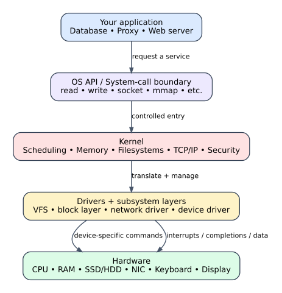
</p>

---

## Lecture Map

| Part | Question you should be able to answer |
|---|---|
| Why OS? | Why not let every application control hardware directly? |
| Abstraction | What does the OS hide from applications? |
| Scheduling | Who gets the CPU, memory, and I/O when many processes compete? |
| Kernel vs OS vs distro | What is Linux? What is Ubuntu? Where do `top` and `/proc` fit? |
| CPU | Where does execution actually happen? |
| Memory | Why are RAM and caches so important to performance? |
| Storage | How are HDDs/SSDs exposed without applications knowing their internals? |
| Network | How do NIC, driver, kernel network stack, sockets, and your backend connect? |
| Filesystem | How does a friendly file name become blocks on a device? |
| Program vs process | What changes when an executable starts running? |
| User vs kernel space | Why can't an application freely execute kernel operations? |
| Drivers + interrupts | How does the kernel react to hardware? |
| System calls | What is the controlled bridge from your process into the kernel? |
| Bare metal | Can software run without a general-purpose OS? |

> **Slide bank:** all course slides from **pages 1–26** are included under [`imgs/slides/`](imgs/slides/README.md). The README embeds the ones that materially improve understanding instead of dumping every slide into the main flow.

---

# 1. Why do we need an OS?

<p align="center">
  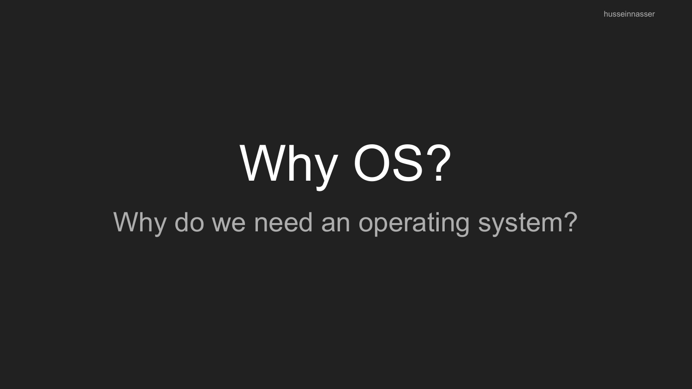
  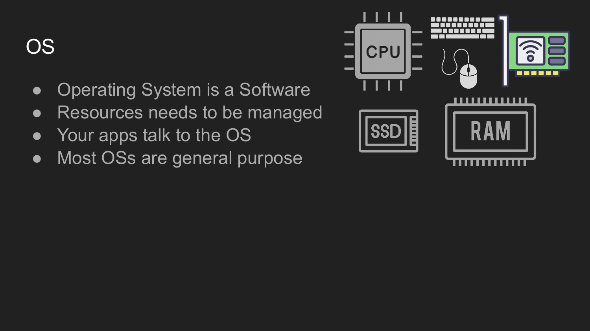
</p>

A computer contains scarce hardware resources:

```text
CPU
RAM
SSD / HDD
NIC
keyboard / mouse
screen
other devices
```

Your **application** needs those resources.

A database needs CPU, memory, storage, files, clocks, and networking. A proxy needs CPU, memory, sockets, and a NIC. Even a tiny program that calculates `1 + 1` and displays `2` needs CPU execution and some path to an output device.

Without an OS, every application would need to understand details such as:

```text
Which display interface is attached?
How do I communicate with this exact storage controller?
How do I send commands to this NIC?
How is this DRAM organized?
Who gets the CPU if several programs want it?
Who prevents one program from overwriting another program's memory?
```

The operating system provides a reusable layer that handles those problems.

```text
Application
    │
    │ "read this file"
    │ "send these bytes"
    │ "give me memory"
    ▼
Operating system / kernel
    │
    │ knows the subsystem + driver + hardware protocol
    ▼
Hardware
```

> **Mental model:** the OS is a giant resource manager **and** abstraction layer between applications and hardware.

---

# 2. Do we absolutely need an OS?

No.

The lecture deliberately plants this idea first:

> **Software can run directly on hardware. A general-purpose operating system is not a law of physics.**

Bare-metal firmware, bootloaders, embedded programs, kernels themselves, and some specialized low-latency systems operate much closer to hardware.

But then **you inherit the work the OS normally does**:

```text
hardware initialization
memory management
interrupt handling
device communication
scheduling (if you need concurrency)
networking implementation
storage/filesystem logic
security/isolation
error handling
```

That is why an OS is so useful: not because execution is impossible without it, but because doing everything yourself is extremely difficult.

### When might bypassing OS machinery be worth considering?

For extremely latency-sensitive or specialized systems, engineers sometimes bypass specific kernel paths rather than removing the whole OS. Networking/storage technologies can be designed to reduce kernel crossings or copies.

The important attitude from the lecture is:

> **Understand the abstraction first. Then you can decide whether its convenience is worth its cost for your workload.**

---

# 3. The OS is an abstraction layer

<p align="center">
  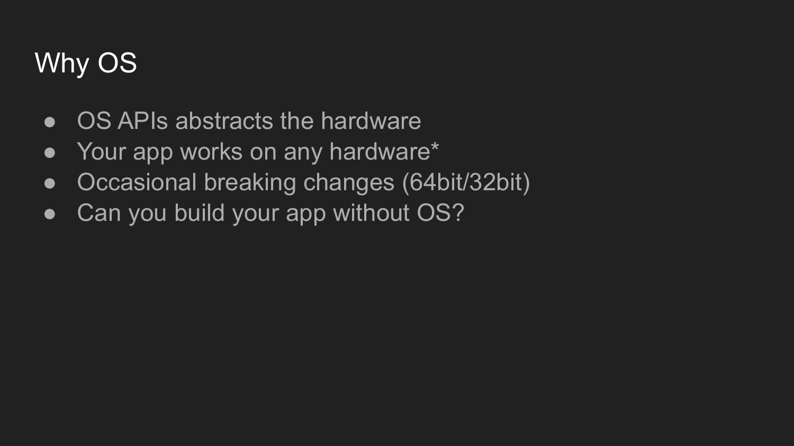
</p>

Suppose an application wants bytes from storage.

The application would rather say:

```c
read(fd, buffer, 4096);
```

than:

```text
Identify the exact drive model
Determine its controller protocol
Build the command descriptor
Submit it to the correct queue
Wait for device completion
Translate controller errors
Copy/return the data
```

The OS exposes a much simpler interface.

## POSIX — one important example

The lecture introduces **POSIX — Portable Operating System Interface**.

Think of POSIX as a family of standardized interfaces/behaviors used heavily by Unix-like systems. Familiar examples include APIs around:

```text
read
write
open
close
processes
threads
files
```

The goal is portability at the OS-interface level:

```text
Your program
      │
      │ common interface
      ▼
OS implementation
      │
      ▼
actual machine / device
```

### Abstraction always has a tradeoff

An abstraction makes the common case easier but hides details.

That can mean:

```text
+ simpler API
+ portability
+ less device-specific code

but

- some hardware-specific capabilities are harder to expose
- performance details can become invisible
- abstractions sometimes "leak"
```

This is not unique to operating systems. It is a software-engineering problem everywhere.

---

# 4. The logger API analogy

The lecture uses logging as an analogy because it is easier to see the abstraction.

Imagine your application always does:

```text
logger.info("server started")
```

But underneath, the implementation could be swapped:

```text
logger.info(...)
      │
      ├── FileLogger ─────► file
      ├── NetworkLogger ──► logging server
      ├── SyslogLogger ───► OS logging facility
      └── CloudLogger ────► external service
```

Your application uses **one interface** while the implementation underneath changes.

The OS does something similar at a much larger scale:

```text
read(file)
   │
   ├── HDD
   ├── SATA SSD
   ├── NVMe SSD
   ├── RAM-backed tmpfs
   └── network-backed filesystem
```

The same high-level call can have **wildly different performance** depending on what sits underneath it.

> This is why a call can be fast in one environment and slow in another even when your source code did not change.

---

# 5. General-purpose OSes and compatibility

Linux and Windows are general-purpose operating systems: they are designed to support enormous ranges of hardware and workloads.

That flexibility is expensive to maintain.

The lecture's compatibility point is:

```text
Old application / old hardware
          │
          │ compatibility expectations
          ▼
new OS version
```

At some point systems may deprecate old hardware/APIs to evolve.

The lecture also mentions **32-bit vs 64-bit** as a major compatibility boundary. An executable is built around an ABI/instruction environment. Some 64-bit systems can support 32-bit applications through compatibility mechanisms, but you cannot assume one binary naturally works everywhere.

> **General-purpose means the OS cannot optimize for one known workload. It must make reasonable decisions for many unknown workloads.**

That becomes extremely important in scheduling.

---

# 6. Resources are scarce → somebody has to schedule them

<p align="center">
  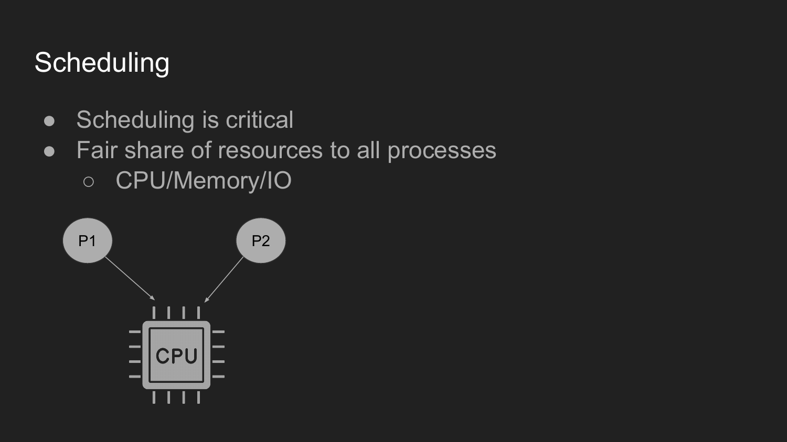
</p>

<p align="center">
  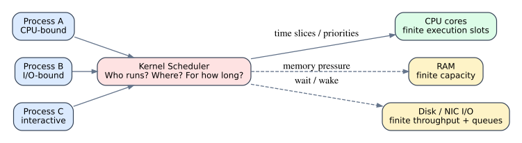
</p>

The system has finite resources:

```text
CPU execution time
RAM capacity
storage throughput / IOPS
network bandwidth
kernel queues
```

As soon as multiple processes exist, they compete.

## The historical scheduling intuition

The lecture uses old Windows/cooperative scheduling as a story: if a task keeps running and does not yield, other work can become unresponsive.

Modern general-purpose operating systems use **preemptive scheduling**: the kernel can interrupt/preempt a running task and give another runnable task CPU time.

Conceptually:

```text
Core 0 timeline

Process A ──────┐
                │ preempt
Process B       └───────┐
                        │ blocks for I/O
Process C               └─────────┐
                                  │
Process A                         └────...
```

The scheduler continuously answers questions such as:

```text
Who should run?
On which logical CPU/core?
For how long?
Who has higher priority?
Who is waiting for I/O?
Who just became runnable?
```

There is no universally perfect scheduler because **the ideal policy depends on the workload**.

A scheduler optimized for long CPU-bound jobs may be poor for interactive low-latency work, and vice versa.

---

# 7. I/O is a resource too

It is easy to think only CPU and RAM are scarce.

But an SSD/HDD/NIC has finite throughput and queue capacity.

If hundreds of requests arrive:

```text
I/O request
I/O request
I/O request
I/O request
       │
       ▼
 device queue
       │
       ▼
finite device throughput
```

Somebody waits.

The lecture uses MySQL's **InnoDB I/O capacity** as an example of an application telling its background work not to consume all available storage I/O. The principle matters more than the specific database setting:

> **Sometimes the application knows which work is urgent and which background work can be throttled.**

The OS tries to schedule fairly, but it does not always know the semantic importance of each operation.

---

# 8. Kernel vs OS vs Linux distribution

<p align="center">
  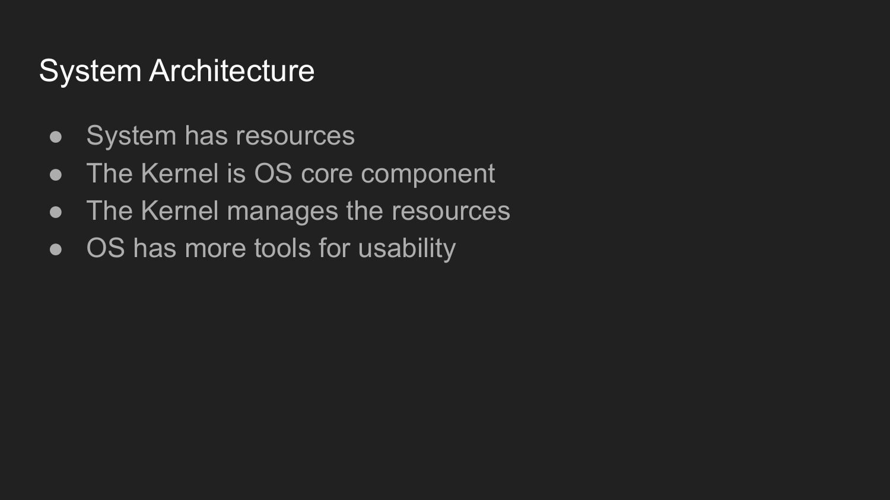
  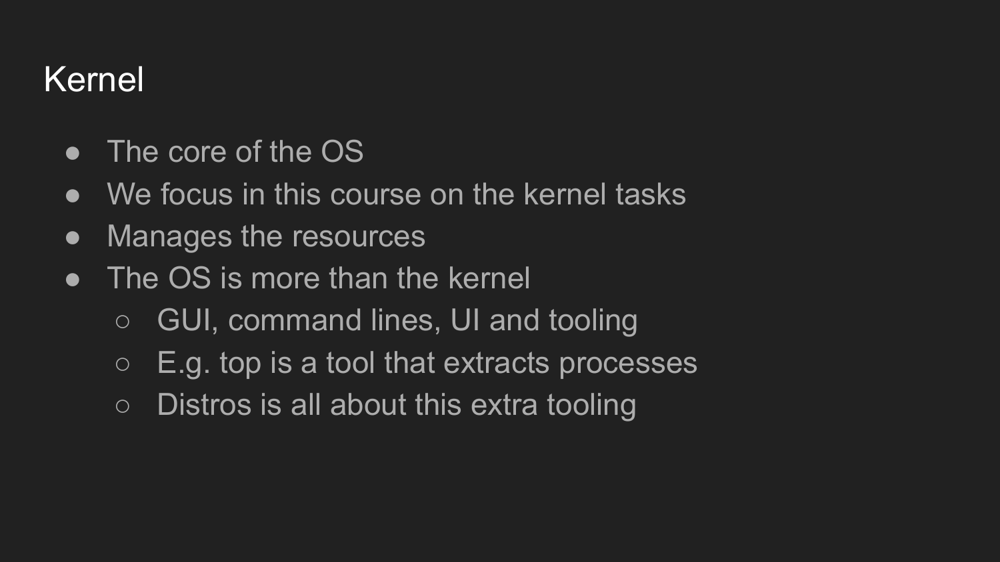
</p>

<p align="center">
  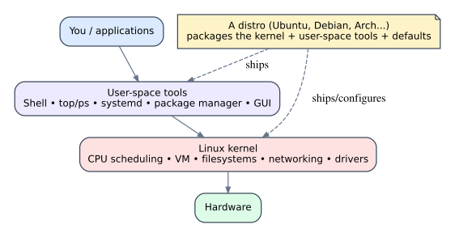
</p>

These words are often mixed together.

## Kernel

The **kernel** is the privileged core that manages hardware/resources.

In this course, the important kernel responsibilities include:

```text
CPU scheduling
process/thread management
virtual memory
filesystems
storage I/O
networking
system calls
security/isolation
device drivers
interrupt handling
```

## Operating system

In everyday speech, an OS usually means more than the kernel.

```text
OS environment
├── kernel
├── shell / command-line tools
├── system services
├── libraries
├── GUI (possibly)
└── utilities
```

## Distribution

A Linux distribution packages a Linux kernel together with user-space software, package management, defaults, installers, and often a desktop environment.

Examples:

```text
Ubuntu
Debian
Arch Linux
Fedora
```

So:

> **Linux kernel ≠ Ubuntu. Ubuntu is a distribution built around Linux plus a large user-space environment.**

### Where does `top` fit?

`top` is a normal user-space program.

The kernel exposes process/system information through interfaces such as `/proc`, and programs such as `ps`, `top`, and `htop` read kernel-provided information and present it nicely.

```text
Kernel internal state
       │
       ▼
/proc and other interfaces
       │
       ├── ps
       ├── top
       └── htop
```

This is a great example of **kernel mechanism + user-space tooling**.

---

# 9. System architecture: what exactly is the kernel managing?

The system-architecture lecture divides the important resources into:

```text
CPU
Memory
Storage
Network
```

and then connects them to kernel mechanisms such as filesystems, drivers, processes, and system calls.

---

# 10. CPU — where execution happens

<p align="center">
  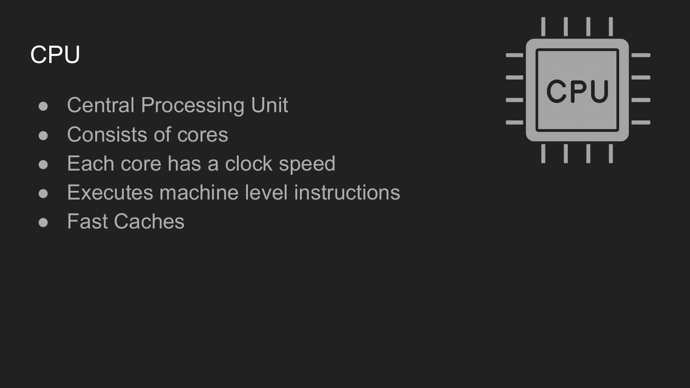
</p>

The CPU is the actual execution engine.

## Processor, core, logical CPU

A physical processor package/socket can contain multiple cores.

```text
Processor package
├── Core 0
├── Core 1
├── Core 2
└── Core 3
```

Modern systems may additionally expose multiple **logical CPUs/hardware threads** per physical core through SMT/Hyper-Threading.

The scheduler normally schedules runnable threads/tasks onto logical CPUs; a process may contain one or more threads.

## Registers and caches

Values needed immediately should be as close to execution units as possible.

<p align="center">
  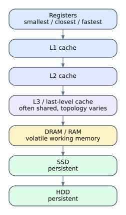
</p>

Conceptually:

```text
closest / fastest

Registers
L1 cache
L2 cache
L3 / last-level cache
RAM
SSD
HDD

farther / slower
```

L1 is usually very small and close to a core. L2 is larger/slower. A last-level cache such as L3 is often shared among groups of cores, although exact cache topology depends on the CPU.

The lecture later goes much deeper into registers, program counter, instruction fetch, and cache behavior.

---

# 11. CPU clock speed and machine instructions

A CPU does not execute C, Python, or JavaScript source text.

It executes **machine instructions** defined by an instruction-set architecture (ISA).

```text
C source
   │
   │ compiler targets architecture
   ▼
x86-64 machine code
```

or:

```text
C source
   │
   ▼
ARM machine code
```

That is why native binaries are architecture-specific.

## RISC vs CISC — lecture intuition

The lecture introduces the traditional idea:

```text
RISC → simpler instructions
CISC → more complex instructions
```

and connects ARM with RISC and x86 with historically CISC-style instruction sets.

> **Precision note:** modern CPU performance/power cannot be predicted simply from “RISC vs CISC.” Modern x86 and ARM cores use pipelining, out-of-order execution, micro-ops, vector units, caches, branch prediction, multiple execution units, etc. Clock frequency also does **not** directly mean “one instruction per clock.” Some instructions take several cycles; modern cores can also retire multiple instructions per cycle under good conditions.

The important lecture takeaway remains:

> **Your compiled program must eventually become instructions that the target CPU understands.**

---

# 12. Why Python/JavaScript can run across many machines

The lecture contrasts native compilation with runtimes/interpreters.

A useful model is:

```text
Python source
      │
      ▼
Python runtime / interpreter
      │
      ▼
native instructions for THIS machine
      │
      ▼
CPU
```

The Python runtime itself has already been built for the platform:

```text
CPython for x86-64 Linux
CPython for ARM Linux
CPython for macOS
CPython for Windows
...
```

So the same `.py` source can often be moved between platforms while the platform-specific runtime does the native work.

Similarly, Node.js is a native executable/runtime that executes JavaScript using its engine and OS facilities.

> **Precision note:** Python/JavaScript code absolutely still causes the CPU to execute native instructions. The extra point is that your source is executed through a runtime/interpreter/JIT layer rather than being a simple ahead-of-time native executable like a typical C program.

---

# 13. Memory / RAM

<p align="center">
  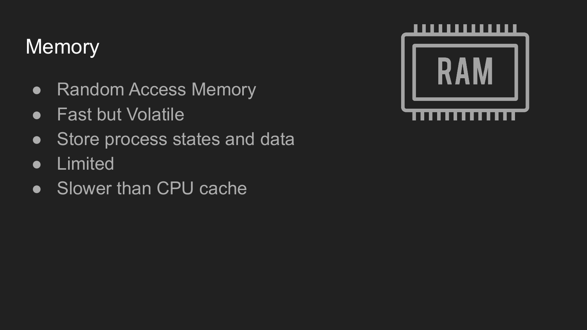
</p>

RAM is the machine's main working memory.

The lecture emphasizes four properties:

```text
fast compared with storage
volatile
limited
slower than CPU caches
```

## Volatile

Remove power and ordinary DRAM contents disappear.

This is fine because applications are designed around that fact.

A running process has working state in memory; if the machine loses power, that process is gone. The executable program still exists on persistent storage and can be run again.

## Why “random access”?

Historically, tapes and disks involved physical movement/seeking to reach different locations. RAM was called **random-access memory** because locations could be addressed directly rather than requiring sequential traversal.

Modern SSD terminology makes the name feel less special because SSDs also support efficient non-sequential access, but the historical name remains.

---

# 14. Database example: memory + durable log

The lecture uses databases to show why volatile RAM is still extremely useful.

A database may keep frequently accessed/modified pages in an in-memory buffer pool because RAM is far faster than storage.

But durable changes must survive crashes.

A common architecture is:

```text
UPDATE row
   │
   ├── modify in-memory page
   │
   └── append change record to WAL / redo log
                         │
                         ▼
                   persistent storage
```

The **write-ahead log (WAL)** records changes durably before relying solely on dirty in-memory pages.

Why can logging be efficient?

Because logs are typically written sequentially/append-style, which storage devices handle well compared with arbitrary scattered updates.

This same idea will appear again in database courses, filesystems, and storage engines.

---

# 15. Virtual memory — preview only

Physical RAM is finite and awkward to share safely between many processes.

The OS therefore gives processes **virtual addresses**.

```text
Process A virtual 0x1000 ──► physical frame X
Process B virtual 0x1000 ──► physical frame Y
```

Both processes can believe they own address `0x1000`, while the OS/MMU maps them to different physical memory.

The lecture previews another behavior: memory pages not currently resident can cause a **page fault**, giving the kernel a chance to bring the required page into RAM.

> **Precision note:** think in terms of **pages**, not “the OS always copies the entire inactive process to disk.” Anonymous pages may be swapped if swap is configured; file-backed pages can often be discarded and reloaded from their file later.

## DRAM addressing preview

The lecture briefly goes even lower:

```text
virtual address
   ↓ page-table translation
physical address
   ↓ memory-controller mapping
channel / rank / bank / row / column
   ↓
DRAM cells
```

You do **not** need to memorize that yet. It is there to show how much machinery an OS + CPU memory system hides from your application.

---

# 16. Storage: HDD vs SSD

<p align="center">
  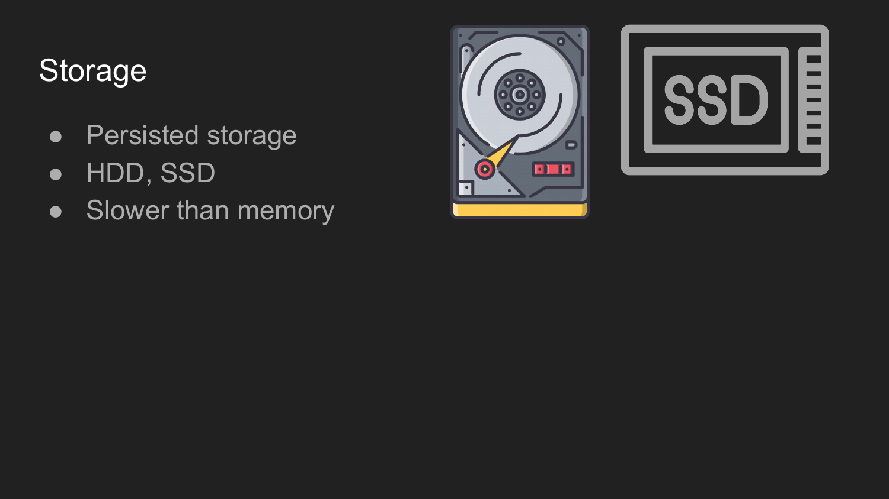
</p>

Storage is persistent: it survives process exit and machine power loss.

The lecture contrasts two broad technologies.

## HDD

A hard disk drive uses magnetic platters and a moving head.

Important intuition:

```text
physical movement / seek
      ↓
random access is expensive
```

## SSD

A solid-state drive uses flash memory and has no mechanical seek arm.

It provides dramatically lower random-access latency than HDDs, but NAND flash has its own constraints.

### Flash pages and erase blocks

A simplified SSD model:

```text
Program/write → page granularity
Erase         → larger erase-block granularity
```

When logical data is updated, the SSD controller may write new physical flash pages and invalidate old ones rather than overwriting in place.

Eventually garbage collection reclaims blocks containing invalid pages.

NAND cells also have a finite **program/erase (P/E) cycle** endurance.

> **Precision note:** HDDs are not literally “unlimited writes”; mechanical devices can fail/wear. The lecture's point is that NAND has a characteristic erase-cycle endurance constraint that HDD magnetic media does not express in the same way.

---

# 17. Storage controllers and NVMe

Applications should not need to know whether a block corresponds to a platter sector or a NAND flash location.

Modern storage devices have controllers/firmware that expose a command interface.

```text
OS storage stack
      │
      ▼
NVMe / SATA interface
      │
      ▼
device controller
      │
      ▼
actual media management
```

For NVMe, the host submits standardized commands/queues and the SSD controller handles internal mapping, flash management, wear leveling, garbage collection, and other device-specific behavior.

This separation is another abstraction boundary:

> **The vendor can evolve the physical implementation while keeping a relatively stable host-facing interface.**

That is the same software-engineering reason we build APIs in backend systems.

---

# 18. The `fsync` / many-SSD shutdown story

The lecture tells an anecdote about a large machine with many SSDs taking a long time to shut down because device flush/shutdown operations were issued synchronously, one after another.

The performance idea is simple.

### Serial waiting

```text
SSD 1: request ─ wait 250 ms ─ done
SSD 2:                         request ─ wait 250 ms ─ done
SSD 3:                                                   request ...
```

Total time grows roughly with the sum of waits.

### Initiate concurrently, then wait

```text
SSD 1: request ───────── done
SSD 2: request ─────── done
SSD 3: request ─────────── done
                     │
                     └── wait for all
```

Now the total wait can approach the slowest device rather than the sum of all devices.

The lecturer was explicitly uncertain whether the specific story belonged to ByteDance/TikTok or Google, so treat the attribution as **an anecdote from the lecture**, not a verified historical claim.

The engineering principle is solid:

> **If independent I/O operations can proceed concurrently, serially waiting for each one can waste enormous time.**

This is the same idea you later see in asynchronous backend I/O, futures/promises, batching, and parallel requests.

---

# 19. Network: another kernel-managed resource

<p align="center">
  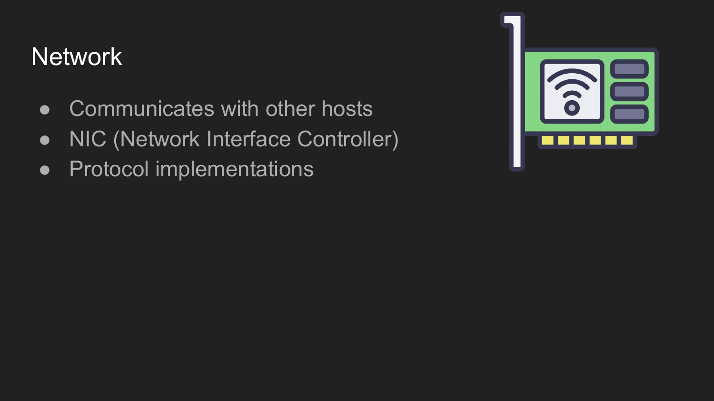
</p>

<p align="center">
  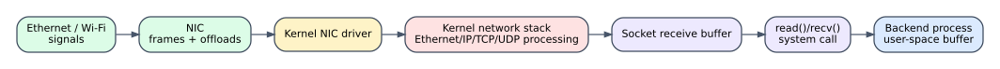
</p>

A machine communicates with other hosts through a **NIC — Network Interface Controller**.

The simplified receive path is:

```text
signals on medium
      ↓
NIC
      ↓
NIC driver
      ↓
kernel network stack
      ↓
socket receive buffer
      ↓
read()/recv()
      ↓
your application's user-space buffer
```

Your networking course already gave you the protocol view:

```text
physical signals
   ↓
bits
   ↓
L2 frames
   ↓
L3 packets
   ↓
L4 TCP/UDP
   ↓
application data
```

The OS kernel implements large portions of the host networking stack, including IP/TCP/UDP behavior, socket state, retransmission/ACK logic, routing decisions, packet queues, and interaction with the NIC driver.

> **Precision note:** layer boundaries are not “L2 only NIC, L3/L4 only OS.” Real NICs perform offloads and the kernel also handles Ethernet/L2 logic. The exact division depends on hardware and configuration.

---

# 20. Kernel — the core resource manager

The lecture's kernel definition can now be made concrete:

```text
                     KERNEL

CPU ─────────────► scheduler / task management
RAM ─────────────► virtual-memory manager
SSD/HDD ─────────► filesystems + block I/O stack
NIC ─────────────► network stack + drivers
Keyboard ────────► device driver + interrupts
Applications ────► system calls
```

The course is called **Fundamentals of Operating Systems**, but much of its technical content is really about the mechanisms implemented in the **kernel**.

---

# 21. Filesystems: files are another abstraction

<p align="center">
  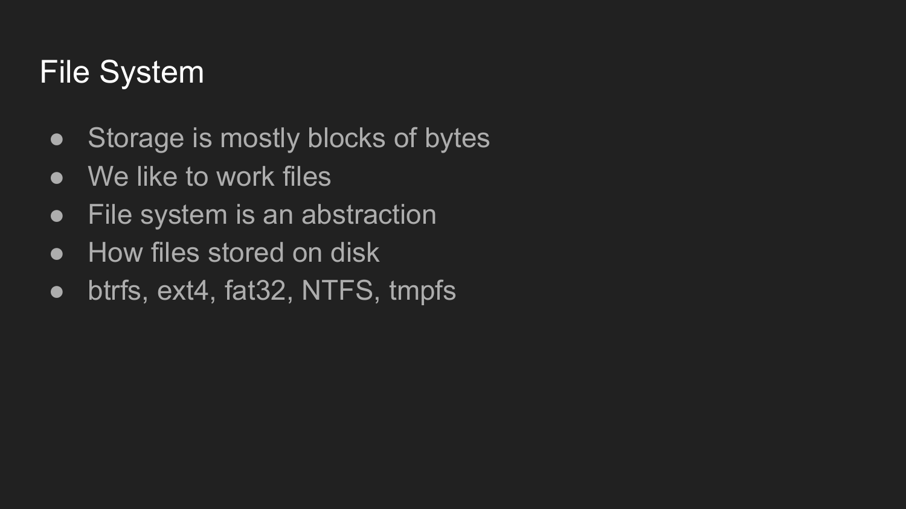
</p>

<p align="center">
  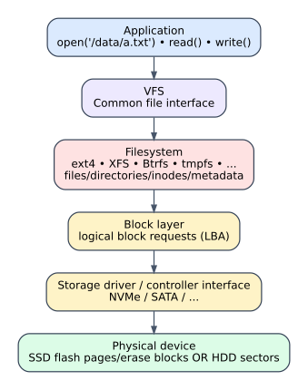
</p>

At the lowest storage interface, the OS wants something much simpler than:

```text
cylinder 4
head 1
track 32
sector 7
```

because that would couple software to one physical device design.

Instead devices are exposed through **logical blocks**.

## LBA — Logical Block Addressing

Think:

```text
block 0
block 1
block 2
block 3
...
```

The OS asks for a logical block number. The storage device/controller decides how that logical address maps to physical media.

```text
LBA 700
   │
   ▼
controller mapping
   │
   ├── HDD location
   └── SSD flash location
```

This decouples software from the physical mechanism.

---

# 22. But humans do not want to manage block numbers

Users want:

```text
/home/nour/report.txt
```

not:

```text
blocks 900, 901, 1173, ...
```

So we add another abstraction: the **filesystem**.

```text
file name + directories
        ↓
filesystem metadata
        ↓
logical blocks
        ↓
storage device
```

A filesystem manages information such as:

```text
file names
file sizes
directories
ownership / permissions
metadata
which blocks belong to which file
free space
locking / consistency structures
```

On Unix-like filesystems you will often encounter **inodes** as metadata objects identifying files and their storage mappings.

---

# 23. Allocation units: why a 3-byte file may consume much more

Storage/filesystems operate with allocation units larger than one byte.

So a tiny file does not necessarily cost exactly three physical bytes of storage.

Simplified lecture example:

```text
filesystem block = 4 KiB
file data         = 3 B

allocated block:
[3 useful bytes | unused remainder................]
```

This is internal fragmentation.

> **Precision note:** the actual allocation unit depends on filesystem/device/configuration, and features such as inline data, compression, sparse files, reflinks, etc. can change the physical-space result. The 4 KiB example is a useful common teaching case, not a universal rule.

---

# 24. Filesystem examples

The lecture names several important filesystems:

```text
ext4   → common/default choice on many Linux installations
Btrfs  → Linux copy-on-write filesystem
ZFS    → advanced filesystem/storage system (mentioned verbally)
NTFS   → Windows filesystem
FAT32  → older/simple filesystem with broad compatibility
tmpfs  → Linux memory-backed filesystem
```

`tmpfs` is a particularly nice abstraction example:

```text
Application thinks: "I am using files"

but underneath:

filesystem storage is RAM-backed
```

So you get familiar file APIs without ordinary persistent-disk behavior.

An OS can only natively understand a filesystem if it has an implementation/driver for that filesystem format.

---

# 25. Program vs process — first preview

<p align="center">
  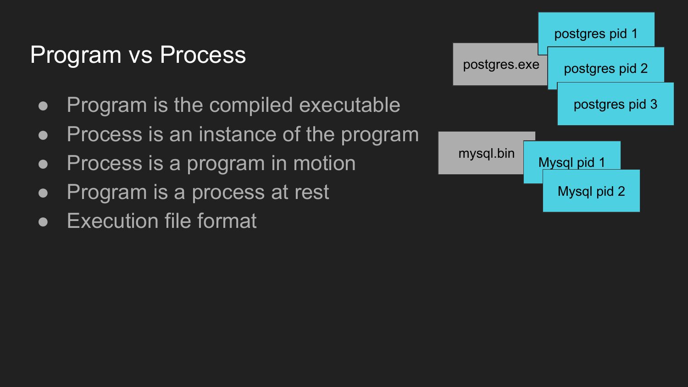
</p>

This is only introduced here; Lecture 02 goes deep into it.

## Program

A **program** is the compiled executable artifact.

```text
postgres executable on disk
mysql executable on disk
```

## Process

A **process** is a running instance of that program.

```text
same executable
      │
      ├── Process PID 401
      ├── Process PID 402
      └── Process PID 403
```

Each running instance has its own live state in memory and may be executing at a different point in the program.

The lecture's phrase to remember is:

> **A process is a program in motion.**

Executables also follow file formats such as:

```text
Linux → ELF
Windows → PE
macOS → Mach-O
```

The next lecture explains text/code, data, heap, stack, PC, registers, and the process control block in detail.

---

# 26. Process management

<p align="center">
  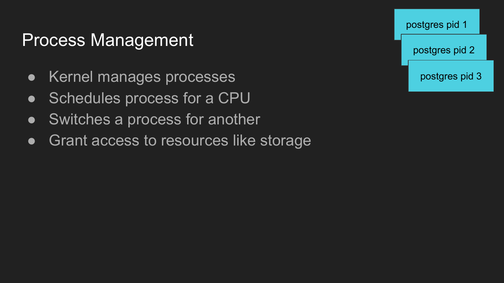
</p>

The kernel manages running tasks.

Its responsibilities include:

```text
create/terminate processes
schedule runnable work on CPUs
block tasks waiting for I/O
wake tasks when I/O completes
manage process memory
protect resources
track open files/sockets
switch execution between tasks
```

## Why block a process on I/O?

Suppose a process requests data from an NVMe SSD.

```text
Process
   │ read request
   ▼
SSD
```

The SSD is incomparably slower than CPU execution.

The CPU should not sit doing nothing while that request completes.

So the process can become blocked/sleeping and another runnable task gets CPU time:

```text
Process A running
       │
       │ asks for I/O
       ▼
Process A WAITING

CPU ─────────► run Process B

I/O completion arrives
       │
       ▼
Process A becomes runnable again
```

This is one of the deepest ideas in backend performance: **waiting for I/O and consuming CPU are different states.**

---

# 27. User space vs kernel space

<p align="center">
  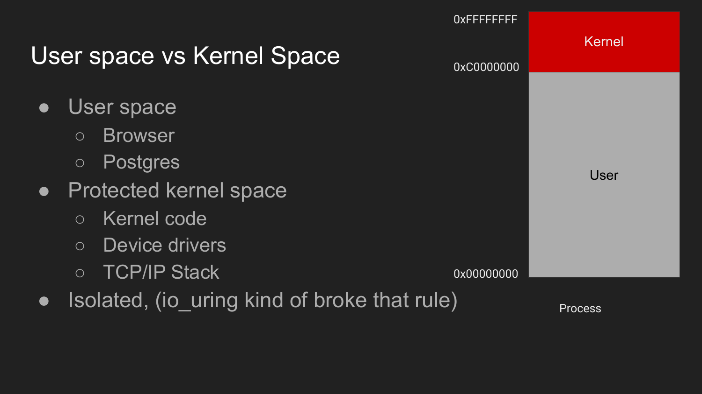
</p>

A normal application runs with restricted privileges in **user mode**.

Kernel code runs with elevated privileges in **kernel mode**.

Conceptually:

```text
USER SPACE
┌────────────────────────────┐
│ browser                    │
│ Postgres                   │
│ your backend               │
│ your heap / stack / data   │
└────────────────────────────┘

      controlled transition
             ↓ ↑

KERNEL SPACE
┌────────────────────────────┐
│ scheduler                  │
│ memory manager             │
│ filesystem                 │
│ TCP/IP stack               │
│ device drivers             │
└────────────────────────────┘
```

The exact virtual-address layout varies across OSes, architectures, kernel configuration, KPTI/security mechanisms, and 32/64-bit environments. Do not memorize the literal addresses from the slide.

The important security idea is:

> **Your application cannot simply dereference arbitrary kernel memory or execute privileged operations whenever it wants.**

---

# 28. System calls — the bridge

<p align="center">
  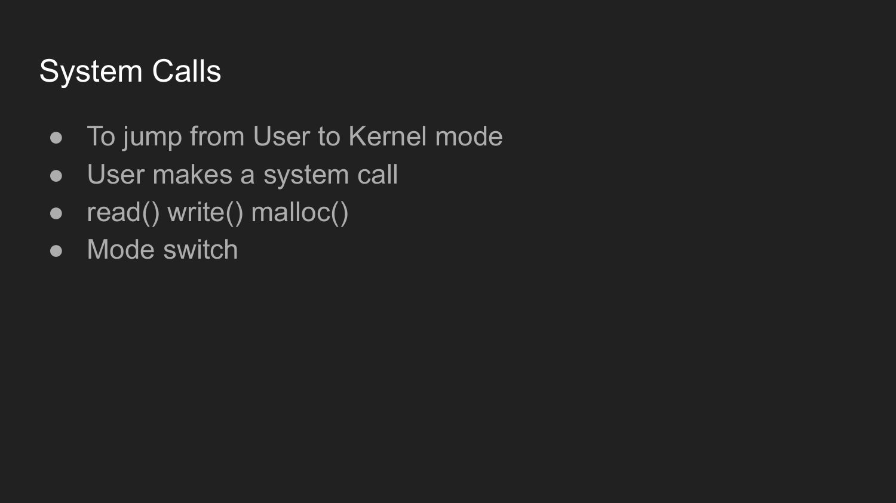
</p>

<p align="center">
  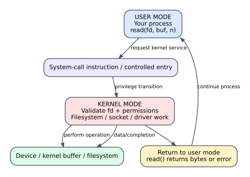
</p>

A **system call** is the controlled mechanism by which a user-space process requests a privileged kernel service.

Examples on Unix-like systems include operations behind APIs such as:

```text
read
write
open/openat
close
mmap
socket
connect
accept
```

Simplified path:

```text
Your code
   │
   │ read(...)
   ▼
libc wrapper
   │
   ▼
system-call instruction
   │
   ▼
CPU enters kernel mode
   │
   ▼
kernel validates + performs request
   │
   ▼
return to user mode
```

## Important correction: `malloc()` is not itself a syscall

The lecture groups `malloc`, `read`, and `write` together while introducing kernel calls.

For a precise mental model:

```text
read()/write()
→ library wrappers around actual kernel system calls

malloc()
→ user-space memory allocator API
→ may request more virtual memory from kernel using mechanisms such as mmap/brk
→ many malloc calls can be satisfied without a syscall
```

This distinction will matter when you later profile backend applications.

---

# 29. Mode switch vs context switch

These are related but **not the same thing**.

## Mode/privilege transition

```text
same process
user mode → kernel mode → user mode
```

Example: a system call.

## Context switch

```text
CPU was running Task A
        ↓
save/replace execution context
        ↓
CPU now runs Task B
```

A syscall does not automatically imply the scheduler switches to another process. A process may enter the kernel, have its syscall serviced, and return directly.

If it blocks for I/O, **then** the scheduler may run something else.

Both transitions have costs, but keep the concepts separate.

---

# 30. Networking example: why `read()` crosses the boundary

Suppose TCP data arrives for your backend.

```text
NIC
 ↓
kernel driver
 ↓
TCP/IP processing
 ↓
kernel socket receive buffer
```

Your application cannot simply read arbitrary protected kernel memory.

It calls something like:

```c
read(fd, user_buffer, size);
```

or:

```c
recv(fd, user_buffer, size, 0);
```

Then the kernel returns data to user space.

Simplified:

```text
KERNEL
socket receive buffer
        │
        │ read()/recv()
        ▼
USER
application buffer
```

That copy/boundary is part of the motivation behind many high-performance I/O designs.

The lecture mentions **io_uring** as an example of a newer asynchronous Linux I/O interface that uses shared submission/completion ring structures to reduce some traditional syscall overhead patterns. The lecture also mentions security concerns around new powerful kernel interfaces. Treat the specific product-policy anecdotes as context rather than a rule about all deployments.

---

# 31. Device drivers

<p align="center">
  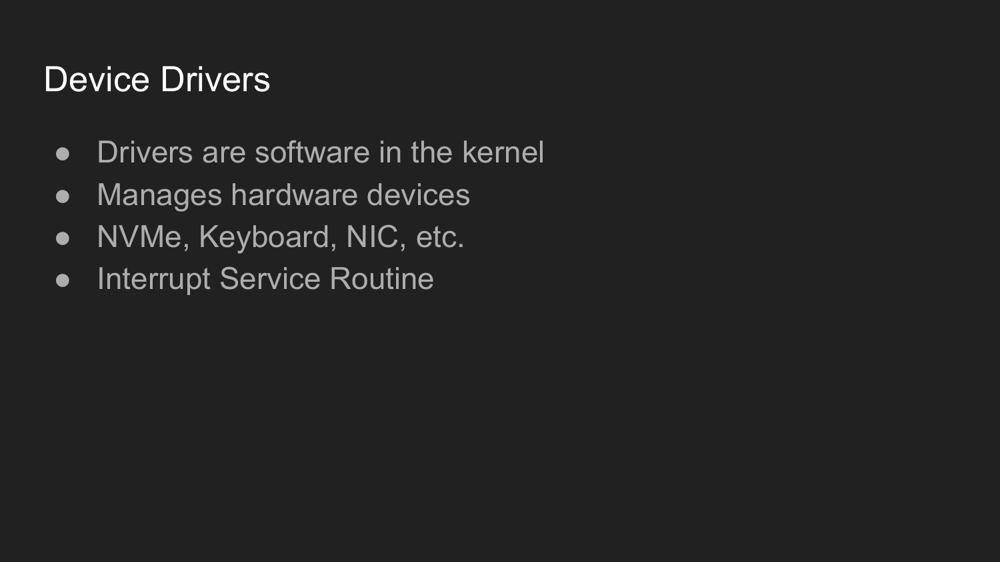
</p>

A **device driver is software** that knows how the OS communicates with a particular class/device.

Examples:

```text
NVMe driver
NIC driver
keyboard driver
GPU/display driver
```

The driver translates between generic kernel operations and device-specific commands/registers/queues.

```text
kernel subsystem
      │
      │ generic request
      ▼
device driver
      │
      │ device-specific operation
      ▼
hardware
```

This lets applications avoid carrying hardware knowledge themselves.

---

# 32. Interrupts — hardware getting the CPU's attention

A keyboard key press is a good mental model.

```text
You press L
    │
    ▼
keyboard/controller
    │
    ▼
interrupt
    │
    ▼
CPU temporarily runs kernel interrupt-handling code
    │
    ▼
driver/kernel records/processes input
```

An **interrupt** allows hardware to notify the CPU that something happened instead of requiring the CPU to continuously ask:

```text
"keyboard, anything?"
"keyboard, anything?"
"keyboard, anything?"
```

The code that responds to an interrupt is traditionally discussed as an **interrupt handler / interrupt service routine (ISR)**, although modern kernels often split work into immediate and deferred portions.

NICs and storage devices also use interrupts and/or polling mechanisms to signal completions depending on the performance design.

---

# 33. The OS should not be a black box

<p align="center">
  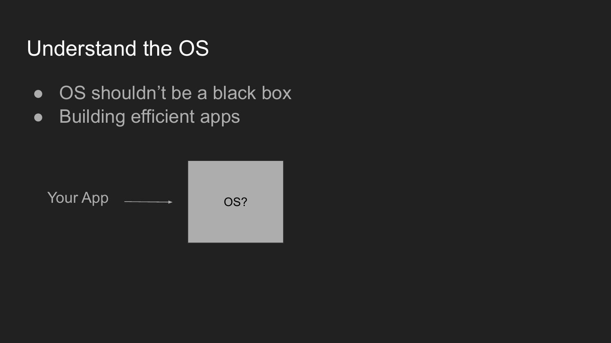
</p>

This is the philosophy of the entire course.

At first:

```text
Your App ─────► [ ??? OS ??? ] ─────► Hardware
```

The goal is to turn it into:

```text
Your App
   │
   ├── syscall
   ▼
Kernel
   ├── scheduler
   ├── virtual memory
   ├── filesystem
   ├── TCP/IP
   ├── socket buffers
   ├── block layer
   └── drivers
             │
             ▼
          hardware
```

When you know the layers, performance stops feeling magical.

You can ask:

```text
Am I CPU-bound?
Am I blocked on I/O?
Am I causing too many syscalls?
Am I copying data unnecessarily?
Am I missing caches?
Am I saturating storage queues?
Is the kernel scheduler moving my task?
Is my runtime doing extra work?
```

That is the transition from using a black box to reasoning about a system.

---

# 34. Performance intuition: the 64-byte cache-line example

The lecture previews cache locality with an intentionally concrete example.

Many modern CPUs use cache lines around **64 bytes**.

If your program accesses bytes that fit in the same cache line:

```text
Cache line
┌──────────────────────────────────────────────────────────────┐
│ byte 0 ............................................. byte 63 │
└──────────────────────────────────────────────────────────────┘
```

one fetched line may satisfy several nearby accesses.

Cross the boundary:

```text
line A                         line B
[................................][................................]
                                ↑
                              byte 64
```

and the CPU may need another cache line.

> **Precision note:** 64 bytes is common, not universal. And crossing a cache-line boundary does not guarantee a RAM access; the next line may already exist in L1/L2/L3. The point is locality and cache-line granularity.

This is why tiny layout decisions can matter in software that is optimized at microsecond/nanosecond scale.

---

# 35. Cache coherence preview

Multiple cores introduce another problem.

```text
Core 0 cache: X = 10
Core 1 cache: X = 10
```

If Core 0 writes:

```text
X = 20
```

Core 1 must not indefinitely use stale `X = 10`.

Modern multicore CPUs implement **cache-coherence protocols** that coordinate ownership/state of cache lines.

Conceptually:

```text
Core 0 writes cache line
       │
       └────► coherence traffic
                    │
                    ▼
          other cached copies updated/invalidated as required
```

This is why shared writable data across threads can create performance costs even when the program is logically correct.

> The lecture uses the word “discard cache”; the precise unit is normally cache-line coherence state, not “throw away the entire L1 cache.”

---

# 36. The Python `fork()` + Copy-on-Write teaser

Near the end, the lecture previews a real performance story involving Python, `fork()`, reference counts, and **Copy-on-Write (CoW)**.

You do not need the full details yet.

The setup is:

```text
Parent process
      │ fork()
      ▼
Parent + child initially share physical pages
(read-only from CoW perspective)
```

If one process writes to a shared CoW page:

```text
write
 ↓
page must become private
 ↓
copy physical page
```

CPython traditionally updates object reference counts. Even if a Python object is conceptually immutable, changing its nearby reference-count metadata is still a **memory write**.

So reads/usages that increment/decrement refcounts can dirty pages and trigger CoW copies after `fork()`.

Later Python work on “immortal” objects reduces unnecessary reference-count writes for certain long-lived singleton objects.

For now, memorize only the engineering lesson:

> **A high-level operation that looks like “just read/use this object” can cause low-level memory writes you never see in source code.**

This is exactly why the course wants the OS to become transparent to you.

---

# 37. Bridge to Lecture 02 — Anatomy of a Process

<p align="center">
  
  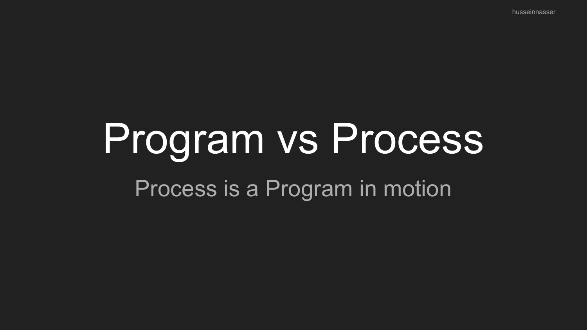
</p>

The lecture ends by transitioning from:

```text
What resources does the OS manage?
```

to:

```text
What exactly is the unit of execution the kernel manages?
```

That unit is the **process**.

The next section breaks a process into:

```text
Text / Code
Data / Static
Heap
Stack
CPU register state
kernel process metadata
```

and traces actual C execution instruction by instruction.

---

# 38. Why the next lecture uses C

The instructor chooses a tiny C program because C makes the path from source to native machine instructions comparatively visible.

```text
C source
   ↓
compiler + linker
   ↓
native executable
   ↓
process
   ↓
CPU executes native instructions
```

With Python/Node/Java, you first have to explain a runtime:

```text
Your source
   ↓
runtime / interpreter / VM / JIT
   ↓
native runtime code
   ↓
OS
   ↓
CPU
```

That does **not** mean runtime languages are “bad.” It means there is more machinery to understand.

The lecture uses a proxy-language migration story to motivate why very latency-sensitive software may choose a native language such as Rust to avoid certain runtime/GC costs. Treat the specific company story as motivation, not as the rule:

```text
C/Rust always fast
Java/Python always slow
```

That statement would be wrong.

Performance depends on workload, runtime, implementation, I/O, algorithms, memory behavior, JIT optimization, GC requirements, and latency goals.

---

# 39. Practical lab — see the system yourself

This repo includes two tiny C programs in [`examples/`](examples/).

## 39.1 Inspect the machine

```bash
uname -a
lscpu
free -h
lsblk
ip link
```

What each shows:

```text
uname -a → kernel/system information
lscpu    → CPU architecture, cores/logical CPUs, cache summary
free -h  → RAM/swap usage
lsblk    → block devices
ip link  → network interfaces
```

## 39.2 Inspect processes

```bash
ps aux
```

or interactively:

```bash
top
```

If installed:

```bash
htop
```

Remember: these are user-space tools reading information the kernel exposes.

---

# 40. Lab — watch a CPU-bound process compete for CPU

Compile:

```bash
gcc -O0 -g examples/02_cpu_bound.c -o cpu_bound
```

Run it:

```bash
./cpu_bound
```

While it is running, open another terminal:

```bash
top
```

or:

```bash
ps -o pid,psr,stat,%cpu,comm -C cpu_bound
```

Interesting columns:

```text
PID   → process ID
PSR   → logical CPU the task was observed on
STAT  → process state
%CPU  → CPU consumption
COMM  → command name
```

Run several copies:

```bash
./cpu_bound &
./cpu_bound &
./cpu_bound &
./cpu_bound &
```

Now the scheduler has visibly competing runnable work.

Clean up if needed:

```bash
pkill cpu_bound
```

---

# 41. Lab — trace the user/kernel boundary

Open [`examples/01_syscall_trace.c`](examples/01_syscall_trace.c).

The program deliberately performs:

```text
malloc()
open()
write()
fsync()
close()
free()
```

Compile:

```bash
gcc -O0 -g examples/01_syscall_trace.c -o syscall_trace
```

Run normally:

```bash
./syscall_trace
cat os-demo.txt
```

On a Linux machine with `strace`:

```bash
strace ./syscall_trace
```

A cleaner filtered trace:

```bash
strace -e trace=openat,write,fsync,close,mmap,brk ./syscall_trace
```

You may see calls conceptually like:

```text
openat(..., "os-demo.txt", ...)
write(..., "hello from user space\n", ...)
fsync(...)
close(...)
```

You may also see `brk()` or `mmap()` activity related to process memory/runtime allocation.

The exact trace varies by libc, allocator, loader, kernel, and prior allocator state.

### What this lab proves

Your C source says:

```c
write(fd, buffer, len);
```

but the interesting OS path is:

```text
C library call
   ↓
system call
   ↓
kernel filesystem / VFS
   ↓
block/storage stack
   ↓
driver/controller/device
```

That is the whole lecture in one command.

---

# 42. One complete mental picture

```text
                                 ┌────────────────────────────┐
                                 │      YOUR APPLICATION      │
                                 │ database / proxy / backend │
                                 └──────────────┬─────────────┘
                                                │
                                    OS APIs / syscalls
                                                │
                                                ▼
┌─────────────────────────────────────────────────────────────────────────┐
│                              KERNEL                                     │
│                                                                         │
│  Scheduler       Virtual Memory       Filesystem       Network Stack    │
│      │                 │                  │                  │           │
│      │                 │                  │                  │           │
│  processes          page tables          VFS            TCP/UDP/IP      │
│      │                 │                  │                  │           │
│      └─────────────────┴──────────────────┴──────────────────┘           │
│                                 │                                       │
│                              Drivers                                    │
└─────────────────────────────────┼───────────────────────────────────────┘
                                  │
                                  ▼
┌─────────────────────────────────────────────────────────────────────────┐
│                              HARDWARE                                   │
│                                                                         │
│       CPU              RAM              SSD/HDD             NIC         │
└─────────────────────────────────────────────────────────────────────────┘
```

The important thing is that the kernel is not “magic.”

It is software implementing policies and data structures that coordinate real hardware.

---

# 43. Final revision sheet

## What is the operating system doing?

```text
Managing scarce resources
Providing hardware abstractions
Protecting/isolation
Scheduling execution
Managing memory
Managing files/storage
Implementing networking
Handling device drivers/interrupts
Providing system-call interfaces
```

## Kernel vs distro

```text
Kernel
→ privileged core resource manager

Linux distribution
→ kernel + libraries + tools + services + package manager + defaults/UI
```

## CPU

```text
Executes machine instructions
Has registers and caches
Contains one or more cores
Kernel schedules runnable tasks onto logical CPUs
```

## RAM

```text
Fast working memory
Volatile
Limited
Slower than CPU caches
Processes keep live state here
```

## Storage

```text
Persistent
HDD → mechanical
SSD → flash/controller/FTL, no seek arm
Both much slower than CPU caches/RAM
```

## Filesystem

```text
File/path abstraction
   ↓
filesystem metadata
   ↓
logical blocks (LBA)
   ↓
device
```

## Network

```text
NIC
 ↓
driver
 ↓
kernel network stack
 ↓
socket
 ↓
read/recv
 ↓
application
```

## Program vs process

```text
Program = executable artifact
Process = running instance with live state
```

## User vs kernel

```text
User mode
→ restricted application execution

Kernel mode
→ privileged kernel execution

System call
→ controlled request from user process into kernel
```

## Driver

```text
Software that knows how the kernel talks to hardware
```

## Interrupt

```text
Hardware/event tells CPU: "I need attention"
```

## The sentence to keep

> **My application does not magically “use the computer.” It asks the OS for services; the kernel schedules and protects resources, translates abstractions into subsystem/driver work, and the hardware finally performs the operation.**

---

# 44. Slide bank — pages 1–26

All original course-slide renders are stored in `imgs/slides/` so the repo remains self-contained.

<details>
<summary><strong>Open the full slide path list</strong></summary>

| Page | Asset |
|---:|---|
| 1 | `imgs/slides/os_page-0001.png` |
| 2 | `imgs/slides/os_page-0002.png` |
| 3 | `imgs/slides/os_page-0003.png` |
| 4 | `imgs/slides/os_page-0004.png` |
| 5 | `imgs/slides/os_page-0005.png` |
| 6 | `imgs/slides/os_page-0006.png` |
| 7 | `imgs/slides/os_page-0007.png` |
| 8 | `imgs/slides/os_page-0008.png` |
| 9 | `imgs/slides/os_page-0009.png` |
| 10 | `imgs/slides/os_page-0010.png` |
| 11 | `imgs/slides/os_page-0011.png` |
| 12 | `imgs/slides/os_page-0012.png` |
| 13 | `imgs/slides/os_page-0013.png` |
| 14 | `imgs/slides/os_page-0014.png` |
| 15 | `imgs/slides/os_page-0015.png` |
| 16 | `imgs/slides/os_page-0016.png` |
| 17 | `imgs/slides/os_page-0017.png` |
| 18 | `imgs/slides/os_page-0018.png` |
| 19 | `imgs/slides/os_page-0019.png` |
| 20 | `imgs/slides/os_page-0020.png` |
| 21 | `imgs/slides/os_page-0021.png` |
| 22 | `imgs/slides/os_page-0022.png` |
| 23 | `imgs/slides/os_page-0023.png` |
| 24 | `imgs/slides/os_page-0024.png` |
| 25 | `imgs/slides/os_page-0025.png` |
| 26 | `imgs/slides/os_page-0026.png` |

</details>

---

## Repository Structure

```text
os-lecture-01-why-os-system-architecture/
│
├── README.md
│
├── examples/
│   ├── 01_syscall_trace.c
│   └── 02_cpu_bound.c
│
└── imgs/
    ├── slides/
    │   ├── README.md
    │   ├── os_page-0001.png
    │   ├── ...
    │   └── os_page-0026.png
    │
    └── generated/
        ├── os-abstraction-stack.svg
        ├── scheduling-and-scarce-resources.svg
        ├── kernel-vs-distro.svg
        ├── memory-hierarchy.svg
        ├── file-to-block-device.svg
        ├── network-packet-to-process.svg
        └── user-kernel-syscall-path.svg
```

---

## Where to go next

The next README is **02 — The Anatomy of a Process**.

This lecture gave us the outside view:

```text
Application ↔ Kernel ↔ Hardware
```

The next one opens the application itself:

```text
Process
├── Text / Code
├── Data / Static
├── Heap
├── Stack
└── CPU execution state
```

That is where the Program Counter, stack pointer, base/frame pointer, registers, cache behavior, heap allocations, and `/proc/<PID>/maps` tracing begin.
