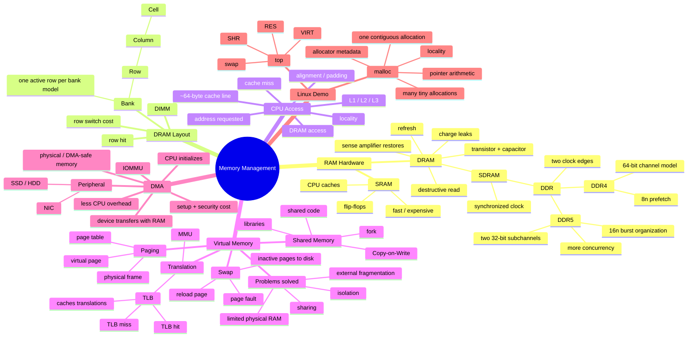
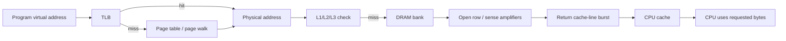
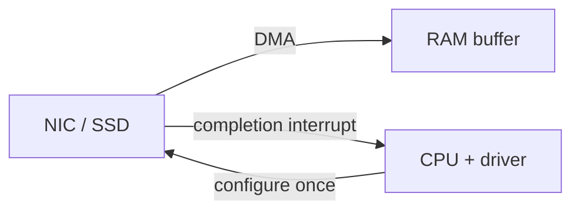

# Memory Management — Mind Map

```mermaid
mindmap
  root((Memory Management))
    RAM Hardware
      SRAM
        flip-flops
        fast / expensive
        CPU caches
      DRAM
        transistor + capacitor
        charge leaks
        refresh
        destructive read
        sense amplifier restores
        SDRAM
          synchronized clock
          DDR
            two clock edges
            DDR4
              64-bit channel model
              8n prefetch
            DDR5
              two 32-bit subchannels
              16n burst organization
              more concurrency
    DRAM Layout
      DIMM
      Bank
        one active row per bank model
        Row
          Column
            Cell
      row hit
      row switch cost
    CPU Access
      address requested
      L1 / L2 / L3
      cache miss
      DRAM access
      ~64-byte cache line
      locality
      alignment / padding
    Virtual Memory
      Problems solved
        external fragmentation
        isolation
        sharing
        limited physical RAM
      Paging
        virtual page
        physical frame
        page table
      Translation
        MMU
        TLB
          caches translations
          TLB hit
          TLB miss
      Shared Memory
        libraries
        shared code
        fork
        Copy-on-Write
      Swap
        inactive pages to disk
        page fault
        reload page
    DMA
      Peripheral
        NIC
        SSD / HDD
      CPU initializes
      device transfers with RAM
      physical / DMA-safe memory
      IOMMU
      less CPU overhead
      setup + security cost
    Linux Demo
      top
        VIRT
        RES
        SHR
        swap
      malloc
        many tiny allocations
        allocator metadata
        one contiguous allocation
        pointer arithmetic
        locality
```

## One-path memory read

```mermaid
flowchart LR
    A[Program virtual address] --> B[TLB]
    B -->|hit| D[Physical address]
    B -->|miss| C[Page table / page walk]
    C --> D
    D --> E[L1/L2/L3 check]
    E -->|miss| F[DRAM bank]
    F --> G[Open row / sense amplifiers]
    G --> H[Return cache-line burst]
    H --> I[CPU cache]
    I --> J[CPU uses requested bytes]
```

## One-path device transfer

```mermaid
flowchart LR
    A[NIC / SSD] -->|DMA| B[RAM buffer]
    C[CPU + driver] -->|configure once| A
    A -->|completion interrupt| C
```
