# Memory Management

> **Slides:** 122–179  
> **Goal:** understand what RAM really is, how the CPU reaches it, why virtual memory exists, and how DMA avoids wasting CPU cycles.

---

## Table of Contents

1. [The Big Picture](#1-the-big-picture)
2. [What Counts as Memory?](#2-what-counts-as-memory)
3. [SRAM → DRAM → SDRAM → DDR](#3-sram--dram--sdram--ddr)
4. [DDR4 vs DDR5](#4-ddr4-vs-ddr5)
5. [Inside DRAM: Banks, Rows, Columns, Cells](#5-inside-dram-banks-rows-columns-cells)
6. [The Full CPU Read Journey](#6-the-full-cpu-read-journey)
7. [Writing to Memory](#7-writing-to-memory)
8. [Alignment + Locality](#8-alignment--locality)
9. [Why Virtual Memory Exists](#9-why-virtual-memory-exists)
10. [Fragmentation](#10-fragmentation)
11. [Pages, Page Tables, MMU and TLB](#11-pages-page-tables-mmu-and-tlb)
12. [Shared Memory + Copy-on-Write](#12-shared-memory--copy-on-write)
13. [Swap + Page Faults](#13-swap--page-faults)
14. [DMA — Direct Memory Access](#14-dma--direct-memory-access)
15. [Linux `top`: Memory Fields](#15-linux-top-memory-fields)
16. [`malloc()` Demo: Many Allocations vs One Big Allocation](#16-malloc-demo-many-allocations-vs-one-big-allocation)
17. [Fast Revision](#17-fast-revision)
18. [References](#18-references)

---

# 1. The Big Picture

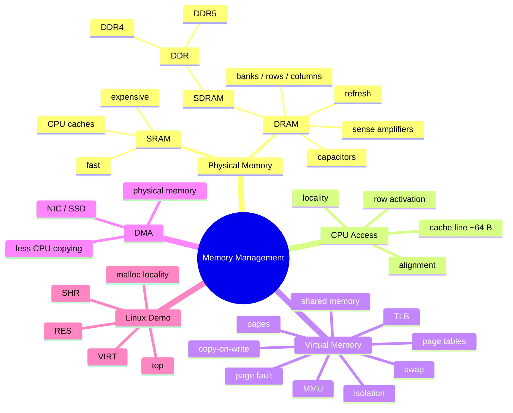
```mermaid
mindmap
  root((Memory Management))
    Physical Memory
      SRAM
        CPU caches
        fast
        expensive
      DRAM
        capacitors
        refresh
        sense amplifiers
        banks / rows / columns
        SDRAM
          DDR
            DDR4
            DDR5
    CPU Access
      cache line ~64 B
      row activation
      locality
      alignment
    Virtual Memory
      pages
      page tables
      MMU
      TLB
      isolation
      shared memory
      copy-on-write
      swap
      page fault
    DMA
      NIC / SSD
      physical memory
      less CPU copying
    Linux Demo
      top
      VIRT
      RES
      SHR
      malloc locality
```

**The complete story:**

```text
Program uses a virtual address
        ↓
CPU / MMU translates it
        ↓
TLB may already know the translation
        ↓
Physical RAM address
        ↓
DRAM bank → row → column
        ↓
Data reaches CPU caches
        ↓
CPU executes
```

---

# 2. What Counts as Memory?

The names are easier if you separate **storage** from **RAM**:

```text
Computer data
│
├── Persistent storage
│   ├── HDD
│   └── SSD
│
└── Volatile working memory
    └── RAM
        ├── SRAM  → mainly CPU caches
        └── DRAM  → main memory
            └── SDRAM
                └── DDR SDRAM
                    ├── DDR4
                    └── DDR5
```

| Thing | What it is | Keeps data after power-off? | Main use |
|---|---|---:|---|
| HDD | magnetic storage | ✅ | files |
| SSD | flash storage | ✅ | files / OS / DB files |
| SRAM | very fast RAM | ❌ | CPU caches |
| DRAM | cheaper, dense RAM | ❌ | main system RAM |
| SDRAM | clock-synchronized DRAM | ❌ | modern RAM family |
| DDR4 / DDR5 | generations of DDR SDRAM | ❌ | modern DIMMs |

<p align="center">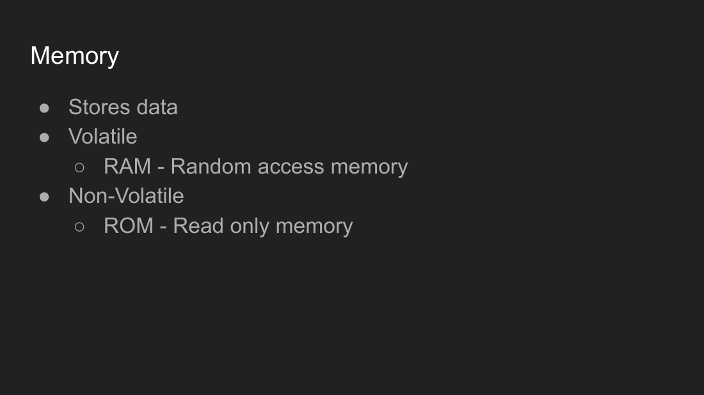</p>

---

# 3. SRAM → DRAM → SDRAM → DDR

## SRAM — Static RAM

- One bit is held using a **flip-flop** built from multiple transistors.
- Very fast.
- Expensive and less dense.
- Common use: **L1/L2/L3 CPU caches**.

<p align="center">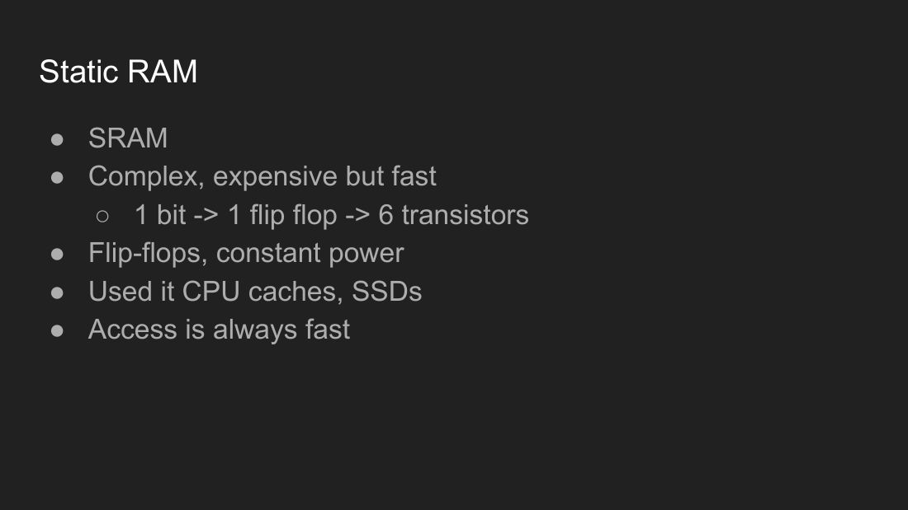</p>

## DRAM — Dynamic RAM

A simplified DRAM cell:

```text
        transistor
            │
            ▼
       [ capacitor ]  ← charge ≈ stored bit
```

- Cheaper and denser than SRAM.
- Capacitors leak charge → they must be **refreshed**.
- Reading a DRAM cell **disturbs** its tiny charge.
- The **sense amplifier** detects the weak signal and restores the value while the row is active.

```text
weak capacitor signal
        ↓
sense amplifier
        ↓
strong 0 / 1
   ├── used for the read
   └── restores the cell
```

> The CPU does **not** issue a software `restore()` after every read. The DRAM circuitry handles the restore as part of row activation/sensing.

<p align="center">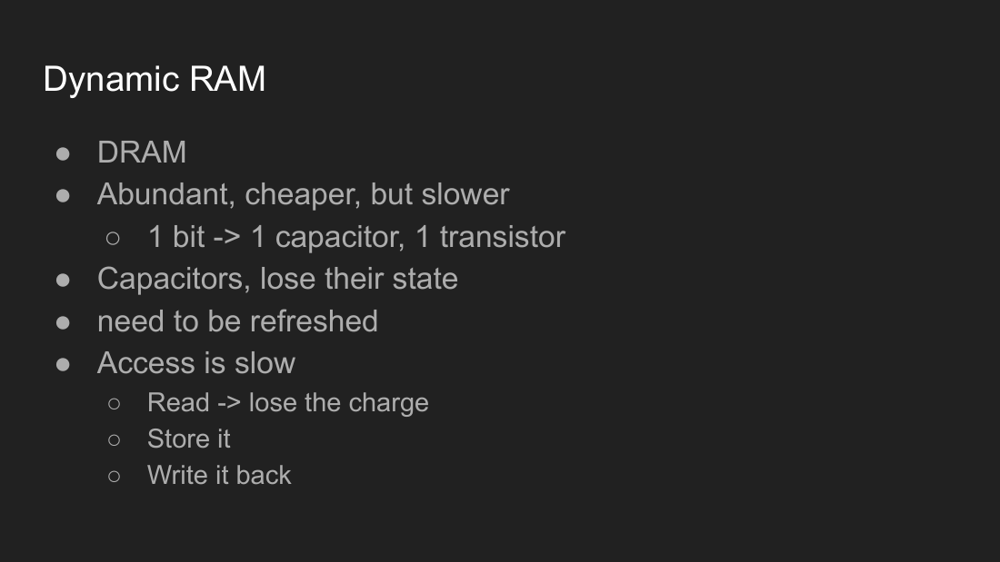</p>

## Asynchronous DRAM → SDRAM

Old asynchronous DRAM had CPU/RAM clocks that were not coordinated, so useful clock opportunities could be missed.

<p align="center">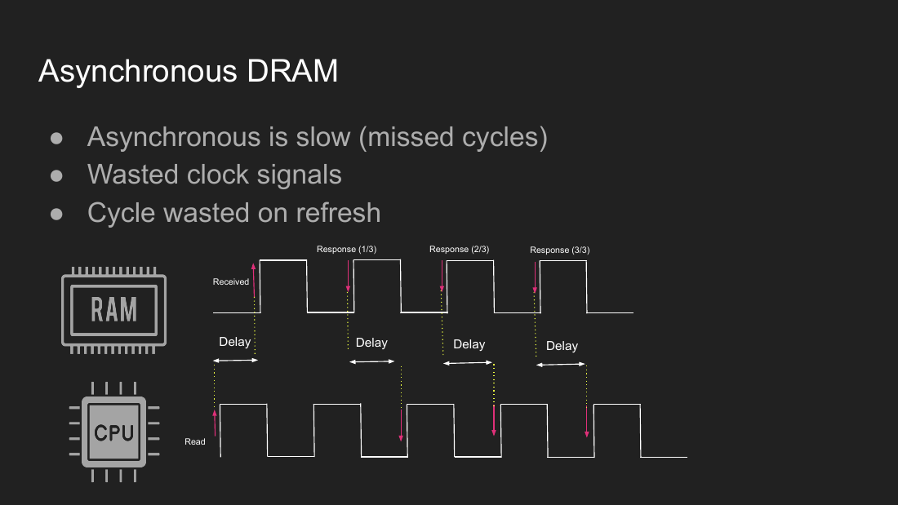</p>

**SDRAM = Synchronous DRAM**: RAM operations are coordinated with a clock.

<p align="center">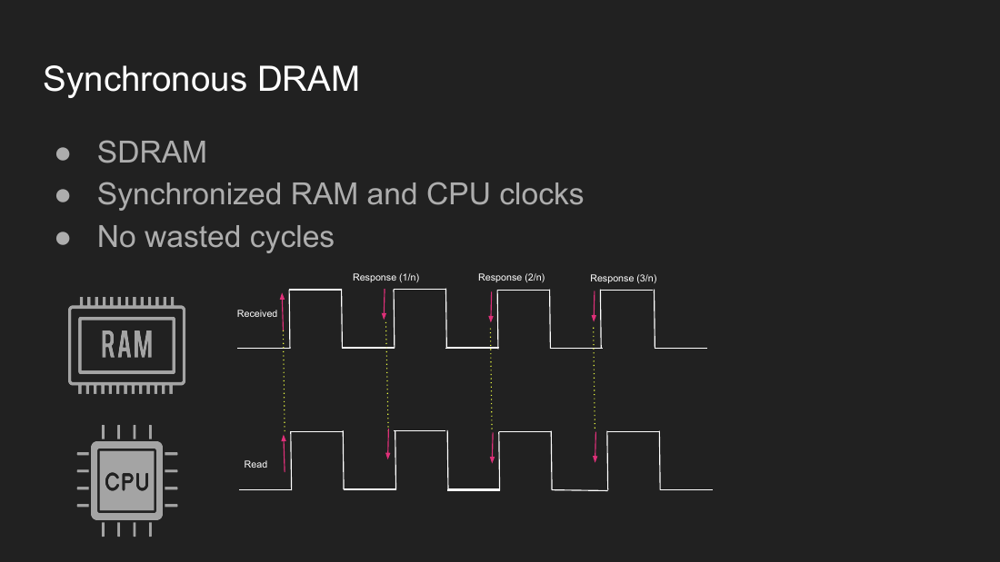</p>

## DDR — Double Data Rate

DDR transfers data on **both clock edges**:

```text
      ┌──────┐
──────┘      └──────
      ↑      ↑
   transfer transfer
```

`DDR4` and `DDR5` are **generations**. The `4` and `5` do not mean four or five transfers.

<p align="center">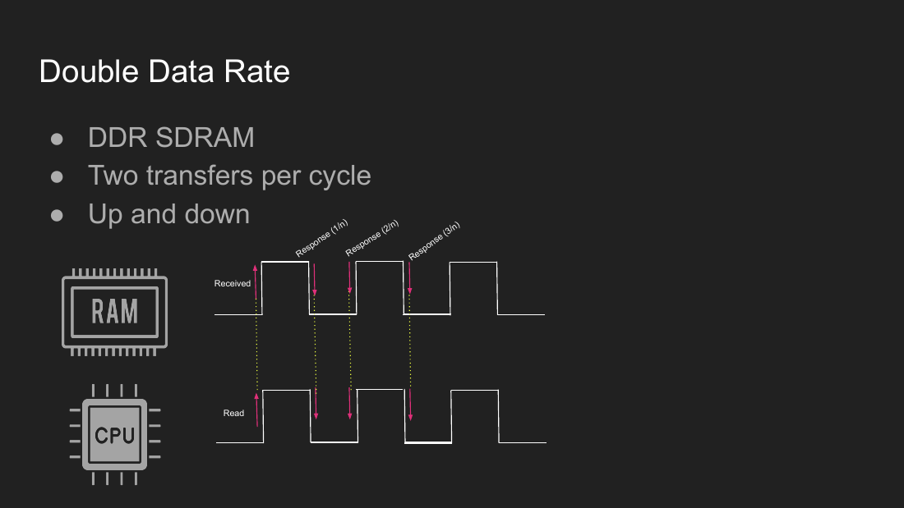</p>

---

# 4. DDR4 vs DDR5

Keep the lecture's simplified model:

## DDR4

```text
64 data lines × 8-bit prefetch = 512 bits = 64 bytes
```

The CPU commonly consumes memory in **~64-byte cache lines**, so one burst fits nicely.

<p align="center">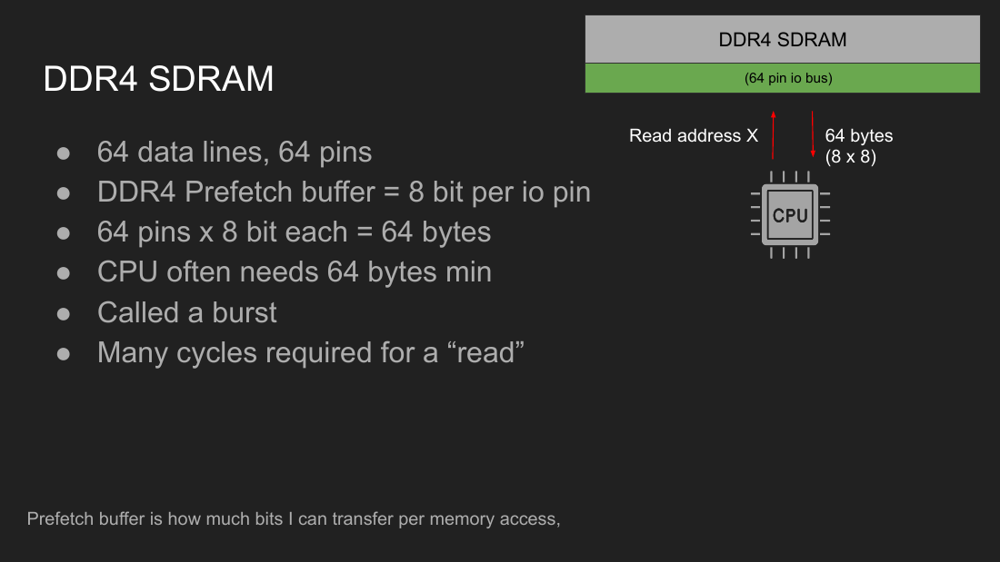</p>

## DDR5

DDR5 splits the DIMM into **two more-independent 32-bit subchannels** and uses a larger burst/prefetch organization:

```text
Channel A: 32 × 16 bits = 64 B
Channel B: 32 × 16 bits = 64 B
```

The important idea is **more concurrency / less contention**, not “a single read magically becomes twice as fast.”

```text
DDR4 simplified
Core A ─────► one channel
Core B ─────► may wait

DDR5 simplified
Core A ─────► Channel A
Core B ─────► Channel B
```

<p align="center">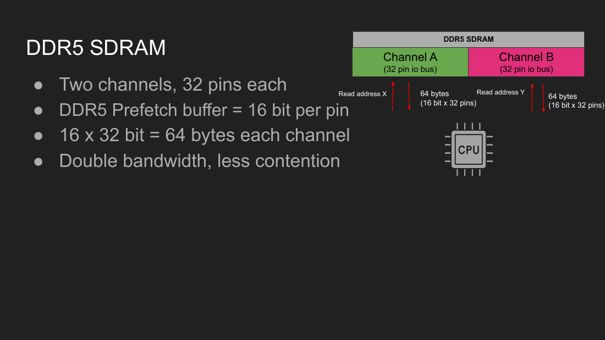</p>

---

# 5. Inside DRAM: Banks, Rows, Columns, Cells

```text
DIMM
└── banks
    └── rows
        └── columns
            └── cells
                └── capacitor + transistor
```

<p align="center">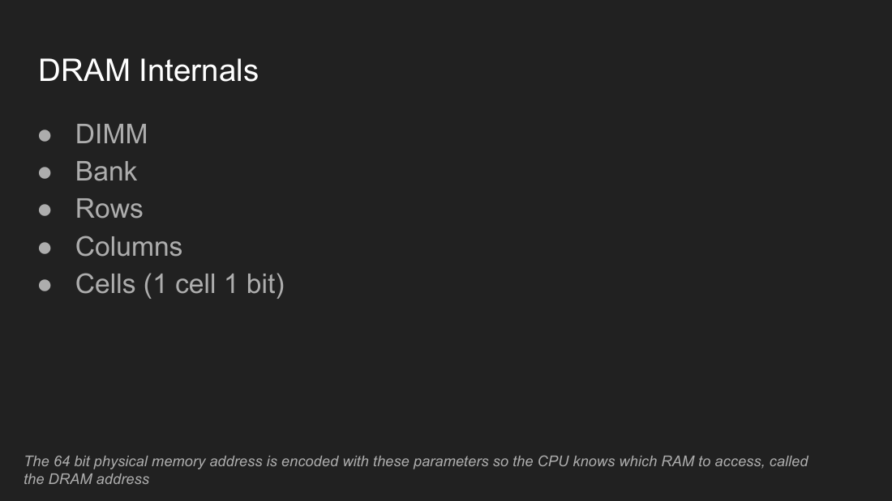</p>

A physical RAM address is eventually interpreted by the memory system to select things such as a **bank, row and column**.

## Opening a row

A bank shares sense-amplifier / row-buffer circuitry. In the simplified model, **one row per bank is active at a time**.

```text
Bank
│
├── Row 41   closed
├── Row 42   OPEN  ─────► sense amplifiers / row buffer
├── Row 43   closed
└── ...
```

If the next access is in the already-open row → cheaper **row hit**.

If another row in that bank is needed:

```text
close / precharge current row
        ↓
activate new row
        ↓
sense its contents
```

That extra work contributes to memory latency.

<p align="center">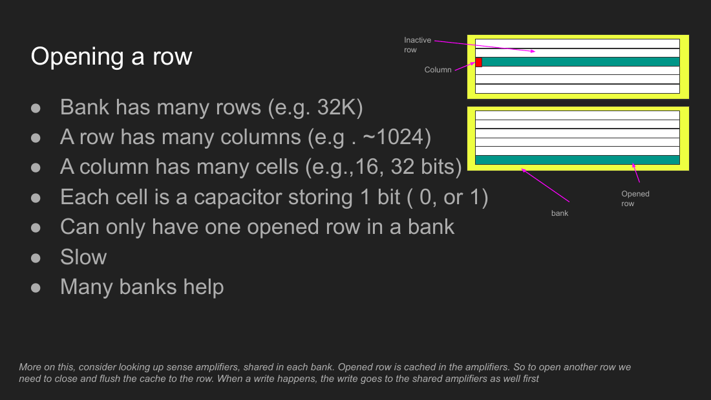</p>

---

# 6. The Full CPU Read Journey

Suppose code needs data or the next instruction.

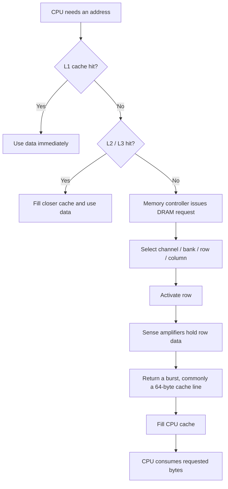
```mermaid
flowchart TD
    A[CPU needs an address] --> B{L1 cache hit?}
    B -- Yes --> C[Use data immediately]
    B -- No --> D{L2 / L3 hit?}
    D -- Yes --> E[Fill closer cache and use data]
    D -- No --> F[Memory controller issues DRAM request]
    F --> G[Select channel / bank / row / column]
    G --> H[Activate row]
    H --> I[Sense amplifiers hold row data]
    I --> J[Return a burst, commonly a 64-byte cache line]
    J --> K[Fill CPU cache]
    K --> L[CPU consumes requested bytes]
```

The CPU may ask for one instruction, but the memory hierarchy brings a **larger nearby chunk** because locality is valuable.

<p align="center">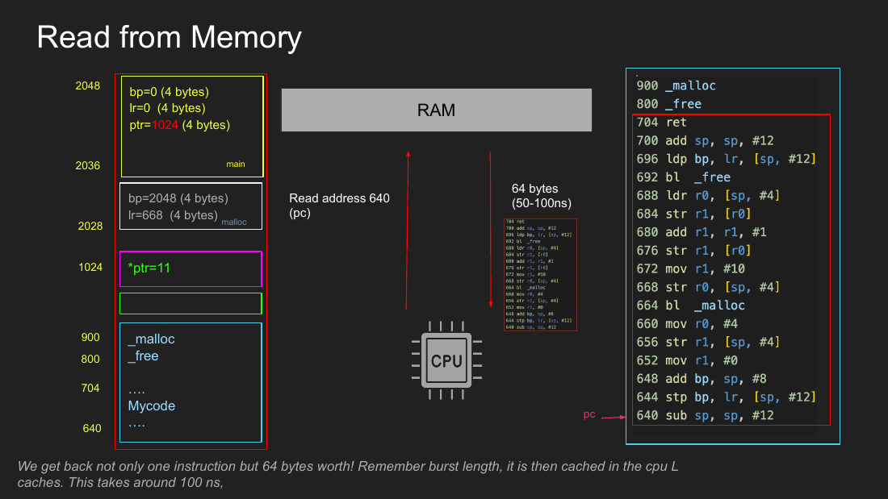</p>

### Why nearby accesses are powerful

```text
array[100]  ← RAM trip may fetch a cache line
array[101]  ← likely already nearby
array[102]  ← likely already nearby
array[103]  ← likely already nearby
```

Random jumping can waste those fetched cache lines and create more DRAM work.

---

# 7. Writing to Memory

At the conceptual DRAM level:

```text
CPU wants to modify address X
        ↓
locate bank / row
        ↓
activate row into sense amplifiers
        ↓
modify relevant bits in row buffer
        ↓
DRAM circuitry restores / writes row state
```

Do not picture the CPU manually reaching a capacitor with a tiny wire. The memory controller and DRAM device perform the protocol.

---

# 8. Alignment + Locality

Common sizes:

```text
char    1 B
short   2 B
int     4 B
double  8 B
```

Compilers may insert **padding** so fields meet alignment requirements.

```c
struct Bad {
    char   c;
    double d;
    short  s;
    int    i;
};
```

can contain more padding than a better field order.

Why we care in this course:

```text
less padding
   ↓
more useful data per cache line
   ↓
fewer memory/cache-line accesses
```

<p align="center">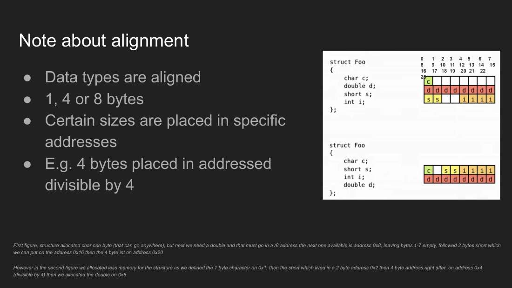</p>

---

# 9. Why Virtual Memory Exists

Directly exposing raw physical RAM to every process creates problems:

- **fragmentation**
- difficult **isolation**
- awkward **sharing**
- physical RAM has a finite size

Virtual memory gives each process its own clean address-space view:

```text
Process A                 Process B
virtual 0x1000            virtual 0x1000
     │                          │
     ▼                          ▼
physical frame 91         physical frame 12
```

Same virtual number, completely different physical location.

---

# 10. Fragmentation

## External fragmentation

Enough memory exists in total, but the free regions are scattered:

```text
[USED][FREE][USED][FREE][USED][FREE]
```

A large contiguous allocation may not fit.

**External = holes BETWEEN allocations.**

## Internal fragmentation

With fixed-size pages, the OS may allocate more than the program currently uses:

```text
4 KB page
[ 1 KB useful | 3 KB unused ]
```

**Internal = waste INSIDE an allocated block/page.**

Paging strongly reduces the “must find one giant contiguous physical region” problem, but fixed-sized allocation can still waste space internally.

---

# 11. Pages, Page Tables, MMU and TLB

## Paging

The lecture uses a common example page size of **4 KB**.

```text
Virtual address space
[P1][P2][P3][P4]
 │   │   │   │
 ▼   ▼   ▼   ▼
physical frames can be scattered anywhere
```

<p align="center">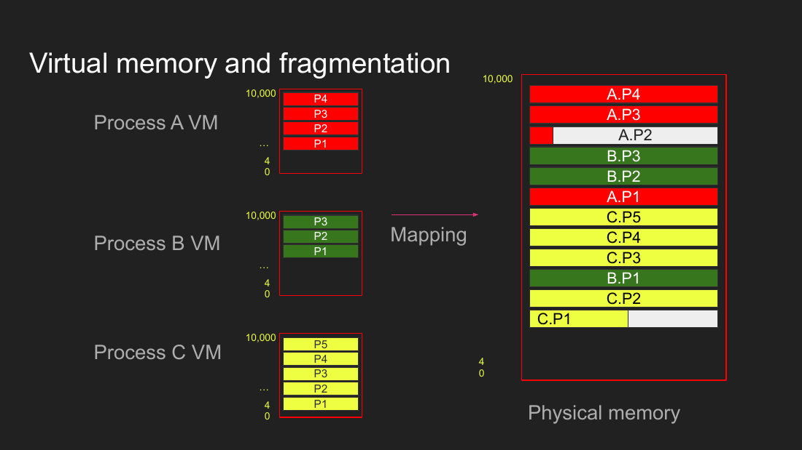</p>

## Page table

Each process has mappings like:

```text
virtual page 1 → physical frame 37
virtual page 2 → physical frame 4
virtual page 3 → physical frame 81
```

<p align="center">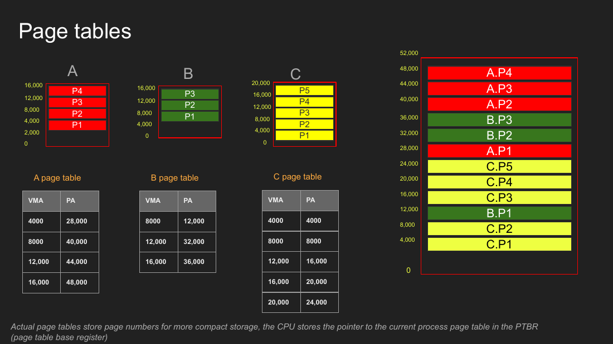</p>

## MMU

**MMU = Memory Management Unit**.

Hardware involved in translating the virtual address used by the CPU into the physical address needed to access memory.

## TLB

**TLB = Translation Lookaside Buffer**.

It caches recent **address translations**, not normal program data.

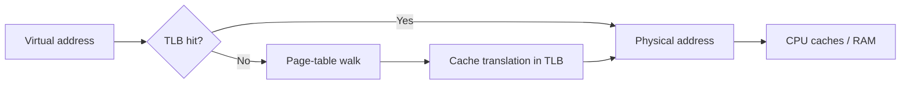
```mermaid
flowchart LR
    A[Virtual address] --> B{TLB hit?}
    B -- Yes --> C[Physical address]
    B -- No --> D[Page-table walk]
    D --> E[Cache translation in TLB]
    E --> C
    C --> F[CPU caches / RAM]
```

| Cache | Stores |
|---|---|
| L1 / L2 / L3 | program data + instructions |
| TLB | virtual → physical translations |

A TLB miss means translation work must be done before the real memory access can continue.

---

# 12. Shared Memory + Copy-on-Write

## Shared physical pages

Virtual memory makes this elegant:

```text
Process A virtual page ──┐
                         ├──► same physical frame
Process B virtual page ──┘
```

Useful for:

- shared libraries such as `libc`
- multiple processes using the same code
- database shared buffers
- proxies / servers
- `fork()`

<p align="center">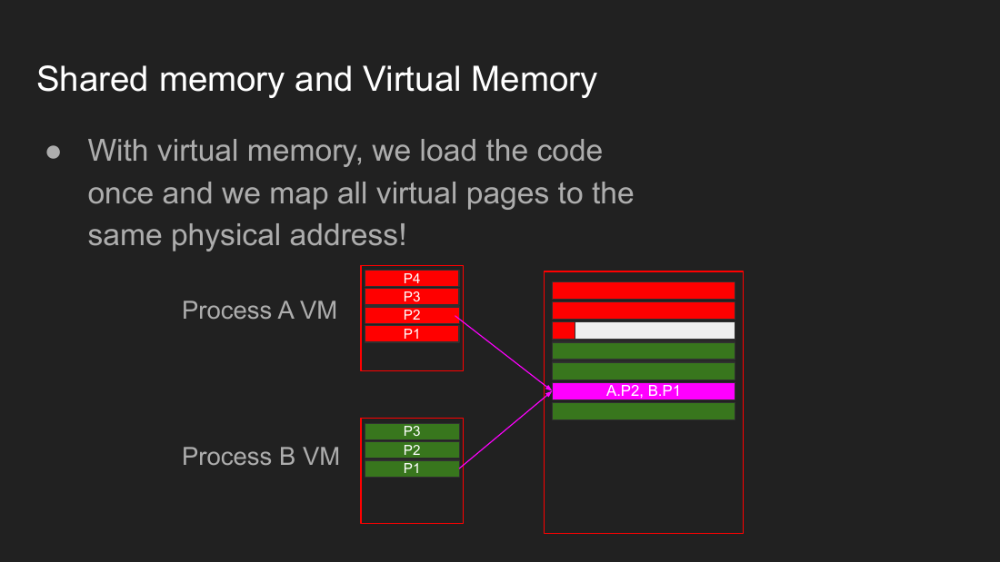</p>

## Copy-on-Write (CoW)

After `fork()`, parent and child can initially share pages.

```text
Parent ─┐
        ├── shared physical page
Child ──┘
```

If the child writes:

```text
write attempted
      ↓
OS copies that page
      ↓
child mapping → new copy
parent mapping → original
```

This is why `fork()` does **not** need to eagerly copy the entire address space.

The lecture connects this to real systems such as Redis snapshots.

## Isolation

Because a process can only use its mappings, `Process A: 0x1000` does not mean the same physical memory as `Process B: 0x1000`.

<p align="center">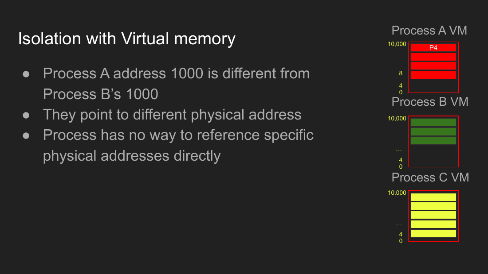</p>

---

# 13. Swap + Page Faults

If physical RAM is under pressure, the OS can move less-active pages to storage.

```text
RAM page
   ↓
SWAP on SSD/HDD
```

The process still thinks in virtual addresses.

<p align="center">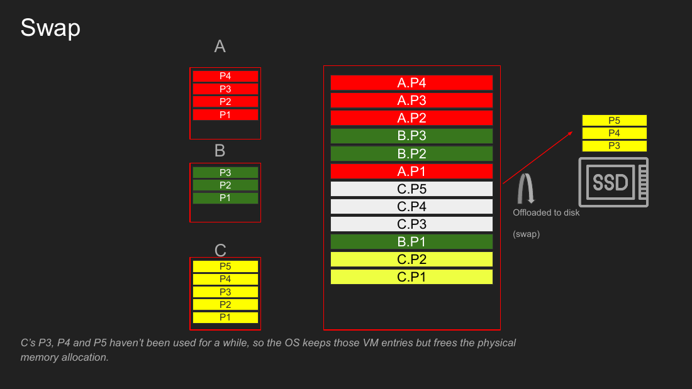</p>

Later the process accesses that page:

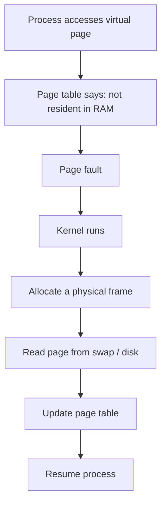
```mermaid
flowchart TD
    A[Process accesses virtual page] --> B[Page table says: not resident in RAM]
    B --> C[Page fault]
    C --> D[Kernel runs]
    D --> E[Allocate a physical frame]
    E --> F[Read page from swap / disk]
    F --> G[Update page table]
    G --> H[Resume process]
```

Disk is far slower than RAM, so heavy swapping can make a system feel extremely slow.

<p align="center">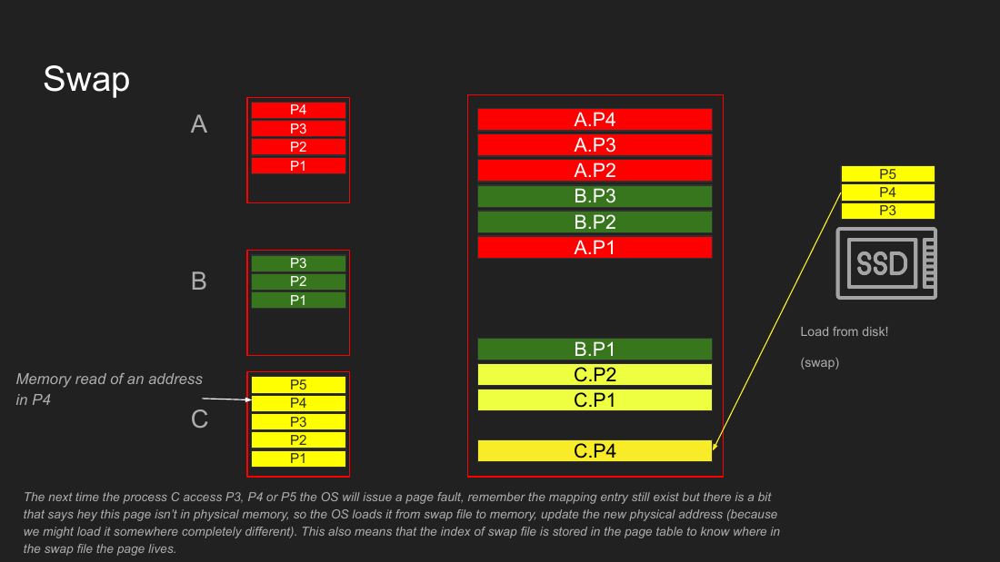</p>

## Cost of virtual memory

Virtual memory solves major problems, but adds:

- translation
- page tables
- MMU/TLB complexity
- TLB misses
- page faults
- bookkeeping

<p align="center">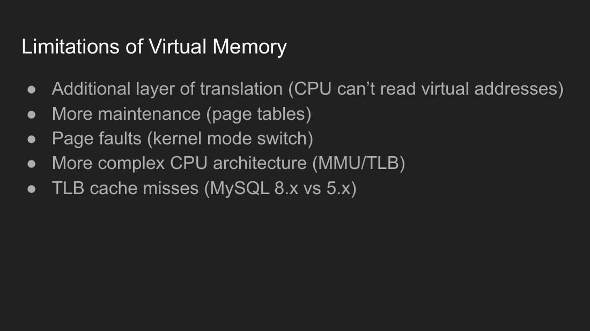</p>

---

# 14. DMA — Direct Memory Access

A **peripheral** is a device such as a NIC, SSD, HDD, keyboard, mouse, etc.

For tiny control events such as keyboard input, CPU interrupts are fine. For large byte transfers, making the CPU copy every chunk is wasteful.

## Without DMA

```text
NIC / SSD
   ↓
  CPU      ← CPU wastes work copying
   ↓
  RAM
```

## With DMA

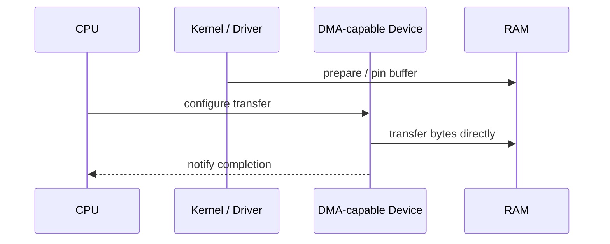
```mermaid
sequenceDiagram
    participant CPU
    participant K as Kernel / Driver
    participant D as DMA-capable Device
    participant R as RAM

    K->>R: prepare / pin buffer
    CPU->>D: configure transfer
    D->>R: transfer bytes directly
    D-->>CPU: notify completion
```

**DMA = hardware-supported direct transfer between a device and RAM with much less CPU involvement.**

<p align="center">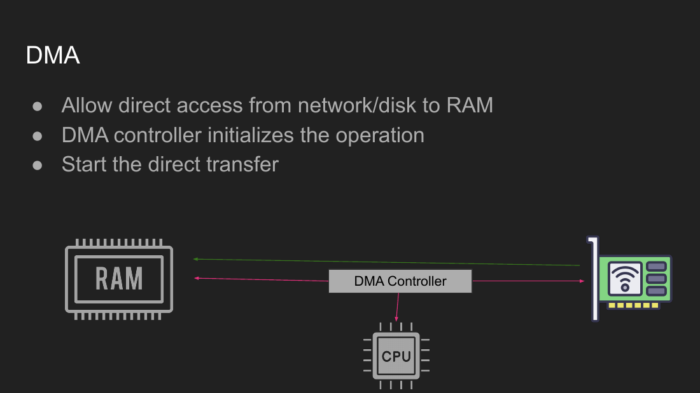</p>

### Why physical addresses matter

A basic DMA device does not automatically understand a process's virtual addresses. The kernel/driver must prepare memory suitable for DMA; modern systems may also use an **IOMMU** to safely translate/restrict device memory accesses.

<p align="center">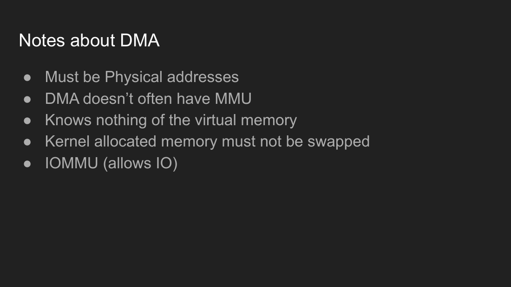</p>

### `O_DIRECT`

The lecture connects DMA to database/file I/O and `O_DIRECT`: an OS/filesystem option that can bypass normal filesystem page-cache behavior for compatible I/O paths.

<p align="center">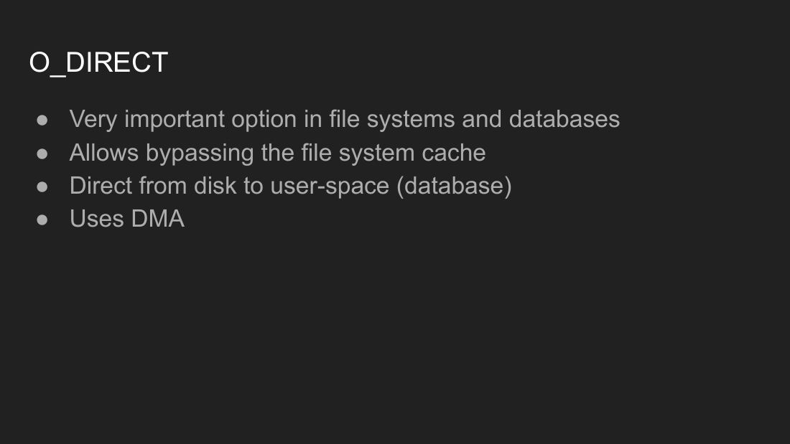</p>

### DMA trade-off

**Good:**
- efficient large transfers
- less CPU copying
- device ↔ memory data path

**Costs:**
- setup complexity
- buffer management
- security concerns
- not worthwhile for every tiny operation

---

# 15. Linux `top`: Memory Fields

The memory demo uses `top`:

```bash
top
```

System-level fields:

| Field | Meaning |
|---|---|
| total | installed/usable physical RAM shown by Linux |
| free | currently unused RAM |
| used | memory currently counted as used |
| buff/cache | kernel caches/buffers that can often be reclaimed |
| available | estimate of memory available for new work without heavy swapping |
| swap | disk-backed swap space |

Process-level fields:

| Field | Mental model |
|---|---|
| `VIRT` | virtual address space associated with the process |
| `RES` | resident physical RAM currently held by the process |
| `SHR` | resident memory that may be shared |

Do **not** read `VIRT = 10 GB` as “this process currently occupies 10 GB of RAM.”

---

# 16. `malloc()` Demo: Many Allocations vs One Big Allocation

The demo models ~1,000,000 packets.

## Version A — many allocations

```c
Packet **packets = malloc(N * sizeof(Packet *));

for (size_t i = 0; i < N; i++) {
    packets[i] = malloc(sizeof(Packet));
}
```

Costs include:

- allocator work repeated many times
- metadata/header overhead per allocation
- many separate heap objects
- worse locality potential

See [`code/alloc_many.c`](code/alloc_many.c).

## Version B — one contiguous allocation

```c
Packet *packets = malloc(N * sizeof(Packet));
```

Memory becomes:

```text
[Packet 0][Packet 1][Packet 2][Packet 3]...
```

Benefits:

- one allocator operation
- one large contiguous region
- less allocation metadata
- excellent sequential locality

See [`code/alloc_contiguous.c`](code/alloc_contiguous.c).

## Pointer arithmetic

If `sizeof(Packet) == 44`:

```c
packets + 1
```

does **not** mean “move 1 byte.” It means:

```text
address + 1 × sizeof(Packet)
        = address + 44 bytes
```

The C compiler scales pointer arithmetic by the pointed-to type.

### Run the demo

```bash
gcc -O2 -o alloc_many code/alloc_many.c
gcc -O2 -o alloc_contiguous code/alloc_contiguous.c

time ./alloc_many
time ./alloc_contiguous
```

Exact timings depend on machine, allocator, compiler, OS, and workload. The point is the **allocation strategy + locality**, not one guaranteed timing number.

---

# 17. Fast Revision

If you can explain these without notes, you understand the section:

- **SRAM** = fast/expensive RAM, mainly CPU caches.
- **DRAM** = dense/cheap main memory built around capacitor cells.
- DRAM capacitors leak → **refresh** is required.
- DRAM reads use **sense amplifiers**; the cell is restored as part of the operation.
- **SDRAM** synchronizes DRAM operation with a clock.
- **DDR** transfers on both clock edges.
- DDR5's major idea here: **more independent memory-channel work / less contention**.
- DRAM is organized into **banks → rows → columns → cells**.
- An already-open row can make nearby accesses cheaper.
- CPUs fetch chunks such as **cache lines**, not one lonely byte every time.
- **Spatial locality** = nearby data tends to be useful soon.
- **External fragmentation** = free holes between allocations.
- **Internal fragmentation** = wasted space inside allocated blocks/pages.
- **Virtual memory** separates process-visible addresses from physical RAM.
- **Page table** = virtual page → physical frame mapping.
- **MMU** performs/supports address translation.
- **TLB** caches translations.
- L1/L2/L3 cache **data/instructions**; TLB caches **address mappings**.
- Shared memory = multiple virtual mappings can reference the same physical page.
- **CoW** copies a shared page only when a write requires separation.
- **Swap** moves inactive pages from RAM to disk-backed space.
- A missing/non-resident page can trigger a **page fault**.
- **DMA** lets devices move large data directly to/from RAM with less CPU copying.
- `VIRT` is not the same thing as physical RAM actually resident (`RES`).
- One large contiguous allocation can outperform millions of tiny allocations.

---

# 18. References

Course visuals in this repository are extracted from **Fundamentals of Operating Systems, slides 122–179**.

Useful deeper references from the course material are collected in [`references/README.md`](references/README.md).

---

> **One-line mental model:**  
> **Physical DRAM is the real hardware; CPU caches hide its latency; virtual memory hides its physical layout; the TLB hides translation cost; DMA prevents the CPU from becoming a byte-copying middleman.**
