# Inside the CPU — Master Revision README

> **Course slice:** slides **179–217**  
> **Purpose:** one-file revision map for the entire CPU section — **CPU components → caches/coherence → NUMA → MMU/TLB → RISC/CISC → instruction lifecycle → pipelining/parallelism/SMT/SIMD → CPU-bound vs I/O-bound → bridge to processes & threads**.
>
> **Rule for this README:** rich enough to rebuild the lecture later, but organized for fast revision — **not an article**.

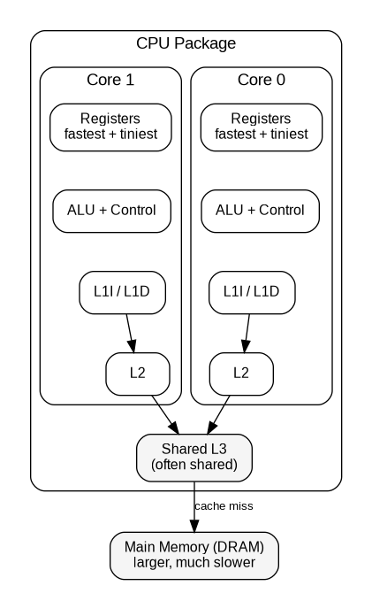

---

## Table of Contents

### A. Big Picture
1. [The whole CPU section in one picture](#1-the-whole-cpu-section-in-one-picture)
2. [The performance hierarchy you must remember](#2-the-performance-hierarchy-you-must-remember)

### B. Inside One CPU/Core
3. [CPU package vs physical core vs logical CPU](#3-cpu-package-vs-physical-core-vs-logical-cpu)
4. [ALU — arithmetic and logic](#4-alu--arithmetic-and-logic)
5. [Control logic — coordinate instruction execution](#5-control-logic--coordinate-instruction-execution)
6. [Registers — values already in the CPU's hands](#6-registers--values-already-in-the-cpus-hands)
7. [MMU — virtual memory reaches physical memory](#7-mmu--virtual-memory-reaches-physical-memory)
8. [TLB + ASID — make address translation fast](#8-tlb--asid--make-address-translation-fast)
9. [Interconnect / bus / memory path](#9-interconnect--bus--memory-path)

### C. Cache System & Multicore Memory
10. [L1 / L2 / L3](#10-l1--l2--l3)
11. [L1I vs L1D](#11-l1i-vs-l1d)
12. [Cache hit, miss, locality, and cache lines](#12-cache-hit-miss-locality-and-cache-lines)
13. [How multiple cores can cache the same value](#13-how-multiple-cores-can-cache-the-same-value)
14. [Cache coherence — how cores learn a value changed](#14-cache-coherence--how-cores-learn-a-value-changed)
15. [Cache invalidation, line bouncing, and false sharing preview](#15-cache-invalidation-line-bouncing-and-false-sharing-preview)
16. [Python / Copy-on-Write connection](#16-python--copy-on-write-connection)

### D. NUMA
17. [NUMA — what it actually means](#17-numa--what-it-actually-means)
18. [Local memory vs remote memory](#18-local-memory-vs-remote-memory)
19. [Why the OS and backend/database engineers care](#19-why-the-os-and-backenddatabase-engineers-care)

### E. Instruction Set & CPU Speed
20. [RISC vs CISC](#20-risc-vs-cisc)
21. [Clock speed — what GHz really means](#21-clock-speed--what-ghz-really-means)
22. [`memchr()` optimization lesson](#22-memchr-optimization-lesson)

### F. Instruction Lifecycle
23. [Fetch → Decode → Execute → Memory → Writeback](#23-fetch--decode--execute--memory--writeback)
24. [Worked example: `SUB SP, SP, 12`](#24-worked-example-sub-sp-sp-12)
25. [Program counter movement](#25-program-counter-movement)
26. [Function calls, instruction cache, and inlining](#26-function-calls-instruction-cache-and-inlining)

### G. How CPUs Avoid Sitting Idle
27. [Pipelining](#27-pipelining)
28. [Branch prediction + speculative execution](#28-branch-prediction--speculative-execution)
29. [Spectre connection](#29-spectre-connection)
30. [Parallelism](#30-parallelism)
31. [SMT / Hyper-Threading](#31-smt--hyper-threading)
32. [SIMD](#32-simd)
33. [Pipelining vs parallelism vs SMT vs SIMD](#33-pipelining-vs-parallelism-vs-smt-vs-simd)
34. [HTTP/1.1 pipelining analogy](#34-http11-pipelining-analogy)

### H. CPU-Bound vs I/O-Bound
35. [Two workload shapes](#35-two-workload-shapes)
36. [Linux `top`: `us sy ni id wa hi si st`](#36-linux-top-us-sy-ni-id-wa-hi-si-st)
37. [CPU-bound demo](#37-cpu-bound-demo)
38. [PostgreSQL I/O-bound demo](#38-postgresql-io-bound-demo)
39. [100% utilization vs saturation](#39-100-utilization-vs-saturation)
40. [PSI — pressure / stalls](#40-psi--pressure--stalls)

### I. Bridge to Processes & Threads
41. [Why this lecture comes before multiprocessing/multithreading](#41-why-this-lecture-comes-before-multiprocessingmultithreading)
42. [Context switch — what hardware state changes](#42-context-switch--what-hardware-state-changes)
43. [CPU-bound → think parallelism](#43-cpu-bound--think-parallelism)
44. [I/O-bound → think concurrency](#44-io-bound--think-concurrency)
45. [SMT changes what the scheduler sees](#45-smt-changes-what-the-scheduler-sees)
46. [NUMA + cache coherence become concurrency costs](#46-numa--cache-coherence-become-concurrency-costs)

### J. Revision
47. [Commands & mini experiments](#47-commands--mini-experiments)
48. [Slides worth revisiting](#48-slides-worth-revisiting)
49. [Common traps / corrections](#49-common-traps--corrections)
50. [2-minute master recap](#50-2-minute-master-recap)
51. [Ready-for-next-section checklist](#51-ready-for-next-section-checklist)

---

# A. Big Picture

## 1. The whole CPU section in one picture

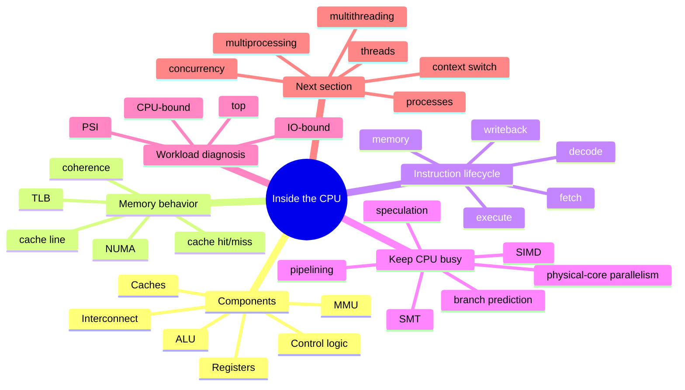
```mermaid
mindmap
  root((Inside the CPU))
    Components
      ALU
      Control logic
      Registers
      MMU
      Caches
      Interconnect
    Memory behavior
      TLB
      cache hit/miss
      cache line
      coherence
      NUMA
    Instruction lifecycle
      fetch
      decode
      execute
      memory
      writeback
    Keep CPU busy
      pipelining
      branch prediction
      speculation
      physical-core parallelism
      SMT
      SIMD
    Workload diagnosis
      CPU-bound
      IO-bound
      top
      PSI
    Next section
      processes
      threads
      context switch
      concurrency
      multiprocessing
      multithreading
```

### The lecture's main story

```text
Your program eventually becomes machine instructions
                    │
                    ▼
              CPU executes them
                    │
      ┌─────────────┼─────────────┐
      │             │             │
 instructions     data        addresses
      │             │             │
     L1I        registers/L1D      MMU/TLB
      │             │             │
      └─────── execution units ────┘
                    │
                    ▼
             results / memory
```

> **Memory stores active state. CPU executes.**  
> The rest of this section explains how the CPU avoids wasting time while executing.

---

## 2. The performance hierarchy you must remember

```text
Registers → L1 → L2 → L3/LLC → DRAM → storage/network
 fastest                                      much slower
 smallest                                      much larger
```

### Do not memorize exact latency numbers

The slides use rough values such as:

```text
registers     ~ tiny / sub-ns-ish scale
L1            ~ 1 ns-ish
L2            ~ few ns
L3            ~ ~10–20 ns-ish
DRAM          ~ tens to ~100 ns-ish
storage       far slower
```

Treat them as **relative intuition**, not universal constants.

### Why the hierarchy exists

```text
CPU is extremely fast
      │
      ├─ RAM is slower
      ├─ storage is vastly slower
      └─ network/dependencies can be slower again

Therefore:
keep useful instructions/data as close to execution as possible.
```

---

# B. Inside One CPU/Core

## 3. CPU package vs physical core vs logical CPU

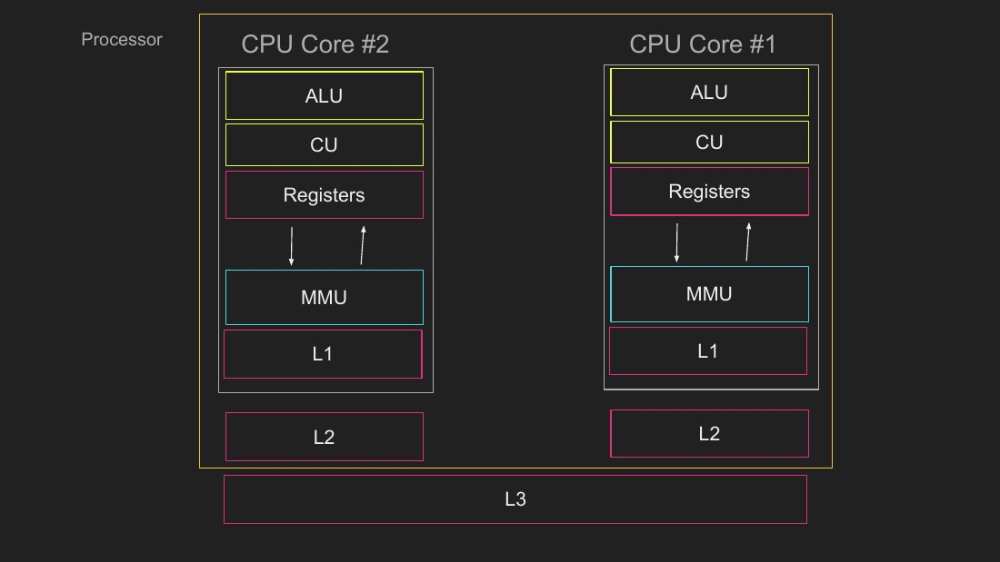

### CPU package / processor

A modern processor can contain multiple **physical cores**.

```text
CPU package
├── Physical Core 0
├── Physical Core 1
├── Physical Core 2
├── Physical Core 3
└── shared package resources
```

### Physical core

A core contains execution resources such as:

- architectural registers/state,
- integer/floating/vector execution resources,
- load/store machinery,
- control/front-end logic,
- private/near caches.

### Logical CPU

With SMT enabled, one physical core may expose multiple **logical CPUs / hardware threads** to the OS.

```text
Physical Core 0
├── Logical CPU 0
└── Logical CPU 1
```

> **Logical CPU ≠ full physical core.**

---

## 4. ALU — arithmetic and logic

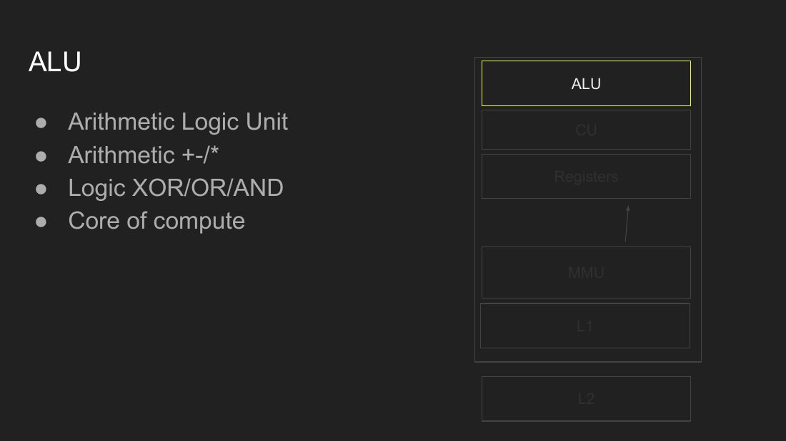

**ALU = Arithmetic Logic Unit**.

### Jobs

- addition,
- subtraction,
- logical AND / OR / XOR,
- comparisons,
- other integer operations depending on the processor.

### Correct mental model

```text
high-level meaning: "reduce the stack pointer"
           │
           ▼
control logic reads operands
           │
           ▼
ALU receives raw values + operation
           │
           ▼
100 - 12 = 88
```

The ALU does **not** understand:

```text
"stack frame"
"Python object"
"database row"
```

It operates on values and hardware operations.

### Gate-level note

Addition can ultimately be implemented using digital logic such as XOR / AND / OR and full/half adders.

**Do not memorize the gate equations for this course.**  
The important bridge is:

```text
ADD instruction
   ↓ decode
control signals
   ↓
physical digital circuitry
```

---

## 5. Control logic — coordinate instruction execution

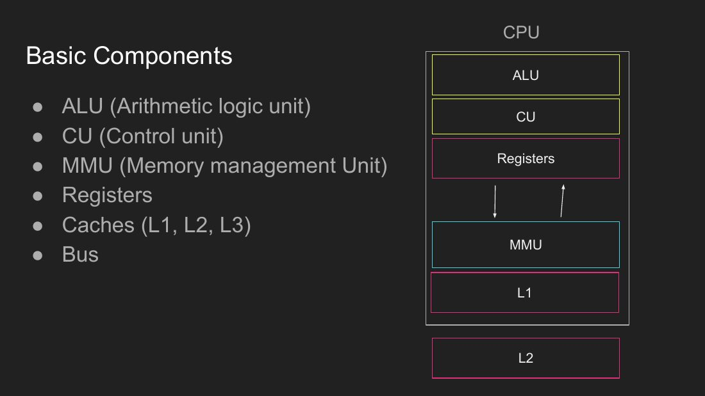

The lecture calls this the **Control Unit**.

Use it as a teaching abstraction for the CPU machinery that:

- fetches / coordinates instruction fetch,
- decodes opcode + operands,
- determines what resources are needed,
- sends work toward execution units,
- coordinates register/memory reads and writeback.

### Execution does not always mean ALU

```text
ADD        → arithmetic execution unit
LOAD       → memory/load-store machinery
STORE      → memory/load-store machinery
MOV        → register/data path
BRANCH     → control-flow/branch machinery
```

> Modern CPUs are more complex than one literal box named `Control Unit`; keep the concept, not the oversimplified physical diagram.

---

## 6. Registers — values already in the CPU's hands

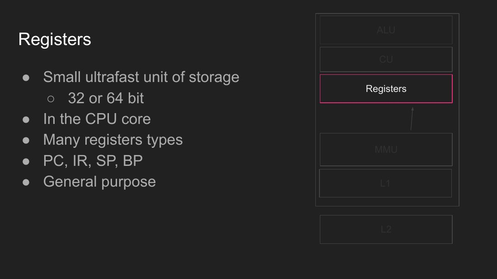

Registers are:

- tiny,
- extremely fast,
- directly part of the CPU's architectural execution state.

### Mental model

```text
RAM       = warehouse
Caches    = nearby shelves
Registers = values already in your hands
```

### Registers already seen earlier in the OS course

| Register / concept | Purpose |
|---|---|
| **PC / IP** | Program counter / instruction pointer — where execution continues |
| **SP** | Stack pointer |
| **BP / FP** | Base/frame pointer when used |
| **General-purpose registers** | operands, addresses, temporary values, results |
| internal instruction state | design-dependent CPU state |

### 32-bit vs 64-bit

A 64-bit general-purpose register can hold 64 bits = 8 bytes.

But:

```text
64-bit CPU
   ≠
automatically 2× faster than 32-bit CPU
```

Software/compiler/ISA must actually exploit available capabilities.

---

## 7. MMU — virtual memory reaches physical memory

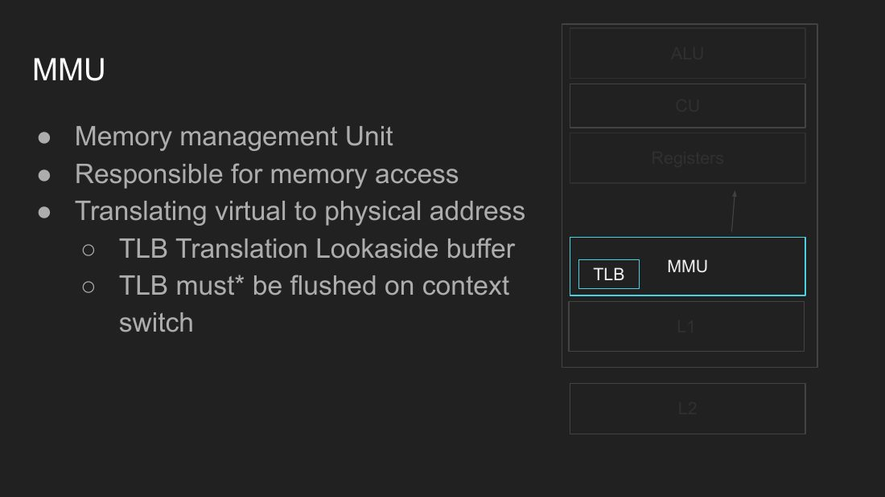

**MMU = Memory Management Unit**.

Your process uses **virtual addresses**.

```text
process sees
VA 0x1234...
      │
      ▼
     MMU
      │
      ▼
physical memory location
```

### Connection to the previous Memory Management section

```text
CPU issues virtual address
         │
         ▼
        TLB
      hit / miss
         │
         ├─ hit → physical translation
         │
         └─ miss → page-table walk
                       │
                       ▼
                physical translation
```

The MMU is a major reason CPU architecture and OS memory management are inseparable.

### DMA clarification

The course's important DMA idea:

> DMA lets devices transfer data to/from memory without forcing the CPU to copy every byte itself.

Do **not** generalize this to:

> “DMA always bypasses every form of address translation.”

Modern systems can use an **IOMMU** for device translation/protection.

---

## 8. TLB + ASID — make address translation fast

**TLB = Translation Lookaside Buffer**.

It caches recent virtual-page → physical-frame translations.

```text
Virtual address
      │
      ▼
     TLB
   ┌──┴──┐
 hit    miss
  │       │
  ▼       ▼
 PA    page-table walk
```

### Why context switches create a problem

```text
Process A: VA 0x1000 → PA 0xAAAA
Process B: VA 0x1000 → PA 0xBBBB
```

Same virtual address. Different process. Different physical page.

A stale translation from A cannot be blindly used for B.

### Simple teaching model

```text
switch address spaces
       ↓
flush relevant TLB entries
```

### ASID idea

Modern CPUs can tag translations by address space.

```text
(ASID A, VA 0x1000) → PA 0xAAAA
(ASID B, VA 0x1000) → PA 0xBBBB
```

This allows multiple processes' translations to coexist and can reduce TLB flush overhead.

> Different architectures use different names/mechanisms; **ASID** is the important idea here.

---

## 9. Interconnect / bus / memory path

The lecture draws cores/caches connected through buses toward DRAM.

Use the modern-safe mental model:

```text
Core
 ↓
private caches
 ↓
shared cache / interconnect
 ↓
memory controller / fabric
 ↓
DRAM channels / DIMMs
```

### Why this matters

A request that misses caches must travel through more hardware before reaching DRAM.

```text
L1 miss
 ↓
L2 miss
 ↓
L3 miss
 ↓
interconnect / memory controller
 ↓
DRAM bank/row/column machinery
```

### Course's multi-socket picture

The lecture uses two processors + two local memory regions connected by a shared-memory/interconnect system.

That is the bridge to **NUMA**.

### Important clarification

The lecture sometimes describes “locking the whole bus.” Treat that as an intuition for **contention**.

Modern server CPUs usually use sophisticated point-to-point interconnects/fabrics, not one simple global electrical bus shared by every core.

---

# C. Cache System & Multicore Memory

## 10. L1 / L2 / L3


### Relationship

```text
L1 → fastest / smallest / closest
L2 → larger / slower
L3 → larger again / often shared / slower
RAM → much larger / much slower
```

### Typical topology — not universal

```text
Core 0                  Core 1
├── L1                  ├── L1
└── L2                  └── L2
       \                 /
        └──── shared L3 ┘
                │
               DRAM
```

But processors vary:

- L1 is usually private to a core.
- L2 may be private or shared.
- L3/LLC is often shared by some/all cores.
- Some CPUs do not expose an L3 in this exact way.

> **Memorize hierarchy + locality, not one universal topology.**

---

## 11. L1I vs L1D

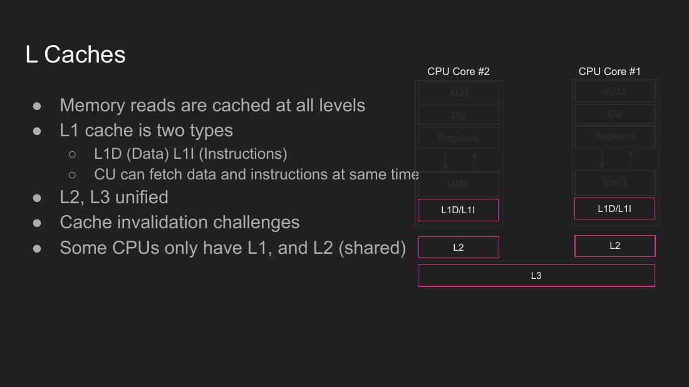

L1 is commonly split:

```text
L1I → Instruction cache
L1D → Data cache
```

### Why separate them?

```text
instruction fetch → L1I
load/store data   → L1D
```

The CPU can provide dedicated paths/resources for instruction fetch and data access.

Lower cache levels are often unified.

---

## 12. Cache hit, miss, locality, and cache lines

### Hit / miss

```text
Need X
  ↓
L1 hit? ─ yes → use quickly
  │ no
  ▼
L2 hit?
  │ no
  ▼
L3 hit?
  │ no
  ▼
DRAM
```

### Cache line

Caches transfer **blocks**, not individual high-level variables.

A common line size is **64 bytes**.

```text
┌────────────── one cache line ──────────────┐
│ A │ B │ nearby bytes / array elements ... │
└────────────────────────────────────────────┘
```

### Spatial locality

If you touch:

```text
arr[0]
```

you may soon touch:

```text
arr[1], arr[2], arr[3]...
```

Fetching nearby bytes together is therefore useful.

### Instruction locality

If PC points to instruction #1, the next instruction is often physically nearby.

```text
fetch one cache line of code
      ↓
next several instructions may hit L1I
```

---

## 13. How multiple cores can cache the same value

Start with memory containing:

```text
A = 1
```

Core 0 reads A:

```text
Core 0 L1: A = 1
```

Core 1 also reads A:

```text
Core 1 L1: A = 1
```

Now two caches contain copies of the same memory line.

```text
Core 0 L1            Core 1 L1
A = 1                A = 1
```

Nothing is wrong yet because both agree.

The problem appears when one writes.

---

## 14. Cache coherence — how cores learn a value changed

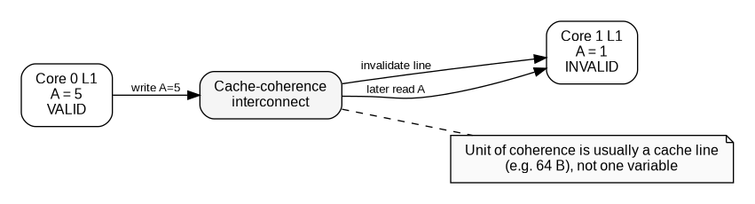

Core 0 changes A:

```text
Core 0: A = 5
Core 1: A = 1   ← stale if still considered valid
```

The CPU therefore has **hardware cache-coherence mechanisms**.

### Mental sequence

```text
Core 0 wants to write cache line containing A
                 │
                 ▼
    coherence controller / interconnect
                 │
                 ▼
other cached copies are invalidated / transitioned
                 │
                 ▼
Core 1 cannot keep treating old A=1 as valid
```

### Core-to-core communication is hardware

Not this:

```c
notify_other_core(A_changed);
```

Instead:

```text
cache controllers + coherence fabric + protocol
```

### MESI / MOESI

Common protocol families use states such as:

- Modified,
- Exclusive,
- Shared,
- Invalid.

You do **not** need the full state machine yet.

### Key sentence

> **Coherence keeps multiple cached copies of shared memory logically consistent.**

---

## 15. Cache invalidation, line bouncing, and false sharing preview

Suppose Core 0 and Core 1 repeatedly write the same cache line:

```text
Core 0 writes
   ↓
ownership / invalidation traffic
   ↓
Core 1 writes
   ↓
ownership / invalidation traffic
   ↓
Core 0 writes
   ↓
...
```

The cache line can **bounce** between cores.

### Why a different variable can still hurt

```text
same 64-byte cache line
┌─────────────────────────────────────────────┐
│ variable A used by Core 0 │ B used by Core 1│
└─────────────────────────────────────────────┘
```

Even though Core 0 and Core 1 modify **different variables**, the coherence unit tracks the line.

This is the seed of **false sharing** — a later multithreading performance topic.

---

## 16. Python / Copy-on-Write connection

The lecture revisits the Instagram/CPython story.

### Layered view

```text
Python object/reference count write
             │
             ▼
CPU writes cache line
             │
             ▼
coherence traffic may occur across cores
             │
             ▼
OS page becomes modified
             │
             ▼
Copy-on-Write sharing after fork can be broken
```

### Lesson

High-level “immutable” semantics do not mean the runtime performs zero writes.

Runtime metadata updates can have:

- CPU cache consequences,
- OS page/COW consequences,
- production memory consequences.

---

# D. NUMA

## 17. NUMA — what it actually means

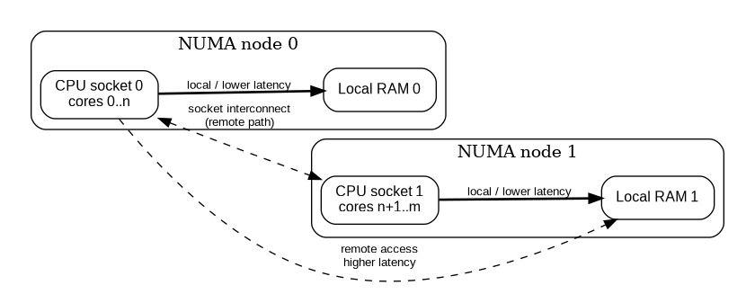

**NUMA = Non-Uniform Memory Access.**

### One-sentence definition

> A CPU can access system memory, but **some memory is closer to that CPU than other memory**, so access cost is not uniform.

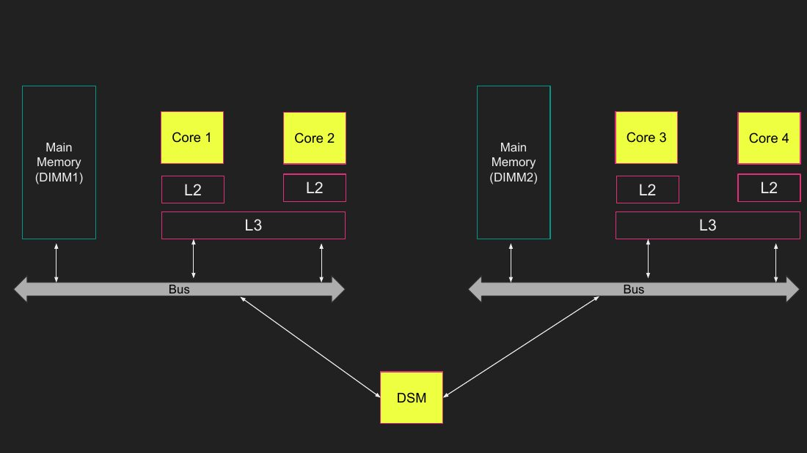

### Picture

```text
NUMA node 0                         NUMA node 1
┌──────────────┐                   ┌──────────────┐
│ CPU socket 0 │                   │ CPU socket 1 │
│ cores        │                   │ cores        │
└──────┬───────┘                   └──────┬───────┘
       │ local                            │ local
       ▼                                  ▼
      RAM 0                              RAM 1
       └──────── socket interconnect ──────┘
```

### What NUMA is NOT

- not cache coherence,
- not SMT,
- not “copy RAM twice”,
- not a programming language feature,
- not one special API.

It is primarily a **hardware topology / locality property**.

---

## 18. Local memory vs remote memory

For a core on node 0:

### Local

```text
Core on node 0
      │
      ▼
RAM on node 0
```

Usually lower latency / higher local bandwidth.

### Remote

```text
Core on node 0
      │
      ▼
inter-socket / fabric link
      │
      ▼
RAM on node 1
```

Extra distance/fabric traversal → usually more expensive.

### Why “Non-Uniform”

```text
same CPU instruction: LOAD X

X in local node   → cost A
X in remote node  → cost B

A ≠ B
```

---

## 19. Why the OS and backend/database engineers care

A running program has two placement questions:

```text
1. Where does my thread execute?
2. Where do its memory pages physically live?
```

Best locality:

```text
thread on node 0 + hot pages on node 0
```

Potentially worse:

```text
thread on node 0 + hot pages on node 1
```

### Later topics this leads to

- CPU affinity / pinning,
- memory placement,
- NUMA-aware allocators,
- per-node worker pools,
- database NUMA tuning,
- scheduler migration costs.

### Why it matters to backend/database systems

Large servers can have:

- dozens/hundreds of cores,
- multiple sockets,
- hundreds of GB/TB of RAM,
- billions of memory accesses.

A modest per-access locality penalty can become meaningful at scale.

### SoC/M1 intuition from the lecture

The lecture uses Apple SoC integration as an intuition: bringing components physically/topologically closer can reduce communication penalties.

Treat this as a **design intuition**, not “Apple removed NUMA as a universal rule.”

---

# E. Instruction Set & CPU Speed

## 20. RISC vs CISC

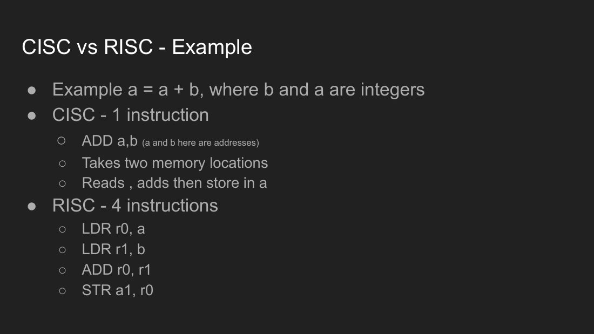

### The question CPU designers answer

> How much work should one machine instruction express?

### RISC — textbook mental model

**Reduced Instruction Set Computer**.

- smaller / more regular instruction set,
- simple load/store + register operations,
- historically designed for regular decode/pipeline behavior.

Classic families:

- ARM,
- RISC-V.

Example teaching sequence for:

```c
a = a + b;
```

```asm
LOAD A → R0
LOAD B → R1
ADD  R0, R1 → R0
STORE R0 → A
```

### CISC — textbook mental model

**Complex Instruction Set Computer**.

- richer instruction set,
- some instructions express more work,
- x86 is the classic example.

Conceptual example:

```text
one instruction may combine memory + arithmetic semantics
```

### Do NOT memorize these false absolutes

```text
RISC instruction = always exactly one cycle       ❌
CISC instruction = always many cycles              ❌
RISC always faster                                 ❌
CISC always slower                                 ❌
```

Modern CPUs:

- pipeline,
- execute out of order,
- issue multiple operations,
- speculate,
- use vector units,
- may translate ISA instructions into internal micro-operations.

### Safe memory hook

> **RISC:** simpler/more regular exposed instructions.  
> **CISC:** richer/more complex exposed instruction vocabulary.

---

## 21. Clock speed — what GHz really means

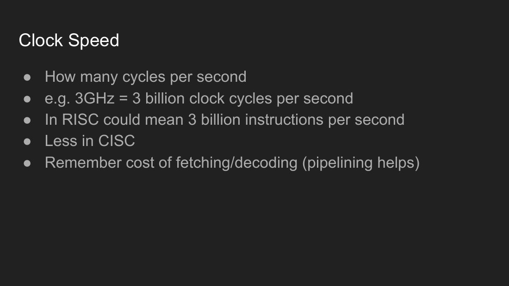

```text
3 GHz ≈ 3,000,000,000 clock cycles / second
```

But:

```text
3 GHz
   ≠
exactly 3 billion completed program instructions / second
```

### Performance also depends on

- instructions per cycle (IPC),
- cache hit/miss rate,
- memory latency,
- dependency chains,
- branch prediction,
- execution-unit availability,
- vectorization,
- SMT contention/utilization,
- physical-core parallelism.

### Important idea

Clock rate tells you the **heartbeat**, not total useful work completed.

---

## 22. `memchr()` optimization lesson

The lecture uses the Linux kernel's `memchr()` work as a practical systems example.

### Old/simple shape

```text
check byte
check byte
check byte
check byte
...
```

### Wider word comparison

```text
load several bytes into a machine word
          │
          ▼
compare multiple bytes in wider operations
```

The referenced optimization reported a large speedup (near 4× in one long-search benchmark).

### What to actually memorize

> A CPU feature is only useful when software/compiler implementation actually exploits it.

Not:

> “64-bit automatically makes every function twice as fast.”

---

# F. Instruction Lifecycle

## 23. Fetch → Decode → Execute → Memory → Writeback


```mermaid
graph LR
  PC[PC / IP] --> F[Fetch]
  F --> D[Decode]
  D --> E[Execute]
  E --> M[Optional memory access]
  M --> W[Writeback]
  W --> N[Next instruction]
```

### Simplified lifecycle

```text
FETCH
  ↓
DECODE
  ↓
EXECUTE
  ↓
optional READ / MEMORY ACCESS
  ↓
WRITEBACK
```

Not every instruction uses every stage identically.

---

## 24. Worked example: `SUB SP, SP, 12`

Assume:

```text
SP = 100
```

Goal:

```text
SP = SP - 12
```

### Step 1 — Fetch

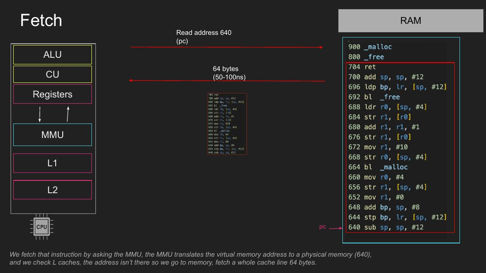

```text
PC contains address of instruction
          │
          ▼
instruction lookup
          │
      L1I / L2 / L3
          │
       maybe DRAM
```

If address translation is needed:

```text
virtual instruction address
          │
          ▼
        TLB/MMU
          │
          ▼
physical location
```

A cache line containing nearby instructions can be fetched.

### Step 2 — Decode

```text
machine bits
   ↓
operation = SUB
source    = SP
operand   = 12
dest      = SP
```

### Step 3 — Read operands

```text
SP register = 100
immediate   = 12
```

### Step 4 — Execute

```text
ALU: 100 - 12 = 88
```

### Step 5 — Writeback

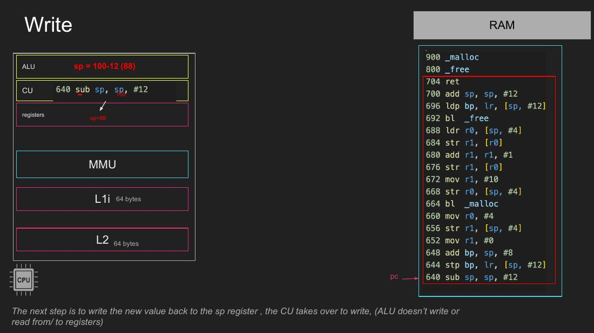

```text
SP = 88
```

### Step 6 — Next instruction

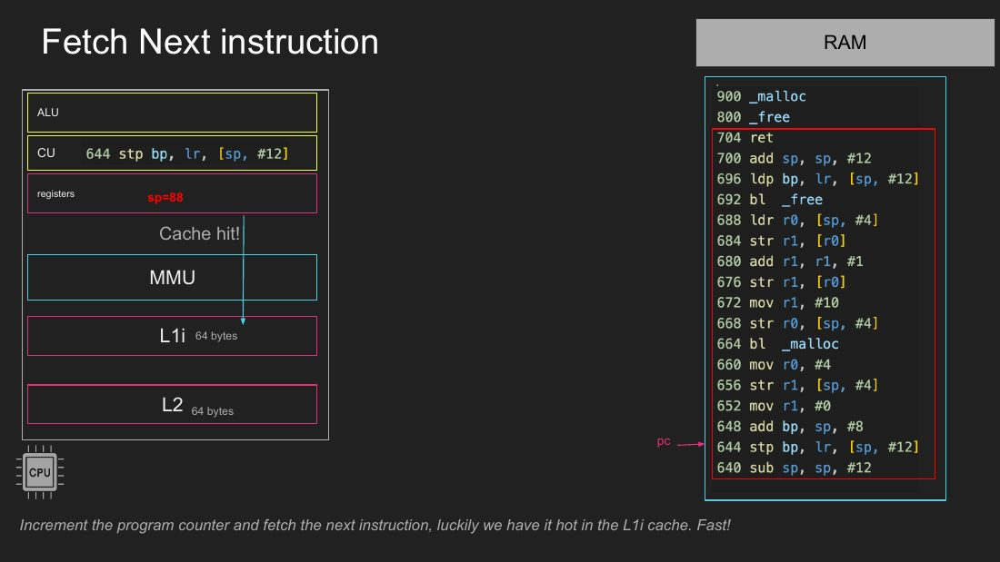

If next instruction is already in the fetched instruction cache line:

```text
next PC → L1I hit ✅
```

---

## 25. Program counter movement

For normal sequential execution:

```text
PC → next instruction
```

But **instruction size depends on the ISA**.

### Important correction

Do not memorize:

```text
64-bit CPU → PC += 8
```

Examples:

- AArch64 instructions are normally 4 bytes.
- x86-64 instructions are variable length.
- branch/call/return can set PC to a completely different address.

### Why PC matters for the next section

Every runnable thread/process has an execution position.

During a context switch, the OS must preserve/restore the architectural state that tells the CPU where to resume.

---

## 26. Function calls, instruction cache, and inlining

### Function call jump

```text
current PC
   │
   └── CALL function far away
              │
              ▼
         new code address
```

If function code is not hot in L1I/L2/L3:

```text
instruction-cache miss
      ↓
more expensive fetch
```

### Inlining

Compiler copies function body into the caller.

Potential wins:

- remove call/return overhead,
- improve local sequential instruction flow,
- expose more compiler optimization opportunities.

Potential costs:

- larger machine code,
- instruction-cache pressure,
- iTLB pressure.

### Lesson

```text
smaller/fewer jumps
        vs
larger code footprint
```

No optimization is free.

---

# G. How CPUs Avoid Sitting Idle

## 27. Pipelining

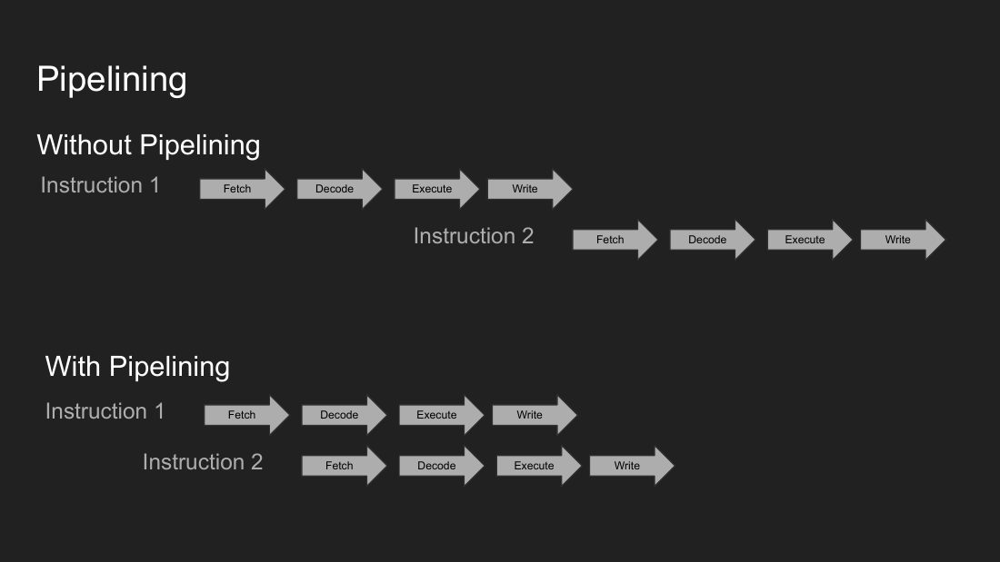

### Bad serial execution

```text
I1: F → D → E → W
                    I2: F → D → E → W
```

While one stage works, other hardware can be idle.

### Pipeline

```text
time →
I1   F   D   E   W
I2       F   D   E   W
I3           F   D   E   W
I4               F   D   E   W
```

At one moment:

```text
I1 → write
I2 → execute
I3 → decode
I4 → fetch
```

### Definition

> **Pipelining = different instructions occupy different execution stages at the same time.**

### Why separating CPU components helps

If fetch/decode/execute use separable resources, the CPU can overlap them.

### Programmer responsibility?

Mostly **automatic CPU microarchitecture behavior**.

---

## 28. Branch prediction + speculative execution

Pipelines hate uncertainty.

```c
if (x > 10) {
    A();
} else {
    B();
}
```

CPU may not yet know whether next instructions come from A or B.

### Without prediction

```text
pipeline waits / bubbles
```

### With branch prediction

```text
CPU predicts likely path
        │
        ▼
fetch likely future instructions
        │
        ▼
decode / possibly execute speculatively
```

### Correct prediction

Useful work is already done.

### Wrong prediction

Architectural results from wrong path are discarded/rolled back.

### Main goal

> **Keep the pipeline fed.**

---

## 29. Spectre connection

The lecture connects speculative execution to Spectre.

Safe mental model:

```text
speculatively touch secret-dependent data
              │
              ▼
       cache state changes
              │
              ▼
speculation is architecturally rolled back
              │
              ▼
cache timing trace can remain
              │
              ▼
attacker measures side channel
```

Important distinction:

> The wrong-path architectural result may be discarded, while **microarchitectural side effects** can remain observable.

---

## 30. Parallelism

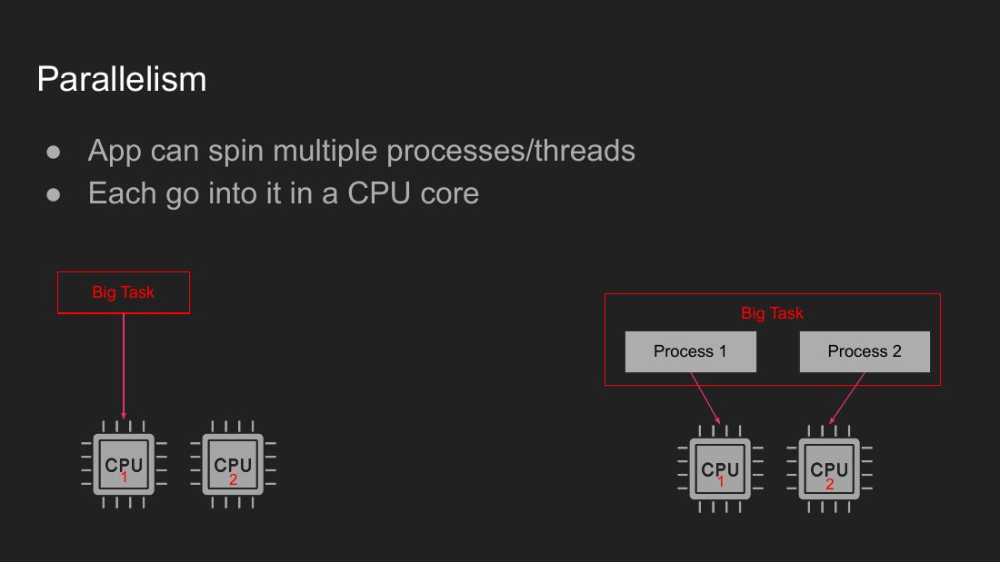

Suppose you have four physical cores:

```text
Core 0 → Task A
Core 1 → Task B
Core 2 → Task C
Core 3 → Task D
```

### Definition

> **Parallelism = different work executes at the same time on different physical execution resources/cores.**

### Who exposes the work?

Software needs independent runnable work:

- multiple processes,
- multiple threads,
- worker pools,
- parallel jobs.

The OS scheduler normally chooses where runnable threads/processes run.

### Key bridge

This is exactly why the next section needs **multiprocessing and multithreading**.

---

## 31. SMT / Hyper-Threading

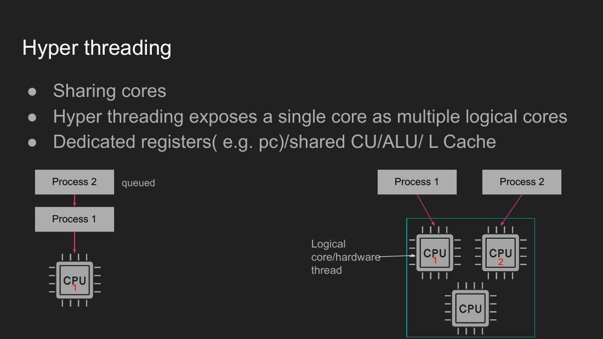

### Names

- **SMT = Simultaneous Multithreading** — generic concept.
- **Hyper-Threading** — Intel brand name for SMT implementation.

### Core idea

One physical core exposes multiple hardware threads/logical CPUs.

```text
Logical CPU 0 ─┐
               ├── ONE physical core
Logical CPU 1 ─┘
```

### Why it exists

One thread does not always use all core resources.

Example:

```text
Thread A → dependency/cache miss → cannot use some execution slots
Thread B → may use available resources
```

### What must be logically separate

Each hardware thread needs its own execution context, conceptually including:

- PC/IP,
- architectural register state,
- other per-thread architectural state.

### What is shared

Many physical core resources are shared/contended, such as:

- execution units,
- caches,
- front-end bandwidth,
- load/store capacity,
- memory bandwidth.

Exact implementation varies.

### Why it can help

```text
Thread A stalls
   ↓
Thread B uses otherwise-idle capacity
```

### Why it can hurt / be disabled

Two siblings can compete for the same bottleneck.

```text
Logical 0 → wants cache/execution bandwidth
Logical 1 → wants same cache/execution bandwidth
             ↓
          contention
```

Therefore SMT benefit is **workload-dependent**.

### Never say

```text
1 core + SMT = 2 full physical cores  ❌
```

---

## 32. SIMD

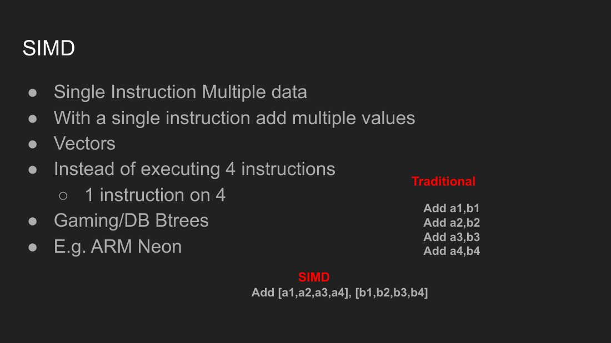

**SIMD = Single Instruction, Multiple Data**.

### Scalar idea

```text
ADD a1,b1
ADD a2,b2
ADD a3,b3
ADD a4,b4
```

### SIMD/vector idea

```text
[a1,a2,a3,a4]
      +
[b1,b2,b3,b4]
      ↓
[r1,r2,r3,r4]
```

### Useful workloads

- images/video/audio,
- games,
- scientific arrays,
- compression,
- cryptography,
- database vectorized execution,
- ML kernels.

### ARM example

**NEON** is an ARM SIMD/vector extension.

### Programmer/compiler relationship

SIMD is not purely invisible CPU magic.

Possible paths:

```text
normal loop
   ↓ compiler auto-vectorization
SIMD instructions
```

or expert code may use:

- vector intrinsics,
- optimized libraries,
- ISA-specific kernels.

---

## 33. Pipelining vs parallelism vs SMT vs SIMD

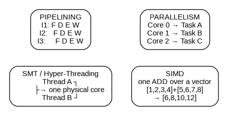

| Technique | What is “many”? | Where? | Core idea |
|---|---|---|---|
| **Pipelining** | instructions | one core | different instructions in different stages |
| **Parallelism** | tasks/threads/processes | multiple physical cores | independent work executes simultaneously |
| **SMT** | hardware threads | one physical core | multiple instruction streams share core resources |
| **SIMD** | data elements | one vector instruction | same operation on multiple values |

### The four mental pictures

```text
PIPELINING
I1: F D E W
I2:   F D E W
I3:     F D E W

PARALLELISM
Core 0: Task A
Core 1: Task B
Core 2: Task C

SMT
Thread A ─┐
          ├── one physical core
Thread B ─┘

SIMD
[1,2,3,4] + [5,6,7,8] → [6,8,10,12]
```

### One obsession behind all of them

```text
DON'T LEAVE EXPENSIVE CPU HARDWARE IDLE
```

---

## 34. HTTP/1.1 pipelining analogy

The lecture uses HTTP/1.1 pipelining as an analogy:

```text
send req1
send req2
send req3
without waiting for each response before sending the next
```

### Why the analogy helps

```text
strict serialization
        ↓
overlap work
```

### Why HTTP/1.1 pipelining itself was problematic

- response ordering,
- head-of-line issues,
- proxies/intermediaries,
- complicated real-world behavior.

HTTP/2 multiplexing uses a different design.

Do not mix:

```text
CPU pipeline      ≠      HTTP pipeline implementation
```

Only the **overlap-work intuition** is shared.

---

# H. CPU-Bound vs I/O-Bound

## 35. Two workload shapes

### CPU-bound

```text
compute → compute → compute → compute
```

Examples:

- compression,
- crypto,
- encoding,
- image processing,
- numerical loops,
- some parsing/ML work.

Likely bottleneck:

```text
CPU execution capacity
```

### I/O-bound

```text
CPU work
  ↓
issue I/O
  ↓
wait
  ↓
CPU work
  ↓
wait again
```

Examples:

- database/storage-heavy tasks,
- file I/O,
- network/database-backed backend requests.

Likely bottleneck:

```text
disk / network / database / dependency latency
```

### Backend mental model

```text
request
  ↓
run code briefly
  ↓
wait for DB/network
  ↓
run code briefly
```

If waiting dominates, a 2× faster CPU may barely change total request latency.

---

## 36. Linux `top`: `us sy ni id wa hi si st`

Run:

```bash
top
```

Important aggregate CPU fields:

| Field | Meaning |
|---|---|
| `us` | time executing user-space code |
| `sy` | time executing kernel/system code |
| `ni` | user CPU time for niced tasks |
| `id` | idle CPU time |
| `wa` | idle time while block I/O is outstanding (`iowait`) |
| `hi` | hardware-interrupt handling |
| `si` | software-interrupt / softirq handling |
| `st` | steal time in virtualized environments |

### `us`

High `us` often means applications are actively consuming CPU.

```text
Postgres / C program / backend / Python / etc.
```

### `sy`

Kernel-side CPU work:

```text
user app
   ↓ syscall
kernel work
```

A high value can come from heavy syscall/kernel activity; it does not automatically mean “kernel bug.”

### `id`

```text
CPU has no runnable work to execute
```

### `wa`

This needs precision.

Use it as:

> idle CPU time while the system has outstanding **block/storage I/O**.

Do **not** interpret it as:

```text
"the CPU itself is frozen waiting for one process"  ❌
```

The scheduler can run other tasks.

And ordinary TCP/socket waiting does not simply show up as `wa`.

### `hi` / `si`

CPU time spent handling hardware/software interrupt work.

### `st`

In a VM, the hypervisor may run another guest instead of yours.

`st` tracks that lost/“stolen” CPU opportunity.

---

## 37. CPU-bound demo

The lecture runs a C program doing a huge calculation loop.

### One busy single-threaded process on a 4-core Pi

```text
Core 0 ██████████ 100%
Core 1 ..........   0%
Core 2 ..........   0%
Core 3 ..........   0%

aggregate ≈ 25%
```

Why?

```text
one runnable CPU-bound thread
        ↓
one core at a time
```

### Four independent CPU-bound processes

```text
Process 1 → Core 0
Process 2 → Core 1
Process 3 → Core 2
Process 4 → Core 3
```

Now:

```text
user CPU → near 100%
idle     → near 0%
```

### This is the exact bridge to multiprocessing

One execution stream cannot magically occupy all physical cores.

Software must expose multiple independent runnable streams.

---

## 38. PostgreSQL I/O-bound demo

The lecture inserts a very large amount of data into PostgreSQL on slow Raspberry Pi storage.

### Shape

```text
Postgres executes some CPU work
          ↓
issues storage writes
          ↓
storage takes time
          ↓
CPU may have little else to do
          ↓
`wa` rises
```

### PostgreSQL processes mentioned

- backend process for a connection,
- background writer,
- checkpointer,
- autovacuum can later perform maintenance/cleanup work.

### Lesson

A database may be “slow” while CPU is not the bottleneck.

Possible limiting resource:

```text
storage latency / write throughput / sync behavior / memory / locks / etc.
```

### This connects to the next storage section

You will later care about:

- buffers,
- writeback,
- WAL,
- `fsync`,
- storage latency,
- persistence guarantees.

---

## 39. 100% utilization vs saturation

This is one of the most important practical lessons.

### Utilization

> How busy is the CPU?

### Saturation / pressure

> Is runnable work waiting because CPU capacity is unavailable?

### Case A — 100% but healthy utilization

```text
4 cores
4 compute jobs
all cores busy
little/no waiting backlog
```

### Case B — 100% and saturated

```text
4 cores
100 runnable compute jobs
many tasks waiting for CPU
```

Both can show:

```text
CPU ≈ 100%
```

But their behavior is very different.

### Therefore

```text
100% CPU
   ≠
automatically "buy more CPU"
```

Look at:

- runnable queue,
- latency,
- application throughput,
- CPU pressure/stalls,
- workload goals.

---

## 40. PSI — pressure / stalls

Linux **PSI = Pressure Stall Information**.

The lecture mentions it as a better way to ask:

> Are tasks actually stalling because CPU/memory/I/O resources are unavailable?

This helps distinguish:

```text
high utilization but okay
```

from:

```text
high utilization + real resource pressure
```

See the lab file for commands/experiments.

---

# I. Bridge to Processes & Threads

## 41. Why this lecture comes before multiprocessing/multithreading

Everything you learned now becomes the hardware foundation for the next section.

```text
Runnable process/thread
       │
       ▼
OS scheduler
       │
       ▼
logical CPU
       │
       ▼
physical core
       │
       ▼
fetch/decode/execute instructions
```

### CPU internals answer

> What can the hardware execute, and what makes execution fast/slow?

### Processes/threads answer

> How does software + OS provide independent streams of execution to that hardware?

---

## 42. Context switch — what hardware state changes

When the OS stops A and runs B, it must preserve/restore execution state such as:

- PC / instruction pointer,
- SP,
- general registers,
- other architectural state.

### Memory-side consequences

Changing execution contexts/address spaces can also affect:

- TLB entries,
- cache locality,
- instruction-cache locality,
- NUMA locality.

Therefore:

```text
context switch
    ≠
free operation
```

### Important preview

Threads in the same process share an address space, while different processes normally have distinct address spaces.

This becomes relevant to TLB/page-table behavior in the next section.

---

## 43. CPU-bound → think parallelism

Example:

```text
compress 4 independent files
```

Potential execution:

```text
worker A → Core 0
worker B → Core 1
worker C → Core 2
worker D → Core 3
```

If work is independent and runtime/language allows it:

```text
more physical cores
      +
multiple runnable workers
      ↓
true parallel CPU execution
```

This is where multiprocessing/thread-level parallelism becomes useful.

---

## 44. I/O-bound → think concurrency

Backend example:

```text
Request A → waiting for database
Request B → waiting for network
Request C → ready to execute
```

A scheduler/runtime can use CPU for C while A/B wait.

```text
A waits ─────────────┐
B waits ─────────────┼─ CPU can execute C/D/E
C ready ─────────────┘
```

### Key distinction

**Concurrency** does not automatically mean multiple CPU instructions are executing on multiple cores at the same instant.

It means:

> multiple tasks make progress over overlapping time.

Parallelism means:

> work literally executes simultaneously on different hardware resources.

This distinction will matter heavily in the next section.

---

## 45. SMT changes what the scheduler sees

With SMT:

```text
1 physical core
├── logical CPU 0
└── logical CPU 1
```

The OS scheduler sees two logical scheduling targets.

But underneath:

```text
logical 0 + logical 1
       ↓
shared physical core resources
```

Therefore later, if Linux says:

```text
16 CPUs
```

do not automatically assume:

```text
16 full physical cores
```

Inspect topology.

---

## 46. NUMA + cache coherence become concurrency costs

### Shared-memory threads

Two threads on different cores can modify shared memory.

```text
Thread A / Core 0 → write shared line
Thread B / Core 1 → write shared line
```

Now coherence traffic matters.

Later terms:

- atomics,
- mutexes,
- locks,
- races,
- memory ordering,
- false sharing.

### NUMA

Thread runs on node 1 but hot data remains on node 0:

```text
thread → remote memory → higher cost
```

Later high-performance systems may use:

- CPU pinning,
- thread affinity,
- per-NUMA-node pools,
- NUMA-aware allocators.

### The bridge sentence

> **CPU internals explain the cost model; threads/processes explain how software exposes and coordinates independent execution.**

---

# J. Revision

## 47. Commands & mini experiments

### CPU architecture / topology — Linux

```bash
lscpu
```

Useful fields:

```text
CPU(s)
Core(s) per socket
Thread(s) per core
Socket(s)
NUMA node(s)
Architecture
```

### CPU-bound experiment

Compile/run a simple busy C loop, then inspect:

```bash
top
```

Observe:

- one thread can saturate one core,
- on four equal cores aggregate usage may be around 25%,
- multiple workers can saturate more cores.

### Process list

```bash
ps aux
```

### PSI — Linux

```bash
cat /proc/pressure/cpu
cat /proc/pressure/io
cat /proc/pressure/memory
```

### NUMA — if tools/system support it

```bash
numactl --hardware
```

### macOS commands shown in the slides

```bash
sysctl -a | grep cachesize
sysctl -n hw.physicalcpu
uname -m
```

More experiments live in [`labs/cpu-lab.md`](labs/cpu-lab.md).

---

## 48. Slides worth revisiting

All requested slides are archived under [`assets/slides/`](assets/slides/) — **179.jpg → 217.jpg**.

### Highest-value visuals

| Slide | Why reopen it |
|---|---|
| **181** | CPU components map |
| **182** | multicore + cache hierarchy |
| **184** | NUMA / multi-memory topology |
| **185** | ALU |
| **187** | registers |
| **188** | MMU/TLB |
| **190** | L1I vs L1D |
| **192** | RISC/CISC example |
| **193** | clock speed |
| **197** | instruction lifecycle |
| **199** | instruction fetch path |
| **204** | writeback |
| **205** | next instruction / instruction-cache hit |
| **210** | pipelining |
| **211** | physical-core parallelism |
| **212** | SMT / Hyper-Threading |
| **213** | SIMD |
| **215–217** | workload / CPU wait demo section |

---

## 49. Common traps / corrections

These are here so you revise the **course idea** without memorizing accidental simplifications.

### Trap 1

```text
"64-bit CPU means PC always increases by 8 bytes"
```

❌ False.

Instruction size depends on ISA.

---

### Trap 2

```text
"RISC = exactly one instruction per cycle"
```

❌ False as a universal statement.

Use it only as historical/textbook intuition for simpler regular instructions.

---

### Trap 3

```text
"Hyper-Threading creates another physical core"
```

❌ False.

It creates multiple hardware-thread/logical-CPU contexts over shared physical core resources.

---

### Trap 4

```text
"NUMA is a component that moves memory"
```

❌ Wrong mental model.

NUMA is primarily a hardware topology where access cost depends on which memory node is used.

---

### Trap 5

```text
"Core 1 updates A, then software sends a notification to Core 2"
```

❌ No.

Hardware cache-coherence mechanisms manage validity/ownership of cache lines.

---

### Trap 6

```text
"iowait means the CPU is literally blocked and cannot execute anything"
```

❌ No.

The scheduler can run other tasks. `wa` is an accounting metric related to idle CPU time with outstanding block I/O.

---

### Trap 7

```text
"100% CPU means the machine definitely needs more CPU"
```

❌ Not enough information.

Check saturation/pressure, queueing, throughput, and latency.

---

### Trap 8

```text
"DMA always bypasses the MMU/translation world"
```

❌ Too broad.

DMA avoids CPU byte-by-byte copying; IOMMUs can provide translation/protection for devices.

---

### Trap 9

```text
"L1/L2/L3 topology and latency numbers are universal"
```

❌ No.

They vary by CPU architecture/microarchitecture.

---

## 50. 2-minute master recap

```text
1. CPU executes machine instructions.

2. ALU performs arithmetic/logic.

3. Control logic decodes/co-ordinates execution.

4. Registers hold tiny, ultra-fast execution state.

5. MMU translates virtual-address usage toward physical memory.

6. TLB caches translations; ASID-like tags reduce context-switch flush cost.

7. Registers → L1 → L2 → L3 → DRAM gets larger but slower.

8. L1I caches instructions; L1D caches data.

9. Caches transfer lines; nearby data/code locality matters.

10. Multiple cores can cache the same line, so hardware coherence is required.

11. NUMA means some RAM is closer to some CPUs than other RAM.

12. RISC/CISC describes different instruction-set design philosophies.

13. GHz = cycles/second, not automatically instructions/second.

14. Instruction lifecycle: fetch → decode → execute → memory if needed → writeback.

15. Pipelining overlaps stages of different instructions.

16. Branch prediction/speculation keeps pipelines from starving.

17. Parallelism uses multiple physical cores.

18. SMT lets multiple hardware threads share one physical core.

19. SIMD performs one operation over multiple data elements.

20. CPU-bound workload spends time computing.

21. I/O-bound workload spends large time waiting on external resources.

22. `top`: us=user, sy=kernel, id=idle, wa=block-I/O wait accounting.

23. 100% utilization is not the same thing as saturation.

24. Threads/processes are the software mechanisms that feed independent execution streams to this hardware.
```

---

## 51. Ready-for-next-section checklist

Before starting heavy **multiprocessing / multithreading**, you should be able to answer these without notes:

- [ ] Why can one busy single-threaded task show ~25% aggregate CPU on a 4-core machine?
- [ ] What is the difference between a CPU package, physical core, and logical CPU?
- [ ] Why is one SMT logical CPU not a full extra physical core?
- [ ] What exactly do ALU, control logic, registers, MMU, and caches contribute?
- [ ] Why does a TLB exist?
- [ ] Why can context switching affect TLB/cache locality?
- [ ] Why does Core 1 changing `A` create a problem if Core 2 cached the old `A`?
- [ ] Who handles cache coherence — application software or hardware?
- [ ] What is a cache line, and why will it matter for false sharing later?
- [ ] What does NUMA mean in one sentence?
- [ ] Why can thread placement and memory placement matter together?
- [ ] What is the difference between pipelining, physical-core parallelism, SMT, and SIMD?
- [ ] Why does branch prediction exist?
- [ ] Why can speculative execution leak via microarchitectural side effects?
- [ ] What is the difference between CPU-bound and I/O-bound work?
- [ ] What do `us`, `sy`, `id`, and `wa` tell you in `top`?
- [ ] Why is 100% CPU not enough to prove CPU starvation?
- [ ] Why does I/O-heavy backend software benefit from concurrency?
- [ ] Why does CPU-heavy software need independent workers to use multiple cores?

If those are clear, the next section becomes a continuation rather than a completely new topic.

---

## Repo Extras

The **explanation is intentionally all here in this README**.

Supporting files remain only as tools:

- [`CHEATSHEET.md`](CHEATSHEET.md) — ultra-short revision.
- [`QUIZ.md`](QUIZ.md) — active recall.
- [`labs/cpu-lab.md`](labs/cpu-lab.md) — hands-on commands/experiments.
- [`REFERENCES.md`](REFERENCES.md) — slide/source map and clarifications.
- [`assets/slides/`](assets/slides/) — all slides 179–217.
- [`assets/diagrams/`](assets/diagrams/) — generated visual maps.

