# Process Management

> **OS Section 6 — slides 218-268**  
> Process vs thread → `fork()` / Copy-on-Write → context switching → scheduling → concurrency → races → mutexes → semaphores.
>
> Slide **268** is the transition into *Storage Management*, so the Process Management content itself ends on slide **267**.

## Table of Contents

- [0. Big picture](#0-big-picture)
- [1. Process: what is actually "running"?](#1-process-what-is-actually-running)
- [2. PCB and the kernel process table](#2-pcb-and-the-kernel-process-table)
- [3. Threads: what is shared vs private?](#3-threads-what-is-shared-vs-private)
- [4. Shared memory](#4-shared-memory)
- [5. PostgreSQL: why this lecture uses it](#5-postgresql-why-this-lecture-uses-it)
- [6. `fork()` and Copy-on-Write](#6-fork-and-copy-on-write)
- [7. Copy-on-Write demo](#7-copy-on-write-demo)
- [8. Context switching](#8-context-switching)
- [9. TLB cost, ASIDs, and why same-process threads are cheaper](#9-tlb-cost-asids-and-why-same-process-threads-are-cheaper)
- [10. Why does a context switch happen?](#10-why-does-a-context-switch-happen)
- [11. Concurrency and parallelism](#11-concurrency-and-parallelism)
- [12. CPU-bound vs I/O-bound](#12-cpu-bound-vs-io-bound)
- [13. Race conditions](#13-race-conditions)
- [14. Mutexes](#14-mutexes)
- [15. Semaphores](#15-semaphores)
- [16. When are threads useful?](#16-when-are-threads-useful)
- [17. Backend/server connection model](#17-backendserver-connection-model)
- [18. Must-remember map](#18-must-remember-map)
- [19. Active recall](#19-active-recall)
- [20. References](#20-references)

---

## 0. Big picture

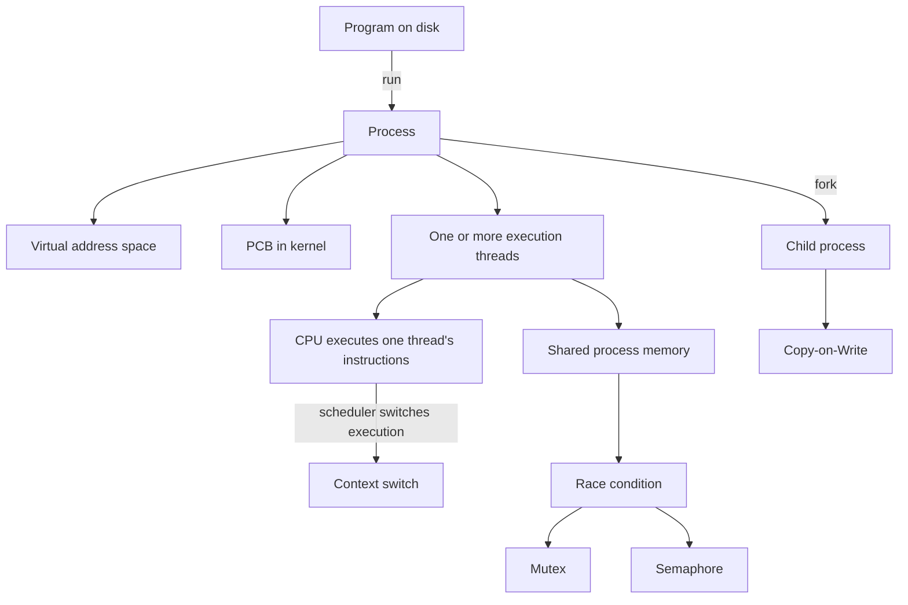

**One sentence for the entire section:**

> The kernel creates execution units, remembers their state, schedules them onto CPUs, and provides synchronization when concurrent execution touches shared state.

---

# Part I — Processes and Threads

## 1. Process: what is actually "running"?

A **program** is static executable code on storage. A **process** is a running instance of that program.

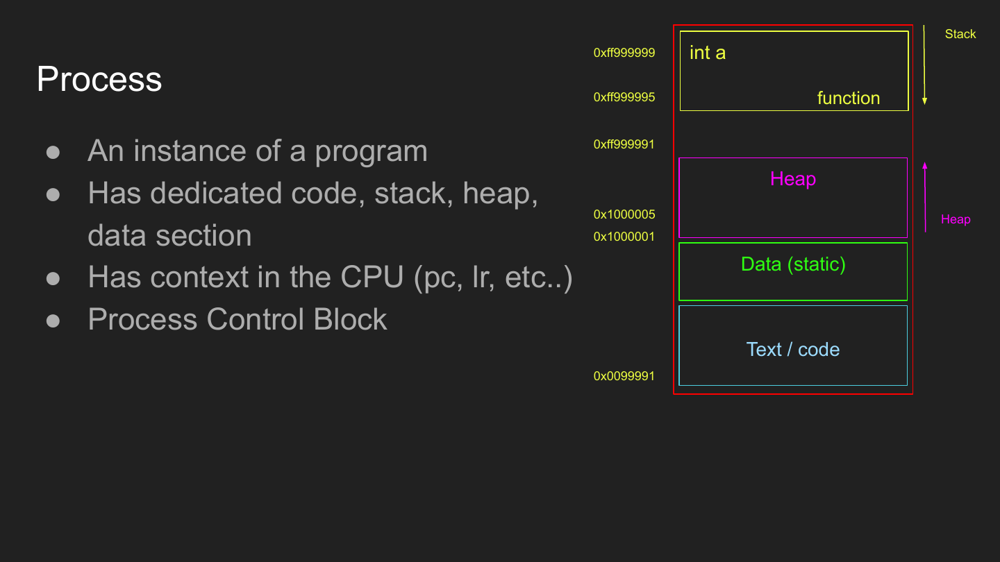

### Do not confuse the diagram with physical RAM

The familiar layout:

```text
high virtual addresses
┌──────────────────┐
│ Stack            │
├──────────────────┤
│ Heap             │
├──────────────────┤
│ Data / static    │
├──────────────────┤
│ Text / code      │
└──────────────────┘
low virtual addresses
```

is the process's **virtual address space**.

The pages may map to completely different physical frames in RAM:

```text
Process virtual address       Page table + MMU          Physical RAM
0x4000  ────────────────────────────────► frame 91
0x8000  ────────────────────────────────► frame 12
0xC000  ────────────────────────────────► frame 300
```

While the process is executing, some of its **current execution state** is inside CPU registers:

- `PC` / instruction pointer — where execution currently is.
- `SP` — current stack position.
- general registers — temporary values and operands.
- architecture-specific state such as flags, link register, etc.

So the process is not "inside the CPU" or "inside RAM" as one object:

```text
process
├── virtual memory mappings → pages backed by RAM / files
├── current execution state → CPU registers while running
└── management metadata     → kernel memory
```

### Four memory regions to recognize

| Region | What it is for |
|---|---|
| **Text / code** | machine instructions |
| **Data / static** | globals and static variables |
| **Heap** | dynamic allocations such as `malloc()` |
| **Stack** | function frames, local variables, return state |

---

## 2. PCB and the kernel process table

The CPU can only hold the state of what it is currently executing. The kernel therefore needs a persistent record for **every** process, including processes that are ready, sleeping, or blocked.

That record is conceptually the **PCB — Process Control Block**.

### PCB mental model

```text
PCB
├── PID
├── state: running / ready / blocked / ...
├── saved CPU context
│   ├── PC
│   ├── SP
│   └── registers
├── memory-management information
├── scheduling/accounting information
├── open files / sockets
└── IPC / synchronization metadata
```

> Exact kernel structures differ by OS. The important concept is **kernel bookkeeping for a process**.

### Why is saved CPU state critical?

If the kernel stops A and runs B:

```text
CPU running A
PC=500, SP=9000, R1=25
        │
        │ SAVE
        ▼
A's kernel state
        │
        │ later RESTORE
        ▼
CPU: PC=500, SP=9000, R1=25
```

A continues **exactly where it stopped**.

The kernel also needs a fast way to find process metadata, hence a **process table / lookup structure** mapping process identity to its kernel representation.

---

## 3. Threads: what is shared vs private?

A thread is a **lighter execution unit inside a process**.

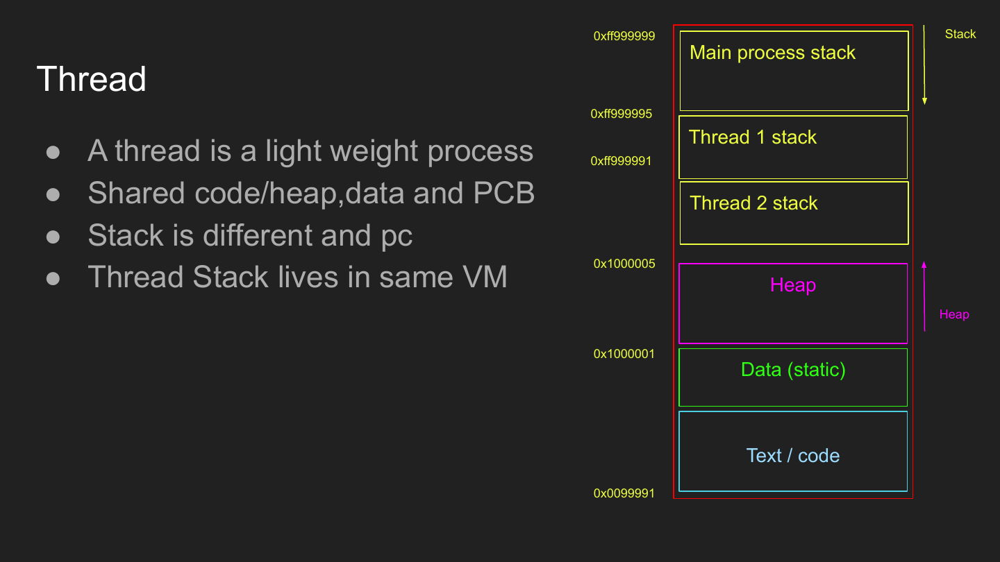

### Best mental model

```text
                    ONE PROCESS
       shared virtual address space / resources

        code       data       heap      open files
          └─────────┬──────────┬───────────┘
                    │
          ┌─────────┴─────────┐
          │                   │
       Thread 1            Thread 2
       own PC              own PC
       own registers       own registers
       own stack           own stack
```

### Shared by threads of the same process

- code
- globals/data
- heap
- virtual address space / page-table context
- open files and sockets
- most process-wide resources

### Private per thread

- program counter / instruction pointer
- register state
- stack
- scheduling state / thread identity

> **Memorize:** Processes primarily give **isolation**. Threads primarily give **multiple execution paths inside shared memory**.

### TCB

The kernel needs per-thread metadata too. Conceptually this is the **TCB — Thread Control Block**:

```text
TCB
├── TID
├── thread state
├── saved PC/registers
├── stack information
├── accounting/scheduling info
└── relationship to the containing process
```

Do not memorize a specific C structure: kernel implementations differ.

---

## 4. Shared memory

Processes normally have separate virtual address spaces, but the OS can deliberately map some pages so that:

```text
Process A virtual page ──┐
                         ├──► same physical RAM frame
Process B virtual page ──┘
```

On Linux, `mmap()` can participate in creating shared mappings.

Threads do not need this trick for ordinary process memory: they already share the containing process's address space.

### Why databases care

A database can have many execution workers that all need common state, for example:

```text
Backend 1 ──┐
Backend 2 ──┼──► shared buffer/cache + synchronization
Backend 3 ──┘
```

---

## 5. PostgreSQL: why this lecture uses it

PostgreSQL is a useful real-world example of the **multi-process** design.

### Current architecture note — PostgreSQL 18

As of PostgreSQL 18 documentation, the server still uses **one backend process per client connection**. PostgreSQL also has auxiliary/background worker processes and uses shared memory/semaphores for cooperation.

```text
application
   │
   ├── DB connection A ──► PostgreSQL backend process A
   ├── DB connection B ──► PostgreSQL backend process B
   └── DB connection C ──► PostgreSQL backend process C

                         ┌── shared buffers
backend processes ──────┼── locks/state
                         └── other shared memory
```

This is why too many direct DB connections are expensive and why applications commonly use **connection pools**.

### Tiny database bridge

You do not need database internals for this lecture. Just keep:

```text
SQL query
   ↓
PostgreSQL backend process
   ↓
planner / executor
   ↓
needed database pages
   ├── already cached in RAM → use them
   └── not cached            → read from storage
```

An **index** helps the database avoid scanning every row; shared buffers cache useful database pages in RAM.

### Why people discuss threads

A 2023 PostgreSQL hackers discussion proposed moving toward a single-process, multi-threaded architecture. The motivation includes reducing some per-process overhead. That discussion is **not** the same thing as PostgreSQL already having completed the transition.

---

# Part II — `fork()` and Copy-on-Write

## 6. `fork()` and Copy-on-Write

`fork()` creates a new process derived from the caller.

Logically, parent and child need independent address spaces:

```text
Parent VA 0x4000 → Parent's value
Child  VA 0x4000 → Child's value
```

Copying every physical page immediately would be expensive, so the OS can initially map both processes to the same physical pages and mark them Copy-on-Write.

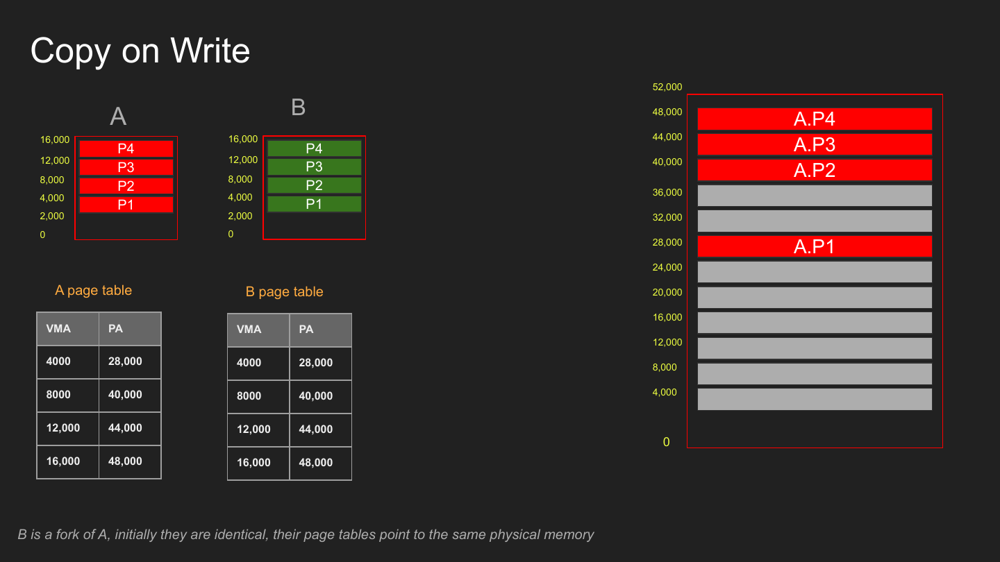

### Read: cheap sharing

```text
Parent ─┐
        ├──► physical page P1
Child ──┘

both READ → keep sharing
```

### Write: copy the affected page

```text
Child writes into P1
        ↓
page fault / CoW handling
        ↓
copy page
        ↓
Parent → original page
Child  → private copied page, then modify it
```

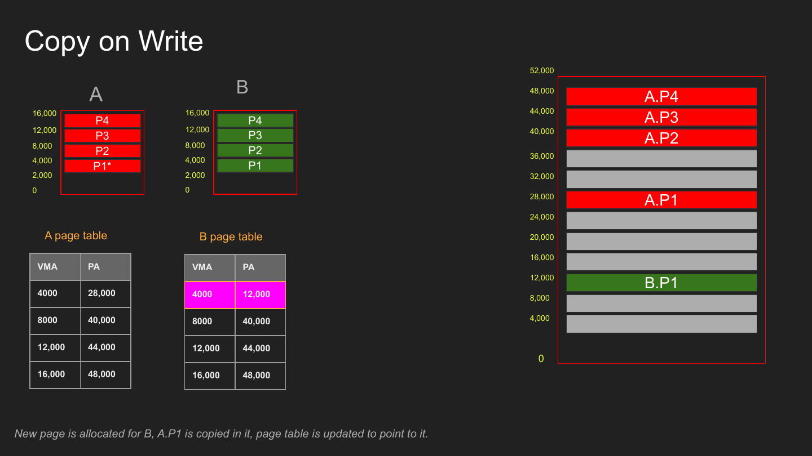

> **CoW copies at page granularity, not "just the changed variable" and not necessarily the entire process.**

### Python CoW story

The course reference describes a production issue where CPython reference-count updates dirtied pages after `fork()`. Objects could be logically immutable while reference-count bookkeeping still caused writes, triggering CoW and increasing private memory. The later "immortal objects" work reduced this type of unnecessary mutation for selected objects.

**Lesson:** a high-level "read" can still cause runtime metadata writes underneath.

---

## 7. Copy-on-Write demo

A lecture-equivalent runnable example is included at:

[`examples/cow_demo.c`](examples/cow_demo.c)

It is **not the instructor's original source**; it recreates the demonstrated behavior.

### Compile

```bash
gcc -Wall -Wextra -O0 -g examples/cow_demo.c -o cow_demo
./cow_demo
```

It allocates 10 MiB, touches it with `memset()`, forks, then lets the child dirty roughly one page at a time.

### Why `memset()`?

```text
malloc(10 MiB)
   ↓
virtual allocation may be lazy

memset(...)
   ↓
touch pages
   ↓
force actual page faults / backing as pages are used
```

### Inspect the two processes

```bash
top -p <parent_pid> -p <child_pid>
```

For detailed Linux mappings:

```bash
cat /proc/<pid>/maps
```

For shared/private accounting:

```bash
grep -A 25 '\[heap\]' /proc/<pid>/smaps
```

Watch fields such as `Shared_Dirty` and `Private_Dirty` while the child writes.

### Expected trend

```text
immediately after fork:
shared pages  ↑
private pages ↓

as child writes:
shared pages  ↓
private pages ↑
```

---

# Part III — Context Switching

## 8. Context switching

The CPU fundamentally executes instructions; **process/thread context is an OS abstraction built around the state required to continue an execution stream**.

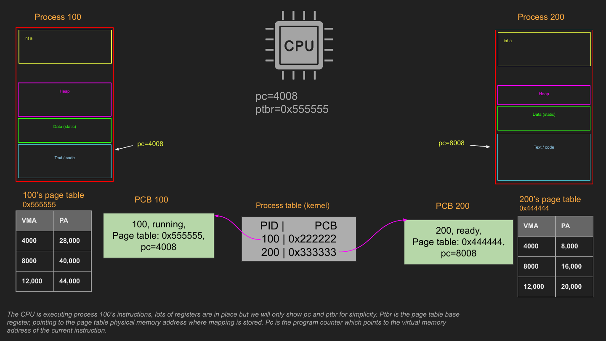

### Core operation

```text
Process / Thread A running
        │
        ▼
1. stop A
2. save A's necessary CPU state
3. choose B
4. load B's saved CPU state
5. resume B
```

Conceptually:

```text
A's CPU registers ──SAVE──► A's kernel state

B's kernel state ──LOAD──► CPU registers
                              │
                              ▼
                         execute B
```

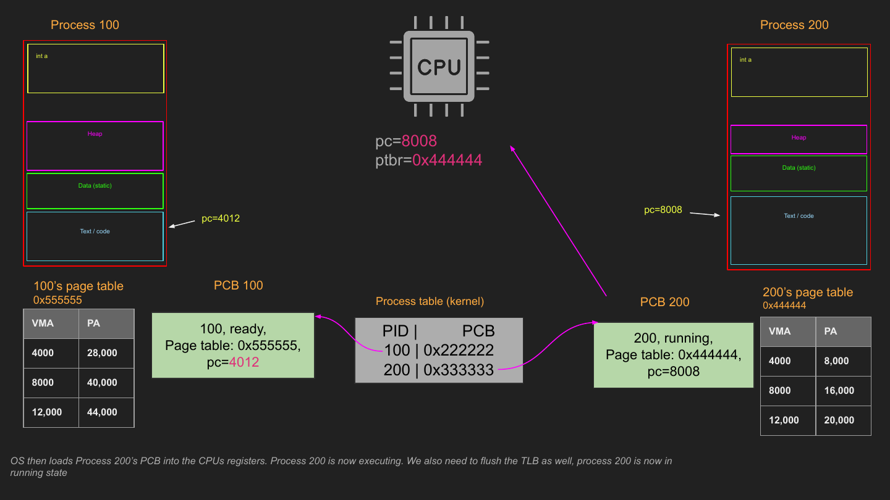

### The important cost question

Do not memorize "context switching is slow" as a blanket statement.

Ask:

- what state must be saved?
- what state must be loaded?
- did the address space change?
- what cache/TLB state stays useful?
- does the new task immediately miss in caches/TLB?

The direct register save/restore is only part of the cost; **lost locality** can matter too.

---

## 9. TLB cost, ASIDs, and why same-process threads are cheaper

The TLB caches virtual → physical translations.

```text
virtual address
      ↓
     TLB
      │ hit
      └────────► physical address
      │ miss
      ▼
 page-table walk
```

Two separate processes can legitimately have:

```text
Process A: VA 0x4000 → physical frame 20
Process B: VA 0x4000 → physical frame 91
```

Therefore an old translation cannot blindly be reused for a new address space.

### Same-process thread switch

```text
Thread A1 ─┐
           ├── same process address space/page tables
Thread A2 ─┘
```

The translation context can remain useful, so a switch between threads **of the same process** can avoid work associated with changing address spaces.

### ASID / tagged TLB

Modern CPU designs can tag TLB entries with an **Address Space ID** (or an analogous identifier), allowing entries from multiple address spaces to coexist.

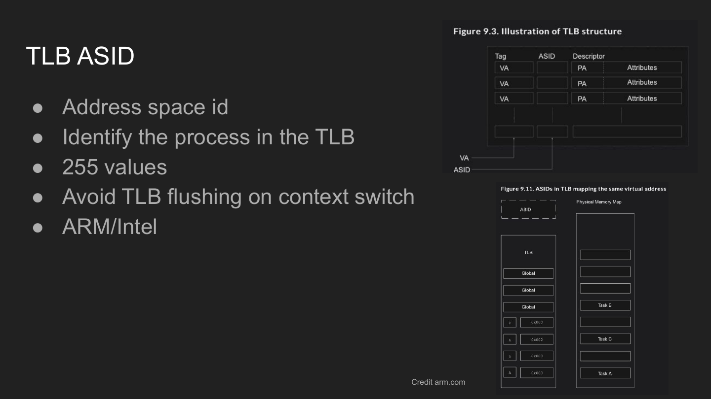

So:

> "Process switch = full TLB flush every time" is an oversimplification.

The exact behavior depends on CPU architecture and OS support.

---

## 10. Why does a context switch happen?

### A. I/O wait

A process cannot execute instructions without CPU time. But after it starts an I/O request, the device/kernel can continue that I/O while the process sleeps.

```text
Process A running
      │
      │ read from disk/network
      ▼
A BLOCKED / waiting
      │
      ├────────────── device/kernel progresses I/O
      │
CPU ──┴──► runs B / C / ...

I/O completes
      ↓
A becomes READY
      ↓
scheduler may run A later
```

This is the key distinction:

> **The process cannot compute without a CPU, but the I/O it requested can progress while the process is not running.**

DMA and device interrupts are part of how modern systems can overlap CPU work with device work.

### B. Preemption / time slicing

A CPU-bound process might be perfectly capable of running forever. The OS may still stop it so other runnable tasks are not starved.

```text
A A A A | B B | C C C | A A ...
         ^ scheduler preempts/switches
```

### C. Scheduling policy

The scheduler answers:

> **Which runnable process/thread gets which CPU, and for how long?**

Lecture examples:

- First Come, First Served
- Shortest Job First
- Round Robin

Real general-purpose OS schedulers are more sophisticated.

---

# Part IV — Concurrency

## 11. Concurrency and parallelism

**Concurrency:** multiple tasks make progress over overlapping time.

```text
one CPU:
A A | B | A | C | B ...
```

**Parallelism:** work is literally executing at the same instant on different execution resources.

```text
Core 1: A A A A
Core 2: B B B B
```

Concurrency can exist without parallelism.

---

## 12. CPU-bound vs I/O-bound

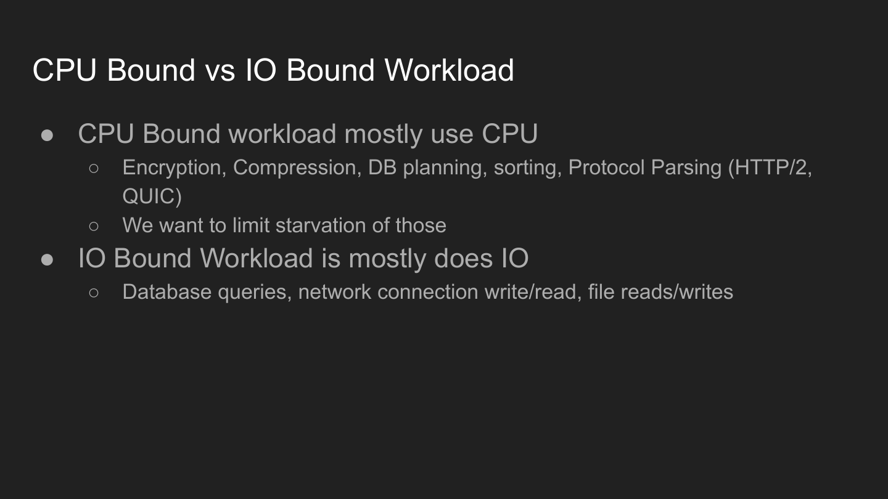

| Workload | Mostly spends time... | Examples |
|---|---|---|
| **CPU-bound** | executing instructions | encryption, compression, sorting, protocol parsing, query planning |
| **I/O-bound** | waiting for external data/device progress | disk reads, network operations, many DB page reads |

Real workloads are usually a mixture.

### Why the distinction matters

```text
I/O-bound task blocks
    → CPU can run another task

CPU-bound task consumes a core
    → parallelizing may require another core
```

---

## 13. Race conditions

Two threads share `a = 1` and both execute `a++`.

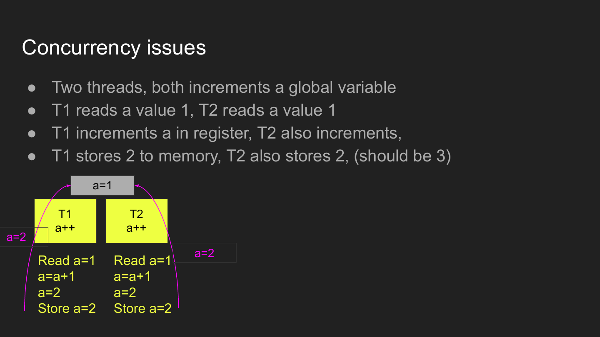

`a++` is conceptually multiple steps:

```text
READ a
ADD 1
WRITE a
```

Possible interleaving:

```text
                 T1                 T2
                 --                 --
read a = 1                          read a = 1
add 1 → 2                           add 1 → 2
write 2                             write 2

final a = 2   ❌ expected 3
```

### Definition

> A **race condition** occurs when correctness depends on uncontrolled timing/interleaving of concurrent operations on shared state.

The block of operations that must behave as one protected region is the **critical section**.

---

## 14. Mutexes

A mutex provides **mutual exclusion**: only one participant owns the lock at a time.

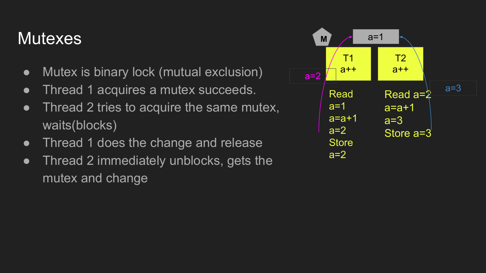

```text
Thread 1                 Thread 2
--------                 --------
lock(M) ✅               lock(M) → wait
read a
increment
write a
unlock(M)
                         lock(M) ✅
                         read latest a
                         increment
                         write a
                         unlock(M)
```

### Why the second thread does not burn CPU forever

If it blocks on the mutex, the OS can stop scheduling it and use the CPU for useful work. When the lock becomes available, it can become runnable again.

### Gotchas

- mutex has **ownership**;
- the owner must unlock it correctly;
- bad lock ordering can create deadlock;
- long critical sections increase contention;
- synchronization buys correctness at a performance/complexity cost.

> Atomic CPU operations are commonly used underneath synchronization primitives so that "acquire the lock" itself can be made safe under concurrency.

---

## 15. Semaphores

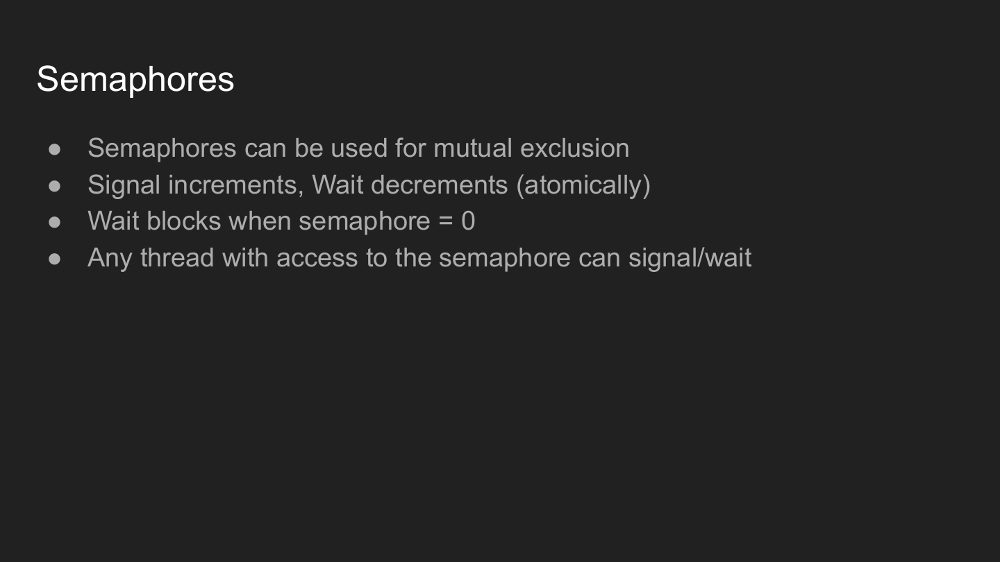

Think **counter**, not "fancy mutex".

```text
semaphore = 3

acquire/wait → 2
acquire/wait → 1
acquire/wait → 0
next wait    → BLOCK

signal/post  → resource becomes available
```

Course terminology:

- `wait` / acquire decrements atomically when possible;
- if the count is `0`, the caller blocks;
- `signal` increments / releases availability;
- unlike a mutex, a semaphore does not carry the same owner-must-release rule.

### Mutex vs semaphore

| | Mutex | Semaphore |
|---|---|---|
| Core idea | exclusive ownership | availability counter |
| Typical capacity | 1 | 0..N |
| Ownership | yes | no equivalent ownership requirement |
| Common use | protect one critical section | limit/coordinate access to N resources/events |

---

# Part V — Backend Engineering Bridge

## 16. When are threads useful?

Threads are valuable when the extra execution path is worth shared-state complexity.

### 1. Blocking work

```text
main server thread ──► offload blocking operation ──► worker thread waits
       │
       └────────────► continue serving useful work
```

File APIs are a common example when the available interface blocks.

**Precision note:** sockets are *not inherently always asynchronous*. A socket can be blocking or non-blocking. Event APIs such as `epoll`, `kqueue`, and `select` let servers efficiently wait for readiness across many sockets.

### 2. Heavy CPU work

If a task is parallelizable and your runtime permits real parallel thread execution, another thread can run it on another core while the main execution path continues.

Runtime caveat: traditional CPython's GIL changes the trade-off for pure Python CPU-bound work, where processes are often used instead.

### 3. High volume of small independent work

A **bounded worker pool** can process many tasks without creating an unbounded number of threads.

```text
work queue
   │
   ├──► worker 1
   ├──► worker 2
   ├──► worker 3
   └──► worker 4
```

> Do not memorize "more threads = faster". Threads consume stack memory, scheduling capacity, cache locality, and synchronization overhead.

---

## 17. Backend/server connection model

### Avoid the naive models

```text
1 connection → spawn 1 process     ❌ expensive at high scale
1 connection → spawn 1 new thread  ❌ can become unbounded
```

A safer general mental model is:

```text
many client connections
        │
        ▼
accept / event-driven front end
        │
        ▼
 bounded amount of execution capacity
 ┌───────────┬───────────┬───────────┐
 worker 1    worker 2    worker 3   ...
```

Modern network servers often combine:

- a small/bounded number of processes or threads;
- asynchronous/event-driven socket I/O;
- queues/backpressure;
- bounded thread pools for blocking operations;
- separate workers/processes for expensive CPU-bound work when appropriate.

### Database connections are a different connection layer

Your HTTP server may handle thousands of clients while keeping a much smaller database connection pool:

```text
10,000 HTTP clients
        ↓
backend workers / async request handling
        ↓
DB connection pool: [1][2][3]...[N]
        ↓
PostgreSQL
```

Do not confuse:

> **HTTP client connection** with **PostgreSQL database connection**.

PostgreSQL's process-per-connection architecture applies to PostgreSQL's client sessions, not as a rule that your web server must spawn a process per HTTP connection.

---

## 18. Must-remember map

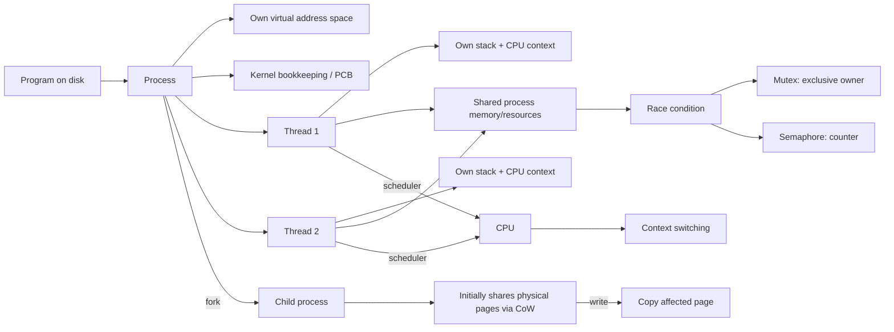

### Ten lines to memorize

1. **Program = static executable; process = running instance.**
2. The process memory diagram is a **virtual address space**, not literal contiguous RAM.
3. **PCB/kernel metadata lets the OS remember and manage a process.**
4. Threads share one process's address space but have **their own stack + execution state**.
5. `fork()` creates a new process; **CoW delays physical copying until writes**.
6. Context switch = **save old execution state → load new state → resume**.
7. A blocked process cannot compute, but its requested **I/O can progress while another task uses the CPU**.
8. Switching same-process threads can preserve more address-space/TLB context than switching unrelated processes.
9. Shared mutable state creates **race conditions**.
10. **Mutex = exclusive owner; semaphore = counter/availability coordination.**

---

## 19. Active recall

### Must know

- [ ] Why is the stack/heap/code diagram a **virtual address-space** diagram rather than "the RAM"?
- [ ] What part of a running process is currently in CPU registers?
- [ ] Why does the kernel need process/thread bookkeeping?
- [ ] What state must be saved so execution can resume after a context switch?
- [ ] What do same-process threads share?
- [ ] Why does every thread need its own stack and PC?
- [ ] Why can two processes map different virtual addresses to the same shared physical page?
- [ ] What does `fork()` create?
- [ ] What exactly triggers Copy-on-Write?
- [ ] Why does a 1-byte write potentially copy a whole page?
- [ ] Why can a process be blocked while the hardware is still doing its I/O?
- [ ] Why does an I/O wait encourage the scheduler to run another task?
- [ ] Why is "context switches are slow" too vague?
- [ ] Why are TLBs relevant to address-space switches?
- [ ] What does ASID/tagging improve?
- [ ] Difference between concurrency and parallelism?
- [ ] CPU-bound vs I/O-bound?
- [ ] Reproduce the `a++` lost-update race from memory.
- [ ] What does a mutex guarantee?
- [ ] Why can mutex contention cause more blocking/context switches?
- [ ] What makes a semaphore different from a mutex?

### Backend bridge

- [ ] Why should a web server not blindly spawn one new thread/process per client connection?
- [ ] Why are bounded worker pools useful?
- [ ] Why might async/event-driven socket I/O handle many connections efficiently?
- [ ] Why is PostgreSQL's DB connection model different from your HTTP server's request model?
- [ ] Why does connection pooling help PostgreSQL-backed applications?

---

## 20. References

### Course-provided references

- [A War Story About a Python, a Fork, a Cow, and a Bug](https://codeconfessions.substack.com/p/a-war-story-involving-a-python-a)
- [User and Kernel Level Threads](http://www.cs.iit.edu/~cs561/cs450/ChilkuriDineshThreads/dinesh%27s%20files/User%20and%20Kernel%20Level%20Threads.html)
- [TLB flush lecture notes](https://lass.cs.umass.edu/~shenoy/courses/fall12/lectures/notes/Lec06_notes.pdf)
- [ARM — Address Space ID](https://developer.arm.com/documentation/den0013/d/The-Memory-Management-Unit/Multi-tasking-and-OS-usage-of-translation-tables/Address-Space-ID)
- [PostgreSQL hackers — Let's make PostgreSQL multi-threaded](https://www.postgresql.org/message-id/31cc6df9-53fe-3cd9-af5b-ac0d801163f4%40iki.fi)
- [Sharing page tables with `mshare()` — LWN](https://lwn.net/Articles/895217/)

### Current PostgreSQL architecture check

- [PostgreSQL 18 — Managing Kernel Resources](https://www.postgresql.org/docs/18/kernel-resources.html)
- [PostgreSQL 18 — Frontend/Backend Protocol](https://www.postgresql.org/docs/18/protocol.html)

---

## Lecture boundary

```text
Slides 218-267 → Process Management
Slide 268      → Storage Management begins
```

**Next:** Storage Management.
