# Storage Management

> **Goal:** understand how a simple `read()` / `write()` travels from your process, through the kernel and file system, into logical blocks, and finally to HDD/SSD media.
>
> **Course scope:** OS slides **268–317** — Persistent Storage → File Systems → A Simple Read → Storage demo.

---

## Table of Contents

- [1. The whole map](#1-the-whole-map)
- [2. Persistent storage: why it exists](#2-persistent-storage-why-it-exists)
- [3. HDDs: from CHS to LBA](#3-hdds-from-chs-to-lba)
- [4. LBA: the storage abstraction](#4-lba-the-storage-abstraction)
- [5. SSD internals](#5-ssd-internals)
- [6. SSD updates, garbage collection, and wear](#6-ssd-updates-garbage-collection-and-wear)
- [7. Storage terminology: block vs page vs sector](#7-storage-terminology-block-vs-page-vs-sector)
- [8. File systems](#8-file-systems)
- [9. FAT32 and clusters](#9-fat32-and-clusters)
- [10. OS page cache](#10-os-page-cache)
- [11. `fsync`, file modes, and databases](#11-fsync-file-modes-and-databases)
- [12. Partitions, formatting, and mounting](#12-partitions-formatting-and-mounting)
- [13. What really happens on `read()`](#13-what-really-happens-on-read)
- [14. Linux demo: only what matters](#14-linux-demo-only-what-matters)
- [15. Backend-engineer takeaways](#15-backend-engineer-takeaways)
- [16. Common confusions](#16-common-confusions)
- [17. Active recall](#17-active-recall)
- [18. Final memory map](#18-final-memory-map)

---

# 1. The whole map

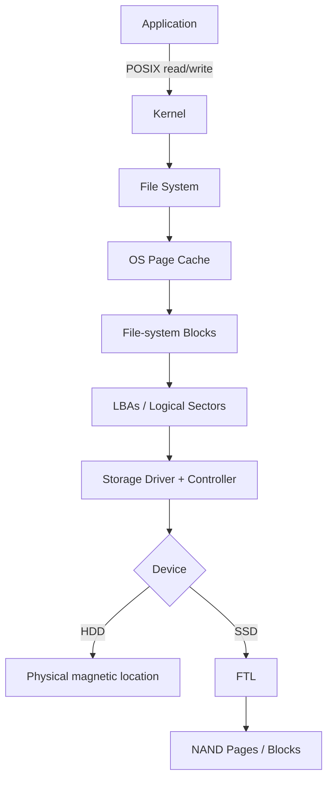
```mermaid
flowchart TD
    A[Application] -->|POSIX read/write| B[Kernel]
    B --> C[File System]
    C --> D[OS Page Cache]
    D --> E[File-system Blocks]
    E --> F[LBAs / Logical Sectors]
    F --> G[Storage Driver + Controller]
    G --> H{Device}
    H -->|HDD| I[Physical magnetic location]
    H -->|SSD| J[FTL]
    J --> K[NAND Pages / Blocks]
```

### One sentence

> **Your app thinks in files; the file system thinks in blocks; the storage device is addressed using LBAs; the device controller handles the physical media.**

---

# 2. Persistent storage: why it exists

RAM is **volatile**:

```text
power loss → RAM contents disappear
```

Persistent media keeps data across:

- process exits
- reboots
- crashes
- power loss

Examples: HDD, SSD, flash, magnetic tape.

---

# 3. HDDs: from CHS to LBA

## Old HDD model

Mechanical HDDs contain:

- platters
- read/write heads
- tracks
- sectors

Historically storage was addressed using **CHS**:

```text
C = Cylinder
H = Head
S = Sector
```

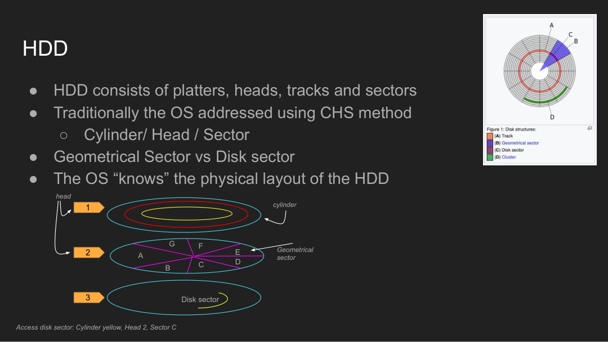

### Problem

If the OS knows the disk's physical geometry, the OS becomes coupled to that hardware design.

```text
OS knows cylinders/tracks/sectors
              ↓
Disk vendor changes physical design
              ↓
Software assumptions can break
```

The solution was to hide physical geometry behind a controller and a logical addressing interface.

---

# 4. LBA: the storage abstraction

**LBA = Logical Block Address.**

The device presents itself as a giant array:

```text
LBA 0
LBA 1
LBA 2
LBA 3
...
LBA N
```

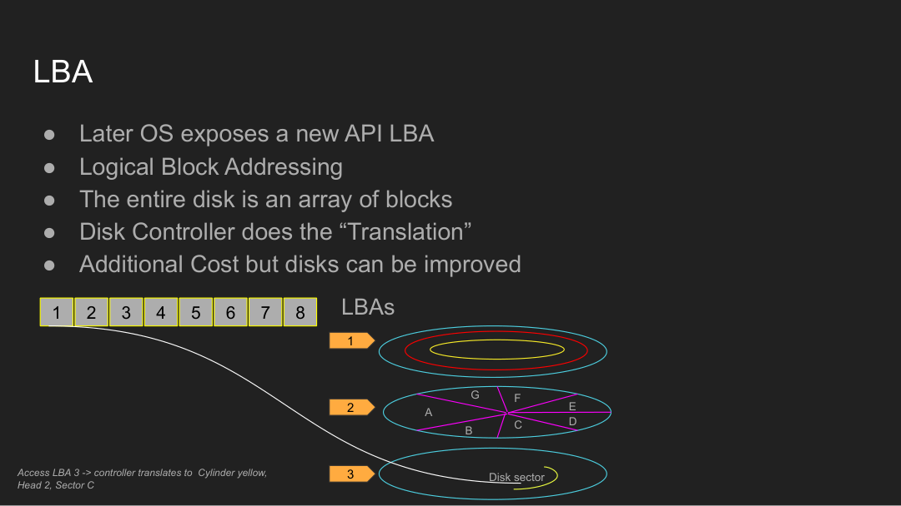

The OS sends a command conceptually like:

```text
READ
starting LBA = 800
block count  = 8
```

or:

```text
WRITE
starting LBA = 5000
block count  = 4
buffer       = <RAM buffer>
```

### Important boundary

```text
OS / driver:
"read LBA 9000"
        ↓
Device controller:
"I will determine where LBA 9000 physically lives"
```

### HDD vs SSD

| Device | OS sees | Device internally resolves to |
|---|---|---|
| Modern HDD | LBA | magnetic physical location |
| SSD | LBA | FTL → NAND physical page |

> **LBA is an address, not the physical location itself.**

---

# 5. SSD internals

SSDs use **NAND flash**.

Simplified hierarchy:

```text
SSD
└── NAND block
    ├── page
    ├── page
    ├── page
    └── page
```

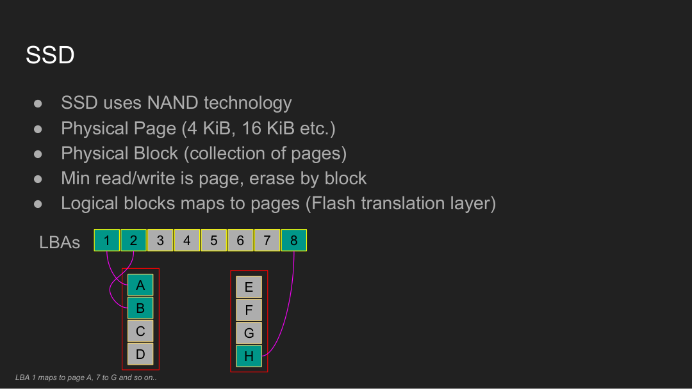

## The three NAND rules to memorize

1. **Read/write granularity is a page.**
2. **An existing programmed page is not simply updated in place.**
3. **Erase happens at the larger NAND-block level.**

That asymmetry is the reason SSD writes are much more complex internally than they look from the OS.

---

# 6. SSD updates, garbage collection, and wear

## FTL — Flash Translation Layer

The SSD controller maintains a logical → physical mapping.

```text
LBA 1 → physical page A
LBA 2 → physical page F
LBA 3 → physical page H
```

## Updating data

Suppose:

```text
LBA 1 → page A
```

Then LBA 1 is updated.

The SSD may do:

```text
page A → INVALID
new data → page B
LBA 1 → page B
```

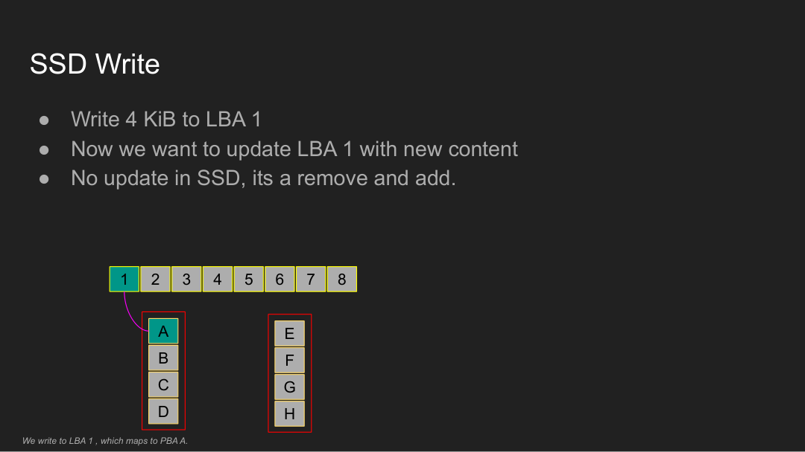

The **logical address remains LBA 1**, while its physical location changes.

## Garbage collection

Invalid pages cannot simply be reused until the relevant NAND block is erased.

If a block contains both valid and invalid pages, the controller may need to:

```text
copy valid pages elsewhere
        ↓
erase whole NAND block
        ↓
reuse the clean pages
```

## Write amplification

You request one logical write, but the SSD performs extra physical work:

```text
1 requested write
      ↓
move data + erase + rewrite + new write
      ↓
multiple physical operations
```

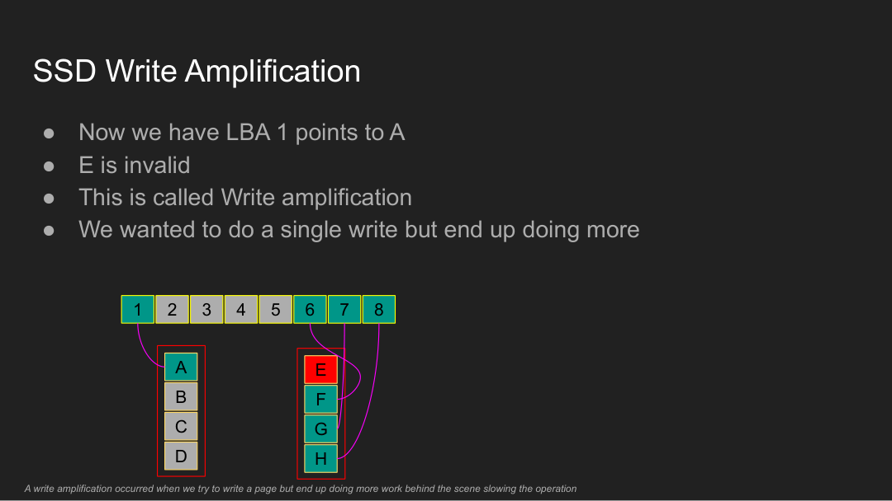

> **Write amplification = physical write work exceeds the logical writes requested by software.**

## Wear leveling

NAND supports a finite number of program/erase cycles.

Without intervention:

```text
hot pages → rewritten repeatedly → wear early
cold pages → barely touched
```

The SSD spreads writes across the media so cells wear more evenly.

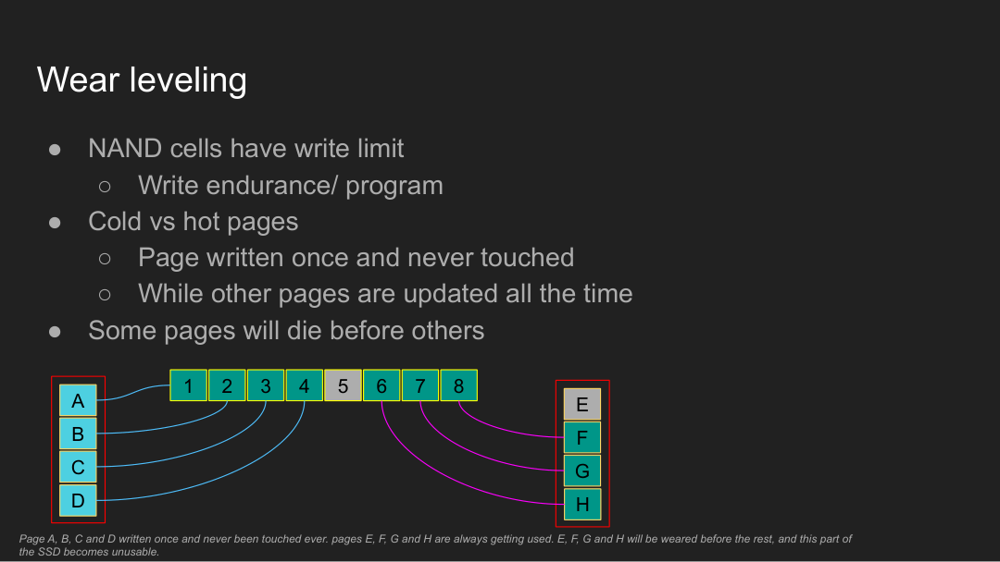

## Over-provisioning

SSDs reserve capacity invisible to normal users so the controller has working room for:

- garbage collection
- wear leveling
- remapping

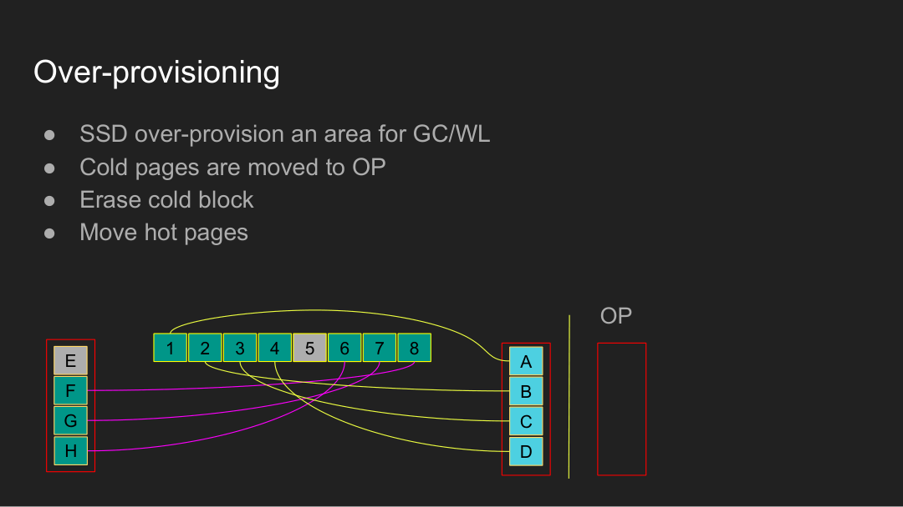

## Dead / bad physical storage

Real drives can develop unusable physical regions.

The controller can often remap an LBA to spare physical media:

```text
LBA 9124
   ↓
old physical location becomes unusable
   ↓
controller remaps it
   ↓
spare healthy location
```

The OS can continue using the same **LBA number** while the physical location underneath changes.

---

# 7. Storage terminology: block vs page vs sector

These words are overloaded. Always ask **which layer?**

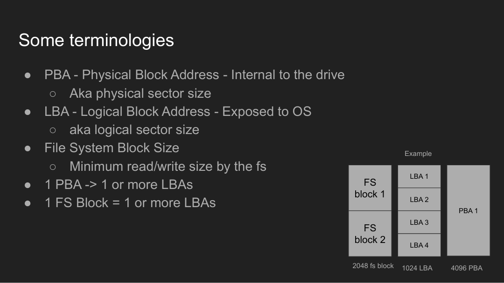

| Term | Layer | Meaning |
|---|---|---|
| Disk sector | HDD | physical magnetic sector |
| Physical sector / PBA | device | device's physical atomic unit in the course model |
| Logical sector / LBA | device interface | logical block exposed to OS |
| NAND page | SSD | flash read/program unit |
| NAND block | SSD | collection of NAND pages; erase unit |
| FS block / cluster | file system | minimum file-system allocation/read unit |
| VM page | OS memory | virtual-memory management unit |

## They do not have to be equal

Example:

```text
Logical sector / LBA = 512 B
Physical sector       = 4096 B
Filesystem block      = 4096 B
VM page               = 4096 B
```

Then:

```text
1 FS block = 8 LBAs
```

Another SSD may have a larger internal NAND page than the exposed LBA size.

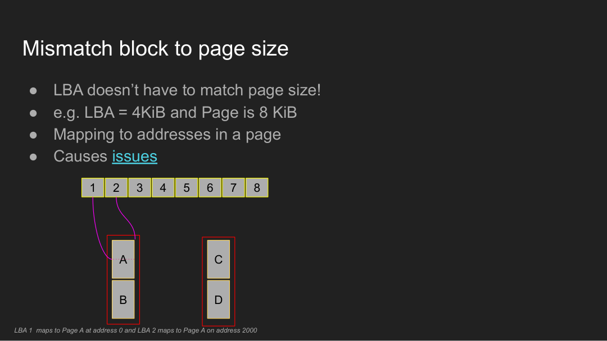

### Critical distinction

> **LBA is the device's logical addressing unit. FS block is the filesystem's allocation unit.**

A raw block-device request can address an LBA, while a normal file on a filesystem may have a larger minimum allocation unit.

---

# 8. File systems

A storage device gives us blocks.

Humans/applications want:

```text
/home/nour/notes.txt
```

not:

```text
LBA 9148 → LBA 9149 → LBA 23300
```

So the file system adds:

- files
- directories
- names
- metadata
- permissions
- allocation bookkeeping
- caching integration

Examples:

- FAT32
- NTFS
- APFS
- ext4
- XFS
- Btrfs

### Useful mental model

> **A file system behaves like a small storage database: it must keep metadata describing files and where their data lives.**

---

# 9. FAT32 and clusters

Hussein uses FAT32 because its core allocation model is simple.

## File Allocation Table

Think of FAT as a table/array where an entry can point to the next chunk of a file.

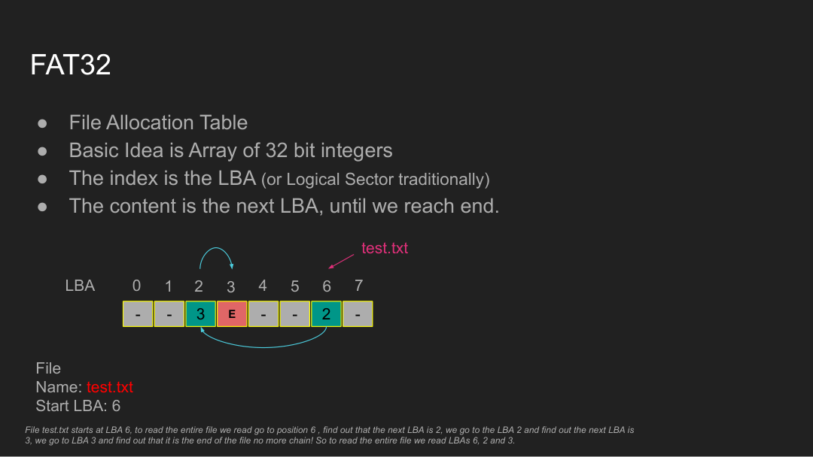

Example:

```text
test.txt starts at cluster 6

FAT[6] = 3
FAT[3] = EOF

therefore:
6 → 3 → EOF
```

This behaves conceptually like a linked list.

## Why clusters?

Instead of tracking every tiny LBA individually, FAT groups several LBAs.

Example:

```text
LBA = 512 B
8 LBAs = 4096 B

1 cluster = 4096 B
```

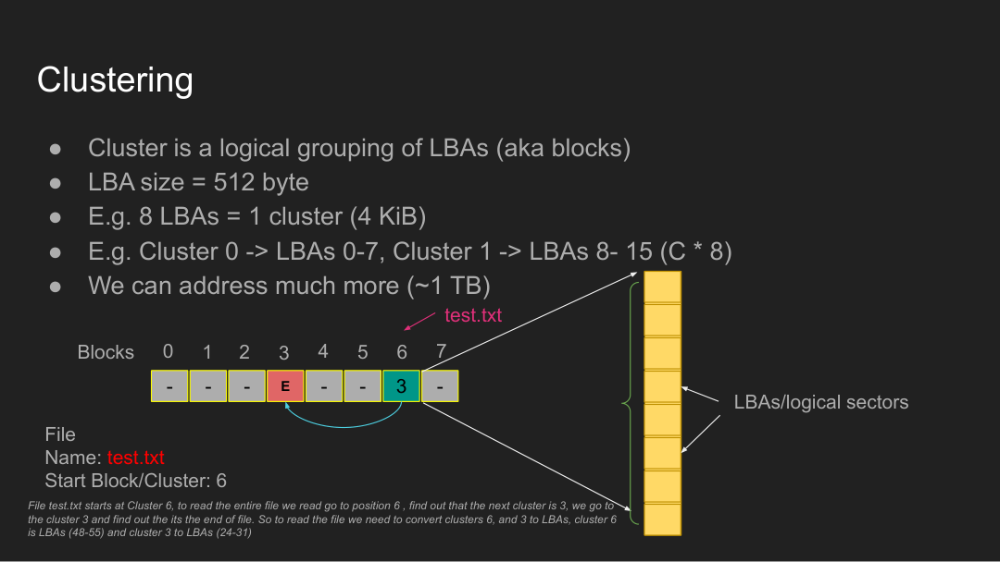

Then:

```text
Cluster 0 → LBAs 0..7
Cluster 1 → LBAs 8..15
Cluster 2 → LBAs 16..23
```

### Trade-off

Larger clusters allow more storage to be addressed with the same number of table entries, but increase **internal fragmentation**.

Example:

```text
FS block/cluster = 4096 B
file contents    = 1 B

allocated data block = at least 4096 B
```

The unused portion cannot normally be allocated to another file.

---

# 10. OS page cache

Storage is slow relative to RAM, so Linux caches file data in memory.

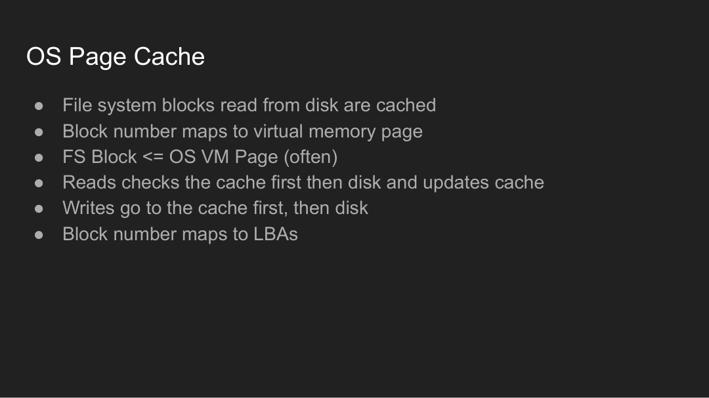

## Read hit

```text
application read()
      ↓
page cache lookup
      ↓
HIT
      ↓
copy cached data to userspace
```

No device read is needed.

## Read miss

```text
application read()
      ↓
page cache lookup
      ↓
MISS
      ↓
FS block → LBA(s)
      ↓
storage device
      ↓
page cache
      ↓
userspace
```

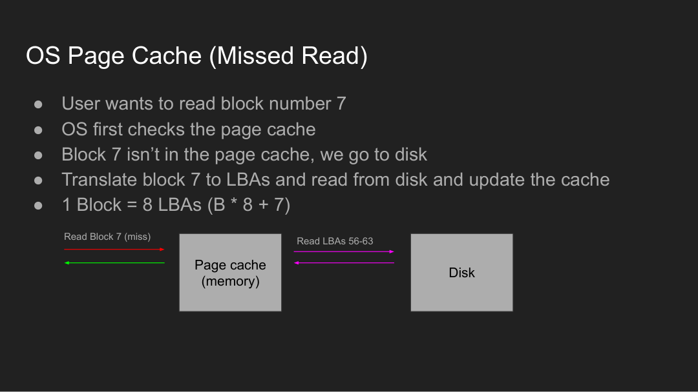

## Buffered write

Normal writes generally update cached file pages first.

```text
application write()
      ↓
page cache becomes dirty
      ↓
write() can return
      ↓
... later ...
      ↓
kernel flushes dirty data
      ↓
storage
```

This lets the OS:

- batch small writes
- merge repeated updates
- avoid excessive device operations

But it creates an important durability distinction:

> **`write()` returning does not automatically mean the data is already persistent on media.**

---

# 11. `fsync`, file modes, and databases

## `fsync(fd)`

Conceptually:

```text
"Flush this file's pending dirty state toward persistent storage now."
```

It is important for durability but expensive when called excessively.

The course uses the Firefox 3 excessive-`fsync` performance bug as a real example.

## `fdatasync()`

Similar durability idea, focused on file data and metadata required for correct retrieval rather than forcing all metadata updates in the same way as `fsync()`.

## File modes mentioned

| Option | Core idea |
|---|---|
| `O_APPEND` | writes append to the file |
| `O_DIRECT` | bypasses much of the normal OS page-cache path |
| `O_SYNC` | synchronous write behavior; stronger durability, slower |

## Why databases care

Databases often have their **own caching and durability logic**.

They care about:

- avoiding duplicate caching
- controlling when WAL / redo information becomes durable
- avoiding excessive `fsync()`
- preventing torn/partial writes
- understanding the device's real atomic write guarantees

> A database saying **COMMIT succeeded** may require stronger guarantees than an ordinary application's buffered `write()`.

---

# 12. Partitions, formatting, and mounting

These are three different concepts.

## Partition

A **partition** is a logical contiguous range of LBAs.

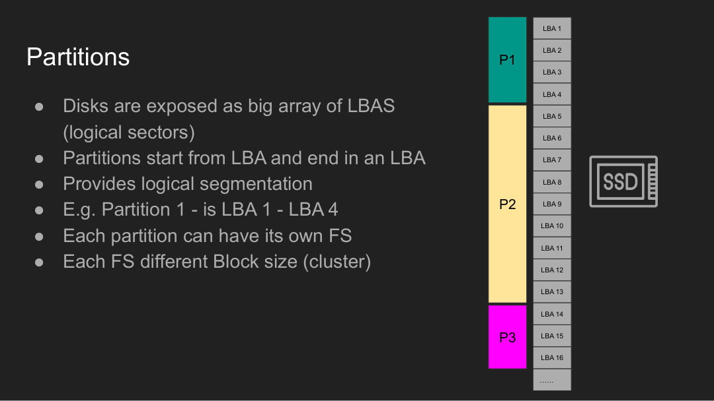

Example:

```text
Disk LBAs 0 -------------------------------- 999999

Partition A: 2048  → 300000
Partition B: 300001 → 700000
Partition C: 700001 → 999999
```

Each partition can use a different filesystem.

## Format

Formatting means:

> **Create the chosen filesystem's structures on that partition.**

For example:

```text
raw partition
     ↓
mkfs.ext4
     ↓
ext4 metadata + allocation structures + journal...
```

## Mount

Mounting means:

> **Attach a filesystem to a path in the Linux directory tree.**

```text
/dev/sdb1
   ↓
mount
   ↓
/mnt/usb
```

Then:

```bash
cd /mnt/usb
```

means you are accessing the filesystem on that partition.

### The chain to memorize


```mermaid
flowchart LR
    A[Physical Disk] --> B[Range of LBAs = Partition]
    B --> C[Format with ext4 / NTFS / FAT32 / ...]
    C --> D[Filesystem]
    D --> E[Mount at a directory]
    E --> F[Use normal paths/files]
```

## C:, D:, E: on Windows

Drive letters usually represent mounted volumes. They may be:

- different partitions on one physical device
- different physical drives
- removable media

So **C:, D:, E: do not necessarily mean three physical disks**.

## Multiple filesystems at once

An OS can support many filesystem types simultaneously.

Example Linux machine:

```text
/            → ext4
/data        → XFS
/backup      → Btrfs
/mnt/usb     → FAT32
```

## Partition alignment

If filesystem blocks cross physical-sector boundaries unnecessarily, one logical operation can require extra physical work.

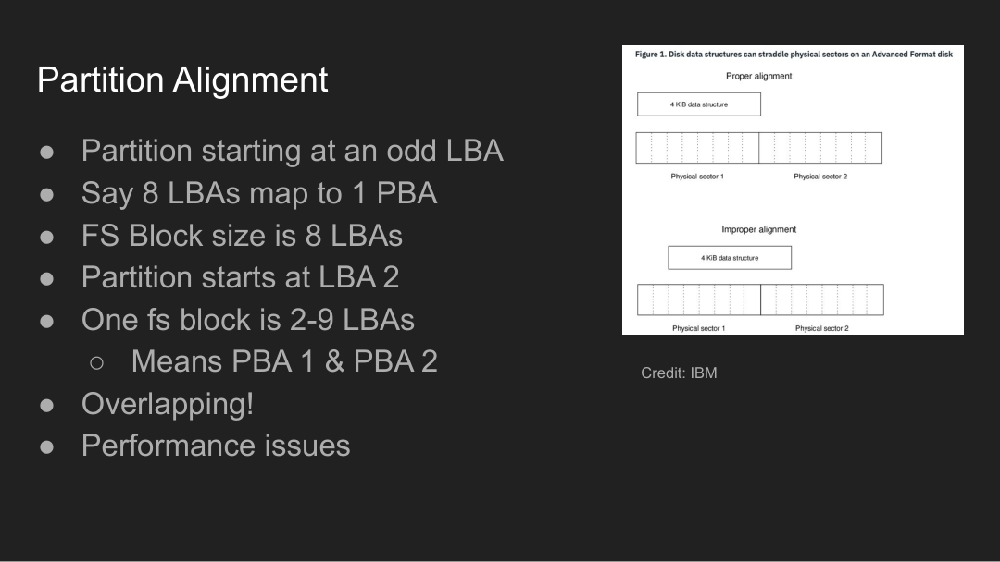

Good idea:

```text
FS block boundary
|---------|---------|
Physical boundary
|---------|---------|
```

Bad alignment:

```text
Physical: |---------|---------|
FS:            |---------|
                 ↑ spans two physical units
```

---

# 13. What really happens on `read()`

This is the section that connects **processes + virtual memory + system calls + filesystem + storage**.

## POSIX interface

Your application calls:

```c
read(fd, buffer, size);
```

Where:

- `fd` identifies the opened file in the process
- `buffer` points to userspace memory
- `size` is the requested byte count

Your application does **not** normally say `READ LBA 6`.

## Example from the lecture

```text
test.dat size           = 5000 B
FS block size           = 4096 B
LBA size                = 4096 B
physical sector         = 4096 B
VM page                 = 4096 B
```

So the file needs two filesystem blocks.

The file metadata leads the filesystem to blocks `6` and `3` in the simplified example.

### Step 1 — resolve the open file

```text
fd
 ↓
open-file/kernel structures
 ↓
file/inode metadata
 ↓
filesystem blocks 6 and 3
```

### Step 2 — check page cache

Suppose:

```text
block 3 → cached ✅
block 6 → missing ❌
```

Only block 6 needs storage I/O.

### Step 3 — convert FS block → LBA

Because this example uses a 1:1 size mapping:

```text
FS block 6 → LBA 6
```

In another system, one FS block may map to multiple LBAs.

### Step 4 — issue device command

Conceptually:

```text
READ LBA 6
length = 1 logical block
```

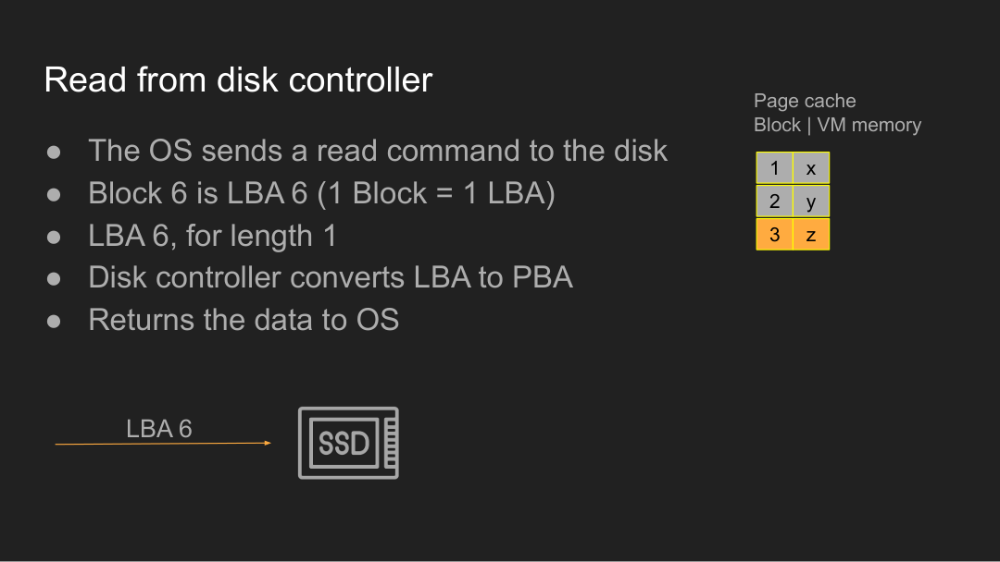

The device controller then resolves that LBA to its physical location.

### Step 5 — update page cache

Returned data becomes cached kernel memory.

### Step 6 — copy to userspace

The kernel copies only the bytes the application actually requested into the application's buffer.

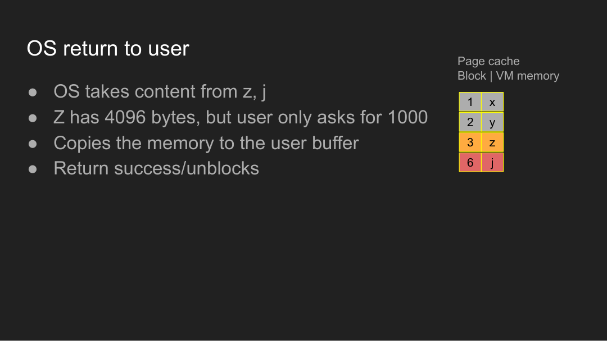

## Full read path

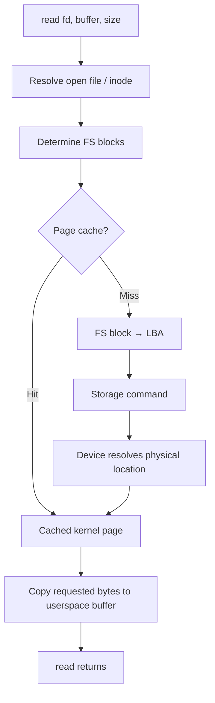
```mermaid
flowchart TD
    A[read fd, buffer, size] --> B[Resolve open file / inode]
    B --> C[Determine FS blocks]
    C --> D{Page cache?}
    D -->|Hit| H[Cached kernel page]
    D -->|Miss| E[FS block → LBA]
    E --> F[Storage command]
    F --> G[Device resolves physical location]
    G --> H
    H --> I[Copy requested bytes to userspace buffer]
    I --> J[read returns]
```

### The address/name transformations

```text
Application:  test.dat, bytes 0..4999
                    ↓
File system:  blocks 6 and 3
                    ↓
Block layer:  LBA(s)
                    ↓
Device:       physical media location
```

> **File → FS block → LBA → physical media**

Then on the way back:

> **physical media → kernel page cache → userspace buffer**

---

# 14. Linux demo: only what matters

You do **not** need to memorize the messy demo line-by-line.

## See disks and partitions

```bash
lsblk
lsblk -f
```

## Partition a test device

```bash
sudo fdisk /dev/sdX
```

Useful interactive commands:

```text
n  new partition
p  print partition table
d  delete partition
w  write changes
m  help
```

> ⚠️ `fdisk` / `mkfs` can destroy data. Practice on a VM or disposable test drive.

## Create a filesystem

```bash
sudo mkfs.ext4 /dev/sdX1
```

## Create a mount point

```bash
sudo mkdir -p /mnt/test
```

## Mount

```bash
sudo mount /dev/sdX1 /mnt/test
```

Now:

```bash
cd /mnt/test
```

accesses that filesystem.

## Demo lesson

```text
Disk
 ↓
Partition
 ↓
Format
 ↓
Filesystem
 ↓
Mount
 ↓
Files/directories
```

That's the part worth retaining.

---

# 15. Backend-engineer takeaways

## 1. `read()` may never touch the SSD

A page-cache hit can satisfy the request from RAM.

## 2. `write()` may not mean durable

Buffered writes can return while dirty data is still in memory.

## 3. Durability costs latency

`fsync()` exists for a reason, but too many forced flushes can crush performance.

## 4. Device behavior matters to databases

SSD garbage collection, write amplification, atomic write size, and filesystem behavior can affect tail latency.

## 5. Sequential / append-heavy workloads can be friendlier

They can reduce random updates and often align better with storage and filesystem behavior.

## 6. Filesystem choice can affect real workloads

The course discusses a Kafka workload where filesystem behavior caused latency spikes and switching filesystem changed performance. The important lesson is not “one filesystem is always better”, but:

> **Workload + filesystem behavior must fit each other.**

## 7. Abstractions are useful—but they hide costs

```text
Backend developer sees: write(file)

Underneath:
page cache → FS metadata → FS blocks → LBAs → device cache/controller → physical media
```

This is why OS/storage knowledge matters when debugging database or backend latency.

---

# 16. Common confusions

## “Can we allocate one LBA?”

Different question depending on layer:

- **Block-device interface:** one logical LBA can be addressed if the device/interface permits it.
- **Normal filesystem file allocation:** allocation happens in **filesystem blocks/clusters**, which may contain several LBAs.
- **Physical media:** the actual physical write unit may be larger still.

Example:

```text
LBA            = 512 B
FS block       = 4096 B
Physical sector= 4096 B
```

A 1-byte normal file still needs at least one `4096 B` filesystem data block, although filesystem metadata adds additional shared/structural storage overhead.

## “Does LBA mean physical NAND page?”

No.

```text
LBA = logical address exposed to OS
NAND page = physical flash structure inside SSD
```

FTL maps between them.

## “Does the OS tell an HDD the platter/head today?”

Modern storage normally exposes logical blocks. CHS is primarily the historical model used to motivate LBA abstraction.

## “Is a partition a filesystem?”

No.

```text
partition = range of LBAs
filesystem = data structures created on that region
```

## “Is mount formatting?”

No.

```text
format → create filesystem
mount  → expose existing filesystem at a path
```

## “Does my OS have multiple filesystems?”

It can support and mount many filesystem types at the same time. Each formatted volume uses a particular filesystem.

## “Is the storage demo essential?”

The **conceptual chain** is essential; memorizing every command/error from the demo is not.

---

# 17. Active recall

Try without opening the notes.

1. Why was exposing CHS to software a coupling problem?
2. Define LBA in one sentence.
3. What information does a modern storage read command conceptually contain?
4. Who translates an SSD LBA into a NAND physical location?
5. What is the difference between a NAND page and NAND block?
6. Why can't an SSD update every page in place?
7. What is garbage collection?
8. Define write amplification.
9. Why is wear leveling needed?
10. What is over-provisioning used for?
11. Differentiate LBA, PBA/physical sector, FS block, and VM page.
12. Why does FAT32 group LBAs into clusters?
13. What trade-off comes from larger clusters?
14. What is the OS page cache?
15. Why can `read()` complete without disk I/O?
16. Why does `write()` returning not automatically guarantee durability?
17. What problem does `fsync()` solve?
18. What does `O_DIRECT` try to bypass?
19. Define partition, format, filesystem, and mount.
20. Why does partition alignment matter?
21. Walk through `read(fd, buf, 5000)` from userspace to storage and back.
22. In the read path, where does FS block → LBA translation occur conceptually?
23. Why can copying a file between two filesystems require a full read + rewrite?
24. If LBA is 512 B and FS block is 4096 B, how many LBAs are in one FS block?
25. If a file contains one byte and the FS allocation block is 4096 B, what is the minimum data allocation for that file?

---

# 18. Final memory map

```text
APPLICATION
    |
    | read() / write() / fsync()
    v
POSIX / SYSTEM CALL INTERFACE
    |
    v
KERNEL
    |
    +---- FILE SYSTEM
    |       |
    |       +---- files / dirs / inodes / metadata
    |       |
    |       +---- filesystem blocks
    |               |
    |               +---- PAGE CACHE (RAM)
    |               |
    |               v
    +-------------> LBAs
                      |
                      v
                DEVICE CONTROLLER
                      |
             +--------+---------+
             |                  |
             v                  v
            HDD                SSD
       physical sector      FTL mapping
                                |
                                v
                         NAND pages/blocks
                                |
                      GC / wear leveling / OP
```

## Five sentences to leave with

> **1. The OS normally addresses storage using logical blocks (LBAs), not physical geometry.**  
> **2. SSD controllers dynamically map those LBAs to NAND locations.**  
> **3. A filesystem turns raw block storage into files, directories, metadata, and filesystem blocks.**  
> **4. The OS page cache makes many file reads/writes memory operations first.**  
> **5. A simple `read()` crosses several translations: file → FS block → LBA → physical media → page cache → userspace.**

---

## Sources

- Hussein Nasser — *Fundamentals of Operating Systems*, Storage Management slides 268–317.
- Course transcripts supplied for Persistent Storage, File Systems, Simple Read, and the partition/mount demo.
- Optional related reading is collected in [`REFERENCES.md`](REFERENCES.md).
