# Socket Management — OS ↔ Networking ↔ Backend

> **Course scope:** slides **318–414**, condensed around what actually matters for backend engineering.  
> The networking recap is intentionally short; the focus is the **kernel view of sockets, connections, queues, blocking I/O, and async I/O**.

---

## Table of Contents

1. [The one mental model](#1-the-one-mental-model)
2. [Minimal networking recap](#2-minimal-networking-recap)
3. [Listening socket vs connected socket](#3-listening-socket-vs-connected-socket)
4. [What happens when a client connects](#4-what-happens-when-a-client-connects)
5. [SYN queue, accept queue, and backlog](#5-syn-queue-accept-queue-and-backlog)
6. [Receive and send buffers](#6-receive-and-send-buffers)
7. [Request vs connection vs process/thread](#7-request-vs-connection-vs-processthread)
8. [Forking listeners and `SO_REUSEPORT`](#8-forking-listeners-and-so_reuseport)
9. [Socket programming patterns](#9-socket-programming-patterns)
10. [Why blocking I/O is a backend problem](#10-why-blocking-io-is-a-backend-problem)
11. [`select()` → `epoll`](#11-select--epoll)
12. [Readiness vs completion](#12-readiness-vs-completion)
13. [`io_uring`](#13-io_uring)
14. [Where Node.js fits](#14-where-nodejs-fits)
15. [Copies, zero-copy, and `sendfile()`](#15-copies-zero-copy-and-sendfile)
16. [The C web-server lifecycle](#16-the-c-web-server-lifecycle)
17. [Backend bottlenecks to recognize](#17-backend-bottlenecks-to-recognize)
18. [What you must master](#18-what-you-must-master)
19. [Source slide map](#19-source-slide-map)

---

# 1. The one mental model

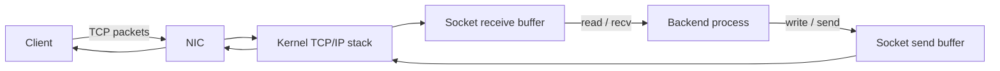

A backend does **not** directly receive packets from the NIC.

The kernel:

- implements TCP/IP,
- establishes connections,
- keeps connection state,
- buffers incoming/outgoing bytes,
- exposes sockets to the process through **file descriptors** on Linux.

The backend mainly sees:

```text
listen_fd  -> "give me new connections"
client_fd  -> "this particular TCP connection"
```

---

# 2. Minimal networking recap

## Only what matters for this OS section

| Concept | Keep this |
|---|---|
| IP | identifies a host/interface across networks |
| Port | identifies a service endpoint on that host |
| UDP | datagram/message-oriented, no TCP-style connection state |
| TCP | byte stream + connection state + ordering + retransmission + flow/congestion control |
| 4-tuple | source IP + source port + destination IP + destination port identifies a TCP flow/connection |
| HTTP | application protocol carried over a transport; the socket itself only sees bytes |

### Example connection

```text
192.168.1.20:53100  --->  10.0.0.5:8000
   client side                server side
```

The server can have thousands of connections ending at the same `:8000` because the complete 4-tuples differ.

---

# 3. Listening socket vs connected socket

This distinction must be automatic.

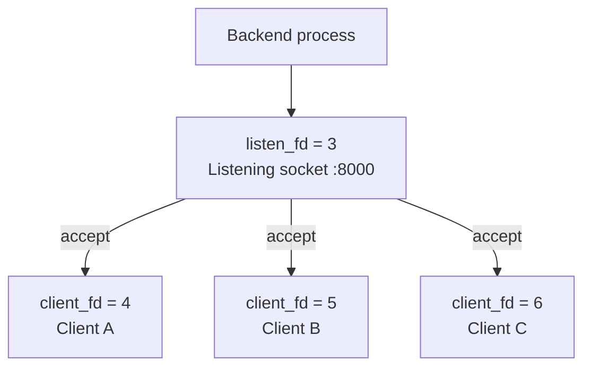

## Listening socket

Purpose:

> Wait for **new TCP connections** on an IP:port.

Typical lifecycle:

```c
socket();
bind();
listen();
```

## Connected socket

Purpose:

> Exchange bytes with **one accepted TCP connection**.

Created for the application by:

```c
client_fd = accept(listen_fd, ...);
```

Then the application can use:

```c
read(client_fd, ...);
write(client_fd, ...);
```

### Precision note

`socket()` creates the socket FD. `bind()` associates an address, and `listen()` turns it into a listening socket. `accept()` returns a **new FD** referencing the accepted connection.

---

# 4. What happens when a client connects

Slides 373–380 are the core of this section.

```text
Client                     Kernel                      Backend
  |                           |                           |
  |-------- SYN ------------->|                           |
  |<------ SYN/ACK ------------|                           |
  |-------- ACK ------------->|                           |
  |                           | completed connection      |
  |                           | -> accept queue           |
  |                           |                           |
  |                           |<------ accept() ----------|
  |                           |------ client_fd --------->|
```

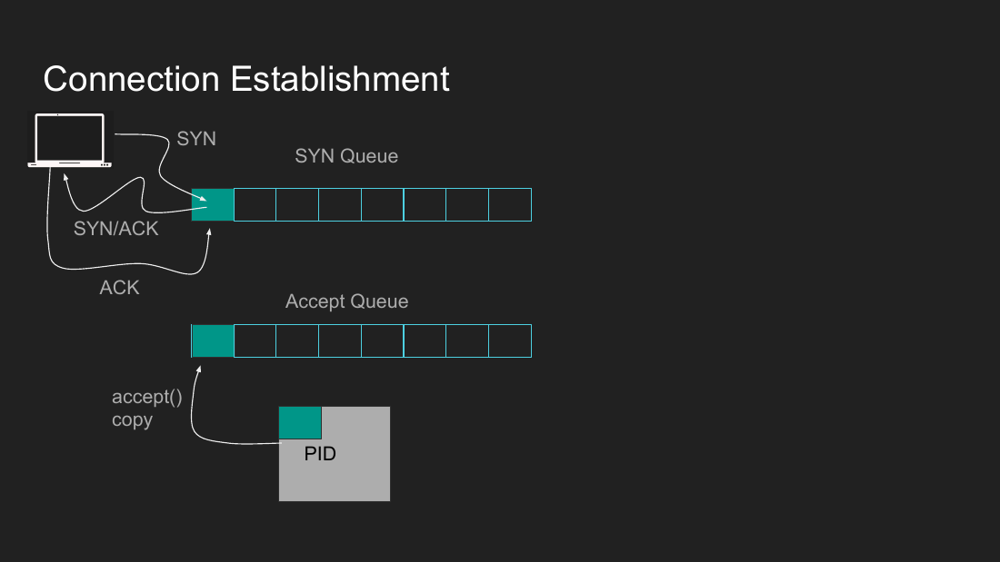

### Who performs the TCP handshake?

**The kernel TCP stack.**

Your route handler does not manually generate SYN/SYN-ACK/ACK.

The backend application becomes involved when it calls `accept()`.

---

# 5. SYN queue, accept queue, and backlog

Use the word **queue** as the conceptual model. Kernel implementations can use more specialized structures internally.

## SYN queue

Contains **incomplete connection attempts** while the handshake is in progress.

```text
SYN received
    ↓
handshake not complete
    ↓
SYN-side state
```

## Accept queue

Contains **completed TCP connections** waiting for the application to accept them.

```text
handshake complete
      ↓
accept queue
      ↓
accept()
      ↓
connected socket FD
```

## Why backlog matters

If the application accepts too slowly:

```text
accept queue
[conn][conn][conn][conn][FULL]
```

new connection attempts may be delayed, dropped, or time out depending on OS/TCP behavior.

### Historical attack idea: SYN flood

Attacker sends many SYNs but does not complete handshakes -> consumes incomplete-connection state.

Modern systems have defenses such as SYN cookies, timeouts, and queue tuning.

### Precision note

On modern Linux, the `listen(..., backlog)` argument mainly governs the queue of **completed connections** waiting for `accept()`; incomplete SYN handling also has separate kernel limits/tuning. The slides use one simplified backlog mental model.

---

# 6. Receive and send buffers

After `accept()`, every connected socket has connection-specific kernel state including send/receive buffering.

## Receive path

```text
Client sends bytes
      ↓
NIC
      ↓
Kernel TCP stack
      ↓
connection receive buffer
      ↓
read()/recv()
      ↓ COPY
backend user-space buffer
```

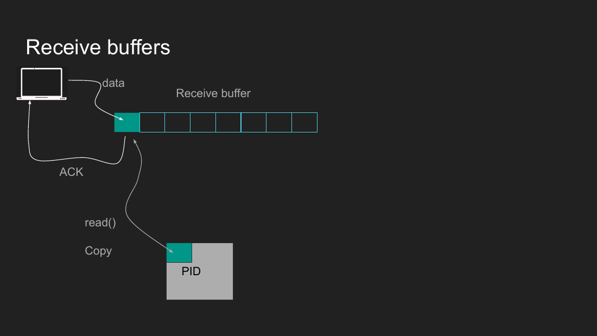

Important:

> Data can already be inside the **kernel receive buffer** while your backend code has not read it yet.

## Send path

```text
backend response bytes
      ↓
send()/write()
      ↓
kernel send buffer
      ↓
TCP stack / NIC
      ↓
network
```

`send()` does not necessarily mean “the byte is physically on the wire right now.” The kernel handles buffering, TCP segmentation, ACK state, windows, and transmission.

## Backpressure / flow control

If your backend reads too slowly:

```text
backend slow to read
       ↓
receive buffer fills
       ↓
advertised receive window shrinks
       ↓
sender must slow down
```

Do not confuse:

- **flow control** -> can the receiver keep up?
- **congestion control** -> can the network path keep up?

---

# 7. Request vs connection vs process/thread

This was the biggest trap in this section.

```text
10,000 HTTP requests
        !=
10,000 TCP connections
        !=
10,000 threads
        !=
10,000 processes
```

A persistent TCP connection can carry multiple HTTP requests over time.

```text
client_fd 7
   |
   +-- request 1
   +-- request 2
   +-- request 3
```

And:

> **A file descriptor is not a thread.**

| Thing | Meaning |
|---|---|
| FD | handle identifying an open kernel object/socket for this process |
| Connection | TCP communication state between endpoints |
| Thread | execution stream that runs code |
| Process | isolated execution/address-space container |

One thread may handle many connection FDs with event-driven I/O.

---

# 8. Forking listeners and `SO_REUSEPORT`

These are **two different designs**.

## A. Fork after creating the listener

```text
                  SAME kernel listening socket
                           ^
                           |
                  +--------+--------+
                  |                 |
              Parent FD         Child FD
              Process A         Process B
```

`fork()` duplicates the process's FD table entries; both processes can reference the same underlying open listening socket.

Both can call `accept()`.

## B. Distinct listeners with `SO_REUSEPORT`

Normally two unrelated sockets cannot independently bind/listen on the same IP:port.

With `SO_REUSEPORT`, cooperating listeners can use the same address:

```text
             Kernel distributes new flows
                  /       |       \
                 v        v        v
              Socket A Socket B Socket C
                 |        |        |
              Worker A Worker B Worker C
```

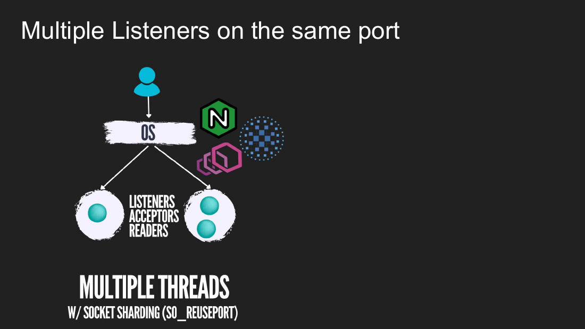

Why use this?

- each worker has its own listener/accept state,
- reduces contention on one shared accept path,
- useful for very high connection-accept rates.

---

# 9. Socket programming patterns

Slides 389–394 are not six unrelated facts. They answer one design question:

> **Which worker performs listen, accept, read, parse, and business logic?**

```text
LISTENER -> ACCEPTOR -> READER -> PARSER/DECRYPTOR -> WORKER
```

You can place those roles in the same thread or split them.

## Pattern A — single listener / single worker

Mental example: **Node.js main event-loop model** for network work.

```text
one main execution thread
  listen + accept + coordinate reads + callbacks
```

Good when work is mostly I/O and callbacks stay short.

## Pattern B — single acceptor / multiple worker threads

Mental example: **memcached-style architecture**.

```text
listener/acceptor
       |
       +--> worker thread
       +--> worker thread
       +--> worker thread
```

Good for distributing connection/request work after acceptance.

## Pattern C — network side creates jobs, worker pool executes them

Mental example: **RAMCloud-style discussion**.

```text
accept/read/parse
      ↓
request/job
      ↓
worker pool
```

Useful when networking and CPU/business work have different bottlenecks.

## Pattern D — multiple acceptors sharing one listener

Mental example: **Nginx worker-process style**.

More acceptors, but a shared listener/accept path can require synchronization and cause contention.

## Pattern E — multiple listeners with `SO_REUSEPORT`

Each worker accepts from its own listener; kernel distributes incoming flows.

### Do not memorize products

Memorize the architecture knobs:

```text
How many listeners?
How many acceptors?
Who owns a connection?
Who reads?
Who parses?
Who executes CPU/business work?
```

---

# 10. Why blocking I/O is a backend problem

Traditional blocking calls can stop the current execution stream until something changes.

Examples:

```text
accept() -> blocks if no completed connection is available
read()   -> blocks if no data is available on a blocking socket
write()  -> can block if it cannot make progress, e.g. buffers/backpressure
```

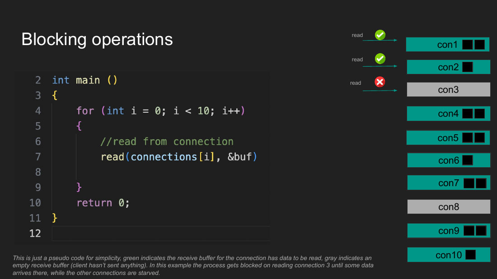

Imagine:

```text
fd1 ✅ data
fd2 ✅ data
fd3 ❌ no data  <-- blocking read stops here
fd4 ✅ data     <-- starved
fd5 ✅ data     <-- starved
```

If one thread blindly loops over blocking sockets, **one idle client can stop progress for ready clients**.

That is why async/non-blocking I/O matters.

---

# 11. `select()` → `epoll`

## `select()` mental model

1. Give the kernel a set of FDs to monitor.
2. Wait until at least one is ready.
3. Application scans the FD set to discover which ones are ready.
4. Perform the actual `read()/write()/accept()`.

Problem at scale:

```text
10,000 monitored FDs
2 ready
application may still scan the large set
```

Also involves repeatedly communicating FD-set state across the user/kernel boundary.

## `epoll` mental model — Linux

Register interest in FDs with the kernel, then wait for **ready events**.

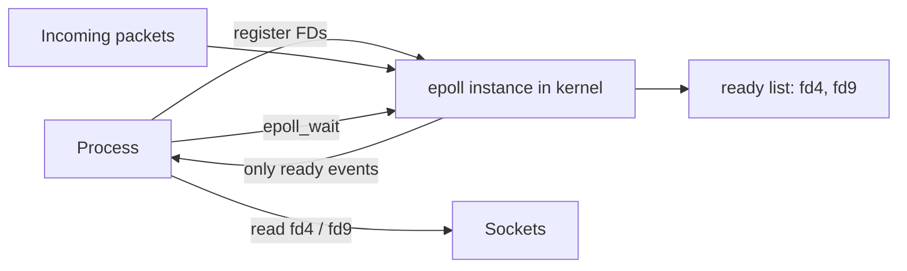

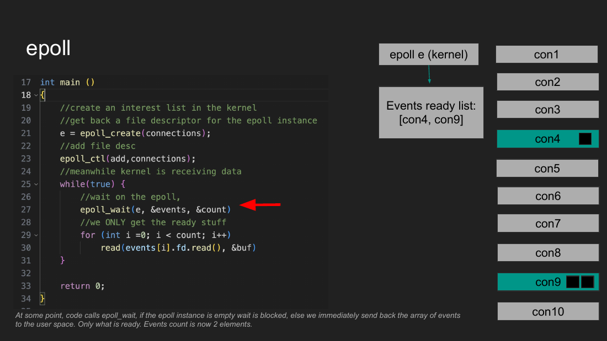

The key improvement:

> The application can work on **ready FDs**, rather than blindly attempting a blocking read on every connection.

### Level-triggered vs edge-triggered

Know the idea, not every flag:

- **level-triggered:** keeps reporting readiness while the condition remains true,
- **edge-triggered:** reports state transitions; more efficient in some designs but easier to misuse because you must drain/track state correctly.

---

# 12. Readiness vs completion

This is the most important async distinction.

```text
READINESS                           COMPLETION
---------                           ----------
"Tell me when I can do it"          "Do it and tell me when done"

kernel: fd7 is readable             app: submit read job
app: read(fd7)                      kernel: performs operation
                                     kernel: completion result

select / epoll / kqueue             IOCP / io_uring-style model
```

## Readiness

Best mental fit for sockets:

```text
receive buffer empty -> not ready
packet arrives        -> ready
```

## Completion

Best mental fit when the important fact is not “ready?” but:

> “Please perform this potentially slow operation and return the result later.”

Regular files do not map cleanly to socket-style readiness: a file can be logically readable while the actual storage operation still takes time.

---

# 13. `io_uring`

Linux completion-oriented asynchronous I/O interface.

Course mental model:

```text
USER / PROCESS
    |
    | writes jobs
    v
Submission Queue  ===== shared ring memory =====>  KERNEL
                                                  does work
USER / PROCESS   <===== Completion Queue ========  KERNEL
    ^
    | consumes completed operations
```

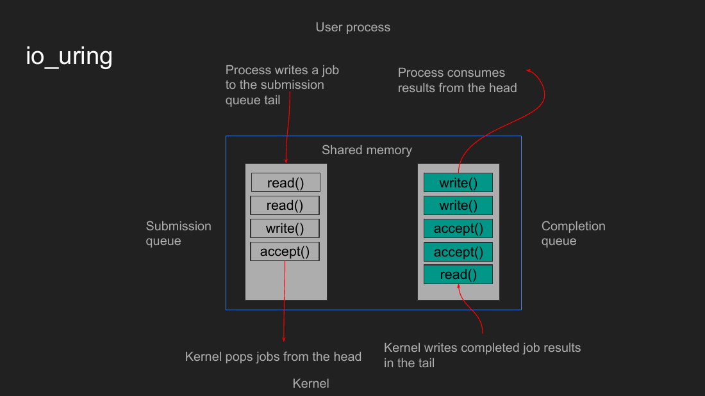

Why it is interesting:

- batch/submit work,
- fewer syscall transitions for some workflows,
- completion-based design,
- supports more than socket readiness use cases.

### Historical course note

Slide 412 discusses security concerns and Google restrictions around `io_uring` at the time the course material was made. Treat that as **historical context**, not a timeless statement about current deployments.

---

# 14. Where Node.js fits

Use the precise statement:

> **Normal JavaScript execution runs on one main event-loop thread, but Node.js as a runtime is not “only one thread.”**

## Network I/O

On Linux, libuv can use readiness facilities such as `epoll`.

```text
thousands of socket FDs
       ↓
OS monitors readiness
       ↓
only ready events returned
       ↓
Node event loop schedules JS callbacks
```

## libuv thread pool

Some operations are offloaded through libuv's worker pool, including certain filesystem, DNS, crypto/compression work.

## Explicit parallel JavaScript

Node can also use:

```text
worker_threads
```

for actual parallel JS execution, or multiple Node processes for multi-core scaling.

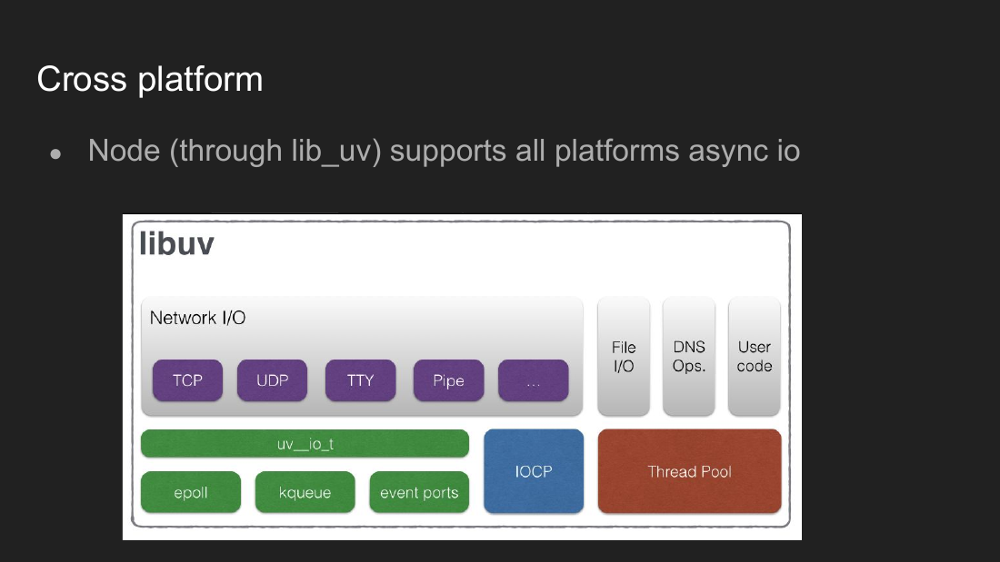

### Event loop in one sentence

> A loop that repeatedly takes **ready/completed events** and runs their corresponding callbacks.

---

# 15. Copies, zero-copy, and `sendfile()`

Normal file-serving path can involve unnecessary movement:

```text
Disk
  ↓
Kernel page cache
  ↓ COPY
Backend user-space memory
  ↓ COPY
Kernel socket path
  ↓
NIC
```

If the application does not need to transform the bytes, APIs such as `sendfile()` can let the kernel move file data toward the socket without the normal round-trip through a user-space buffer.

```text
Page cache  ------------------>  socket/NIC path
             avoid user-space copy
```

### Why zero-copy is not always available

If your application must:

- compress,
- encrypt in user space,
- parse,
- transform,
- generate dynamic content,

then it may need the bytes in user space.

### Nagle's algorithm — only the idea

TCP may avoid immediately sending tiny writes to improve network efficiency.

Trade-off:

```text
wait/combine -> fewer tiny packets, possibly more latency
send now     -> lower latency, possibly more overhead
```

Do not memorize tuning yet; remember that **buffering trades latency for efficiency**.

---

# 16. The C web-server lifecycle

The demo exists to expose what high-level frameworks hide.

```text
socket()
   ↓
bind()
   ↓
listen()
   ↓
while forever:
   accept()
      ↓
   read()
      ↓
   application logic
      ↓
   write()
      ↓
   close(client_fd)
```

See [`examples/c-web-server.c`](examples/c-web-server.c).

## Hidden behind high-level frameworks

Node/Python/etc. eventually rely on the same OS ideas:

```text
socket -> bind -> listen -> accept -> read/write
```

They wrap them in higher-level objects, callbacks, event loops, request parsers, and framework APIs.

## Why the demo server is intentionally bad for production

It handles one client at a time with blocking calls:

```text
accept client A
   ↓
read A
   ↓
write A
   ↓
close A
   ↓
accept next client
```

That simplicity is useful for learning because you can see exactly where the process blocks.

---

# 17. Backend bottlenecks to recognize

| Bottleneck | What happens |
|---|---|
| accept too slowly | accept queue pressure; new clients struggle to connect |
| client never completes handshake | consumes incomplete-handshake state until defenses/timeouts remove it |
| read too slowly | receive buffers fill; TCP flow control slows sender |
| write/send pressure | outgoing buffers/backpressure can block or delay progress |
| one blocking connection | can starve other ready connections in naive single-thread design |
| too many shared acceptors | synchronization/lock contention around shared state |
| CPU-heavy JS on Node main thread | event loop cannot run other JS callbacks promptly |
| unnecessary copying | extra memory bandwidth + CPU/cache work |

---

# 18. What you must master

## Must be automatic

- [ ] Listening socket **!=** connected socket.
- [ ] `accept()` happens once per **TCP connection**, not once per HTTP request.
- [ ] `accept()` returns a new connected-socket FD.
- [ ] Connection FD **!=** thread.
- [ ] One process/thread can own many FDs.
- [ ] Kernel performs the TCP handshake and manages connection state.
- [ ] Completed connections wait for the application in accept-side kernel state.
- [ ] Incoming bytes wait in the connection's receive buffer until the app reads them.
- [ ] Outgoing writes enter kernel socket buffering before actual transmission.
- [ ] Blocking `read()`/`accept()` can stop the current thread.
- [ ] `select`/`epoll` are **readiness** ideas.
- [ ] `io_uring`/IOCP-style designs are **completion** ideas.
- [ ] Node's JS main execution is usually one event-loop thread; the runtime/OS may use other threads/mechanisms.
- [ ] `fork()` sharing one listener is different from distinct `SO_REUSEPORT` listeners.

## Nice to recognize, not memorize yet

- SYN cookies
- exact queue/hash-table implementation
- level-triggered vs edge-triggered flags
- Nagle tuning
- exact `io_uring` API structures
- kernel `sk_buff` internals

---

# 19. Source slide map

| Slides | Used for |
|---|---|
| 318–343 | only the minimum client-server/OSI/IP/port context |
| 352–372 | UDP/TCP recap; TCP connection semantics |
| 373–383 | sockets, SYN/accept queues, handshake, sharding |
| 384–388 | receive/send buffers and slow-reader behavior |
| 389–394 | socket programming patterns |
| 395–414 | blocking I/O, select, epoll, io_uring, libuv |

The C server lifecycle, zero-copy/`sendfile()`, Node clarifications, and some precision notes come from the lecture transcripts/discussion around this section rather than being copied from every slide.

---

## Final mental picture

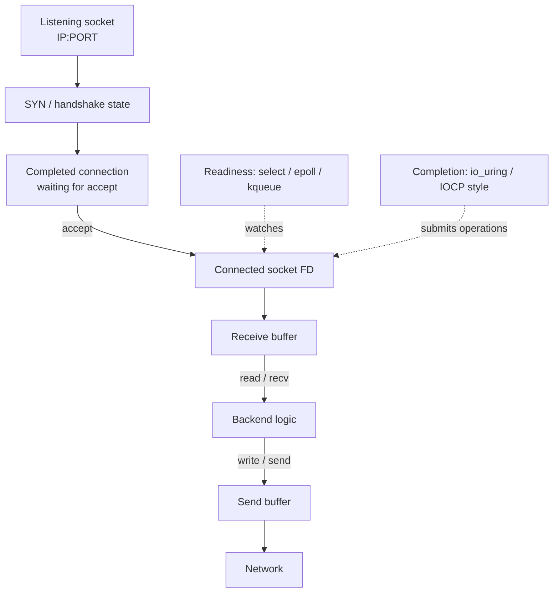

> **Backend engineering, from the OS point of view, is largely the art of efficiently managing many sockets without wasting CPU while waiting on I/O.**
