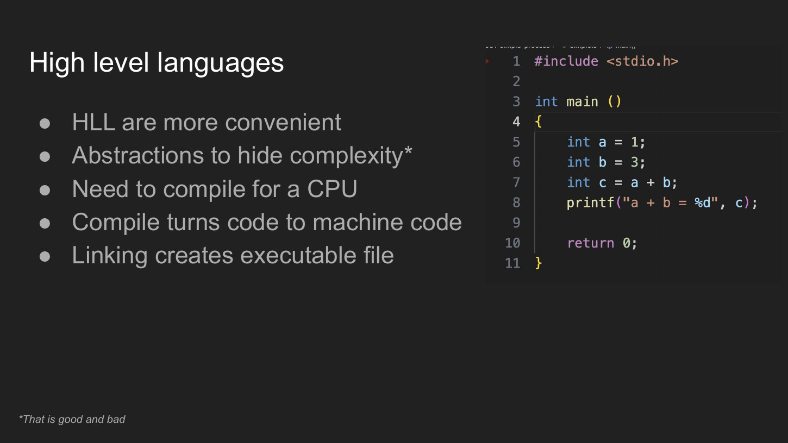
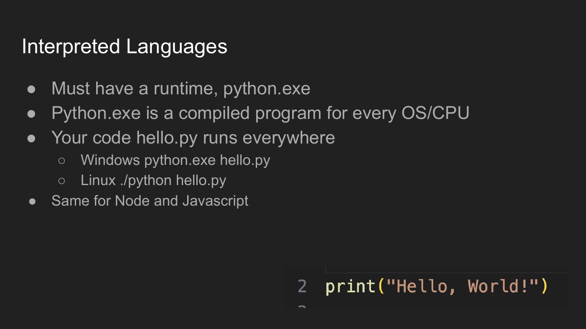
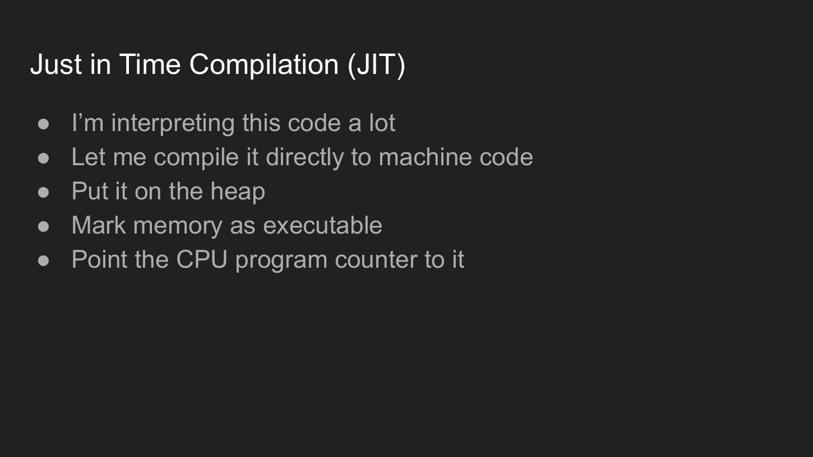
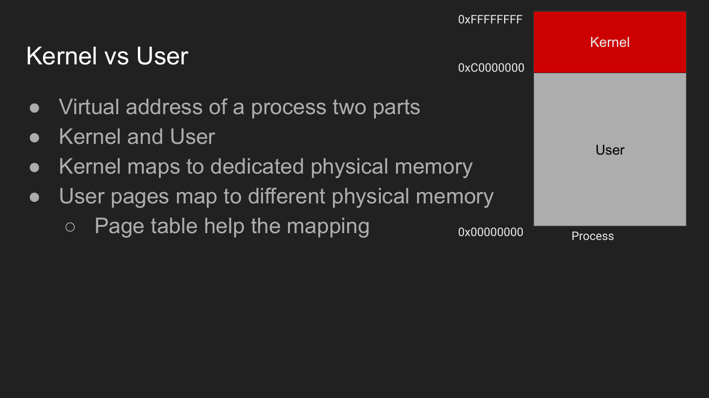
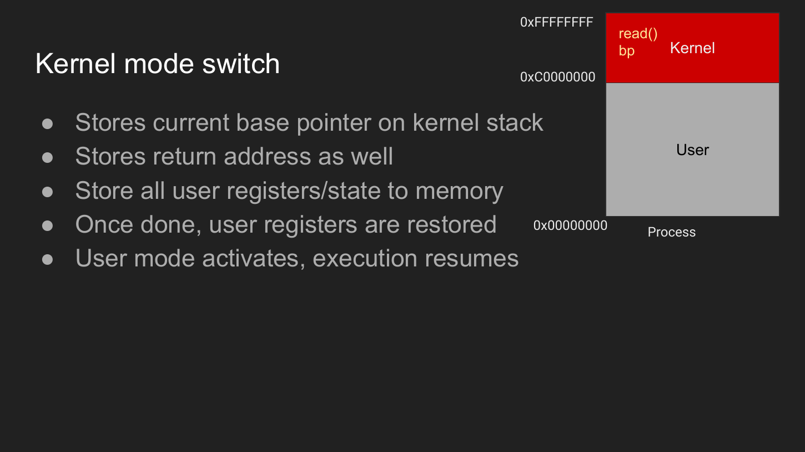
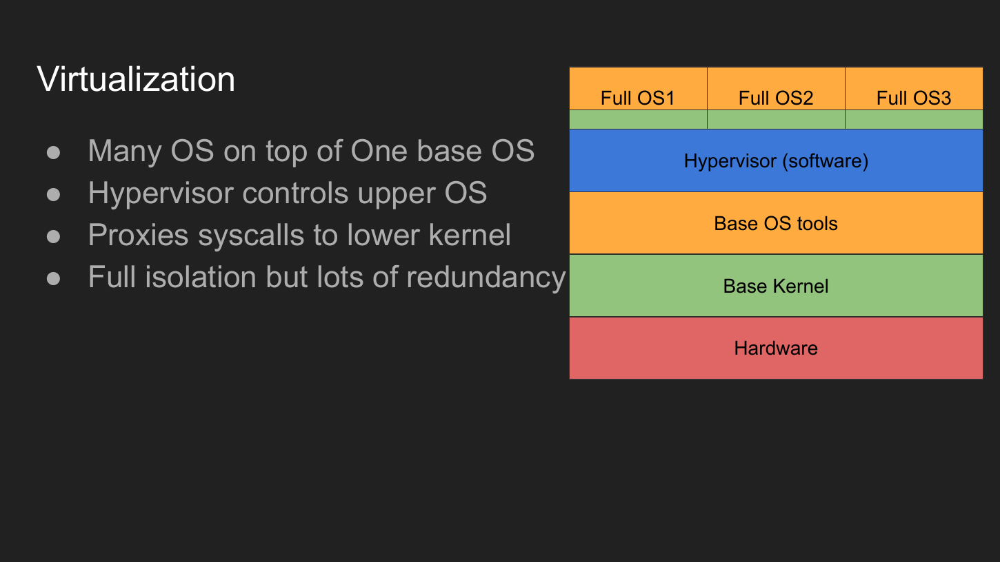
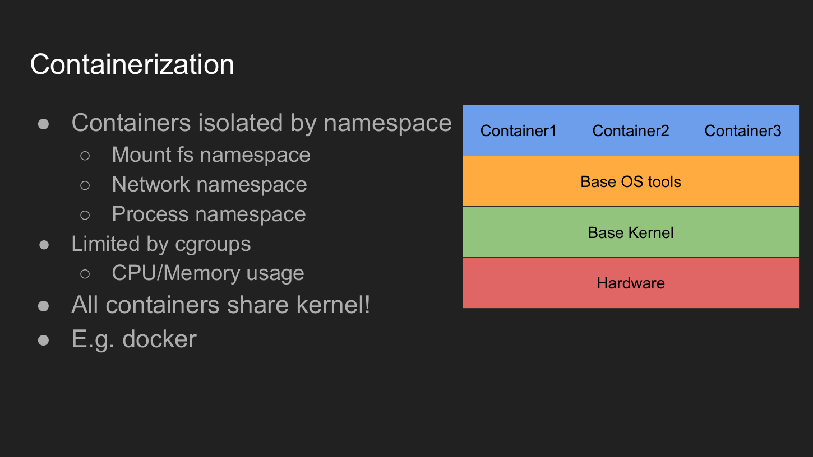
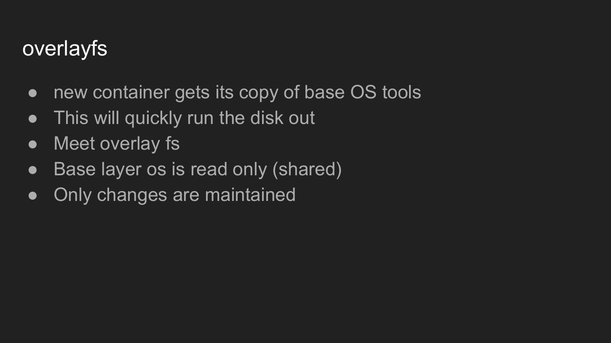
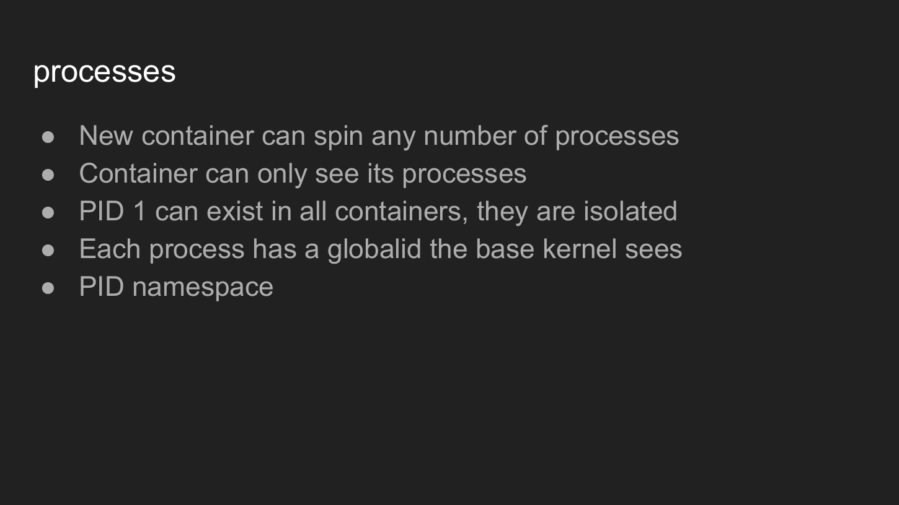

# More OS Concepts — Compilers, Mode Switches, Virtualization & Containers

> **Course scope:** slides **415–450** — the final section of *Fundamentals of Operating Systems*.
>
> Goal: keep the final section **easy to revise**, connected to the rest of the OS course, and useful for backend engineering.

---

## Table of Contents

1. [Big picture](#1-big-picture)
2. [Compilers and linkers](#2-compilers-and-linkers)
3. [Compiled vs runtime-based execution](#3-compiled-vs-runtime-based-execution)
4. [JIT compilation](#4-jit-compilation)
5. [Garbage collection](#5-garbage-collection)
6. [User mode vs kernel mode](#6-user-mode-vs-kernel-mode)
7. [What a system call mode switch does](#7-what-a-system-call-mode-switch-does)
8. [Why mode switches matter to backend engineers](#8-why-mode-switches-matter-to-backend-engineers)
9. [Virtualization](#9-virtualization)
10. [Containers](#10-containers)
11. [Namespaces](#11-namespaces)
12. [cgroups](#12-cgroups)
13. [Container filesystem and OverlayFS](#13-container-filesystem-and-overlayfs)
14. [Container networking](#14-container-networking)
15. [PID namespaces](#15-pid-namespaces)
16. [VM vs container](#16-vm-vs-container)
17. [How this closes the OS course](#17-how-this-closes-the-os-course)
18. [What to master](#18-what-to-master)
19. [Slide map](#19-slide-map)

---

# 1. Big picture

This section connects three questions that stayed open during the course:

```text
How does source code become something the kernel can run?
                     ↓
          COMPILERS + LINKERS

How does a user program safely ask the kernel to do work?
                     ↓
          USER ↔ KERNEL MODE

How can many isolated environments share one machine?
                     ↓
       VIRTUALIZATION + CONTAINERS
```

The complete path is now:

```text
source code
   ↓ compile
object files
   ↓ link
executable program
   ↓ loader/kernel
process in memory
   ↓ executes in user mode
system call / fault / interrupt
   ↓
kernel mode
   ↓
CPU • memory • files • sockets • devices
```

---

# 2. Compilers and Linkers

## 2.1 Why compilation exists

The CPU executes **machine instructions**, not Python/C/JavaScript source text.

Machine code is tied to an **instruction-set architecture (ISA)** such as x86-64 or ARM64.

```text
High-level source
      ↓
   compiler
      ↓
CPU-specific machine code
```



### Memory hook

> **Compiler = translate code.**  
> **Linker = connect pieces into a final program.**

---

## 2.2 Assembly vs machine code

```text
High-level language
        ↓
     assembly
        ↓
   machine code
```

- **Machine code** = binary instructions the CPU executes.
- **Assembly** = human-readable mnemonics that closely represent CPU instructions.
- Both are architecture-specific.
- High-level languages hide most CPU details.

Do not memorize that one high-level line always equals a fixed number of assembly instructions. It depends on the compiler, architecture, optimization level, and code.

---

## 2.3 Compilation produces object files

If a project has multiple source files:

```text
main.c ──compile──> main.o
math.c ──compile──> math.o
net.c  ──compile──> net.o
```

An **object file** normally contains:

- machine code for that source unit;
- symbols;
- relocation information;
- section metadata;
- unresolved references that may need the linker.

It is usually **not yet the final runnable program**.

### Small Linux example

```bash
gcc -c main.c -o main.o
gcc -c math.c -o math.o
```

At this stage:

```text
main.o  +  math.o
```

still need linking.

---

## 2.4 Linking

The linker resolves references and combines the required pieces.

```text
main.o ──┐
math.o ──┼──> linker ──> executable
lib... ──┘
```

Examples mentioned in the lecture:

- `ld`
- GNU `gold`
- LLVM `lld`
- `mold`

A faster linker mostly improves **developer/build time**. It does not magically make the finished application execute faster.

### Build example

```bash
gcc main.o math.o -o app
./app
```

---

## 2.5 Static vs dynamic linking

### Static linking

Required library code is included in the produced binary.

```text
app code + library code
          ↓
     one larger binary
```

**Trade-off:** easier deployment, but larger binaries and duplicated library code across programs.

### Dynamic linking

The executable refers to shared libraries that are loaded/resolved separately.

```text
app
 └── depends on shared library
```

Linux commonly uses `.so` shared objects; Windows commonly uses DLLs.

**Failure mode:** executable exists, but a required library is missing or incompatible.

```text
program starts
   ↓
required library missing
   ↓
runtime/load failure
```

---

## 2.6 Executable file formats

The OS loader needs a defined format that describes the executable.

| Platform | Common executable format |
|---|---|
| Linux / many Unix-like systems | ELF |
| Windows | PE (Portable Executable) |
| macOS | Mach-O |

The file format contains enough structure for the OS/runtime loader to understand things such as executable segments, data segments, entry point, required libraries, and permissions.

### Important precision

The OS does **not simply jump directly to your source-level `main()`**. It enters at the executable's defined **entry point**; runtime startup code can then initialize the process and eventually call `main()`.

Useful Linux inspection commands:

```bash
file ./app
readelf -h ./app
readelf -S ./app
ldd ./app
```

---

# 3. Compiled vs Runtime-Based Execution

The lecture contrasts native compilation with languages that depend on a runtime.



## Native/AOT mental model

```text
source
  ↓ compile + link
native executable
  ↓
CPU
```

The executable must match the target architecture and OS environment.

## Runtime-based mental model

```text
your source / bytecode
        ↓
platform-specific runtime
        ↓
machine instructions
        ↓
CPU
```

Examples include Python, Java, JavaScript engines, and .NET runtimes, but their exact execution models differ.

### The key portability trick

Your program may stay mostly the same while the **runtime is ported to each platform**.

```text
hello.py
   │
   ├── Windows → Windows CPython runtime
   ├── Linux   → Linux CPython runtime
   └── macOS   → macOS CPython runtime
```

### Important precision

"Compiled" and "interpreted" are not two perfectly separate boxes.

For example:

- CPython normally compiles Python source to Python bytecode, then executes it in the interpreter loop.
- Java commonly compiles source to JVM bytecode, then the JVM may interpret and/or JIT-compile it.
- JavaScript engines commonly parse/compile into internal forms and can JIT hot code.

So the better question is:

> **Where and when does translation to native machine code happen?**

---

# 4. JIT Compilation

**JIT = Just-In-Time compilation.**

The runtime notices code that is worth optimizing and produces native machine code **while the program is running**.



```text
frequently executed runtime code
            ↓
          JIT
            ↓
native machine instructions
            ↓
execute directly on CPU
```

Conceptually:

1. detect hot code;
2. compile it to native instructions;
3. place generated code in memory;
4. make that memory executable under the runtime's security policy;
5. execute the generated code.

### Why bother?

Interpretation repeatedly spends CPU work figuring out what the program means.

JIT pays a compilation cost once, hoping to make repeated execution cheaper.

```text
extra compilation cost now
          ↓
faster repeated execution later
```

---

# 5. Garbage Collection

Manual memory management requires the programmer to eventually release allocations.

```text
allocate
   ↓
use
   ↓
free
```

If memory is forgotten:

```text
allocation remains reachable by nobody
         ↓
memory leak / wasted memory
```

A managed runtime can provide **garbage collection (GC)** to reclaim memory automatically.

```text
objects allocated
      ↓
runtime tracks/reasons about reachability
      ↓
unreachable objects identified
      ↓
memory reclaimed
```

### The trade-off

GC saves huge amounts of application complexity, but the collector itself consumes:

- CPU time;
- metadata;
- memory bandwidth;
- synchronization work;
- sometimes pauses that affect latency.

The lecture uses the Linkerd story as a performance case study: runtime/GC behavior can become visible as latency in infrastructure software. The engineering lesson is broader than any single implementation:

> **Language/runtime convenience is a trade-off, and runtime behavior can matter in latency-sensitive backend systems.**

Do not conclude that "GC languages are bad". Modern collectors use many techniques to reduce pause times and do work concurrently.

---

# 6. User Mode vs Kernel Mode

The CPU has privilege mechanisms that separate normal application execution from privileged kernel execution.



## User mode

Your application normally executes here.

It can:

- execute its own instructions;
- access memory mapped for it with appropriate permissions;
- call normal user-space functions.

It cannot directly perform arbitrary privileged operations such as controlling devices or rewriting kernel memory.

## Kernel mode

The kernel executes with higher privilege and can manage:

- virtual memory;
- scheduling;
- filesystems;
- device drivers;
- networking;
- process/thread state;
- hardware resources.

### Core rule

```text
USER MODE
  cannot directly do privileged kernel work
        ↓
controlled entry mechanism
        ↓
KERNEL MODE
```

---

# 7. What a System Call Mode Switch Does

Suppose the process calls a system interface such as `read()`.

```text
user code
   ↓
read(...)
   ↓
system-call entry
   ↓
CPU enters privileged kernel execution
   ↓
kernel handles request
   ↓
return to user mode
```



The system needs enough saved state to resume the user computation correctly afterward.

Conceptually this includes things such as:

- instruction/return location;
- stack-related state;
- register state required by the architecture/ABI;
- privilege state;
- syscall arguments/return value.

### Do not memorize an overly literal implementation

The lecture describes "saving all registers" as the mental model. Exact saved state is architecture- and kernel-specific.

The invariant to remember is:

> **The CPU/kernel must preserve enough user state to return as if the system call were a controlled function-like interruption.**

---

## 7.1 A syscall is not the same thing as a process context switch

These are related but different.

### Mode switch

```text
same thread/process
user mode → kernel mode → user mode
```

### Scheduler context switch

```text
Process/Thread A
      ↓ save execution context
Process/Thread B
      ↓ restore execution context
```

A syscall may return to the same thread without the scheduler choosing another process.

---

## 7.2 Page faults also enter the kernel

A user instruction can simply touch memory:

```text
LOAD [virtual address]
```

If the translation/permission cannot be completed normally:

```text
CPU raises page fault
       ↓
kernel handles fault
       ↓
maybe allocate/map/load page
       ↓
resume instruction
```

So the application did not explicitly call `read()` or `malloc()`, but kernel work may still happen.

---

## 7.3 Where the cost comes from

The lecture highlights several sources:

- privilege transition;
- state save/restore;
- memory accesses;
- validation/security checks;
- syscall dispatch/number lookup;
- accounting.

The important lesson is **not a magic nanosecond number**.

It is:

> Crossing into the kernel is not free, so high-performance APIs often try to reduce unnecessary crossings and copies.

### CPU accounting

Tools often distinguish:

```text
user time = CPU executing user-space code
sys time  = CPU executing kernel code on behalf of the process
```

Try:

```bash
time ./your_program
```

---

# 8. Why Mode Switches Matter to Backend Engineers

This connects directly to earlier I/O lectures.

```text
backend event loop
      ↓
epoll_wait()
      ↓
KERNEL
      ↓
return ready sockets
      ↓
USER
      ↓
read()/write()
      ↓
KERNEL
```

If an architecture generates huge numbers of tiny syscalls, the fixed overhead can matter.

This is one reason kernel interfaces such as batching, `epoll`, and `io_uring` exist: reduce waste around I/O coordination, copying, or repeated crossings where possible.

### Memory hook

> **System call = controlled doorway into kernel services.**

---

# 9. Virtualization

The original problem:

```text
one machine
   ↓
one installed environment
   ↓
conflicting versions / difficult isolation
```

Virtualization lets multiple isolated guest systems use the same physical hardware.



## VM mental model

```text
        VM 1                 VM 2
  ┌──────────────┐     ┌──────────────┐
  │ guest apps   │     │ guest apps   │
  │ guest OS     │     │ guest OS     │
  │ guest kernel │     │ guest kernel │
  └──────┬───────┘     └──────┬───────┘
         └──────── hypervisor ─┘
                    ↓
                 hardware
```

A VM has its **own guest kernel**.

The hypervisor provides/controls virtual hardware and mediates privileged access to the real machine.

### Precision note

The slide's phrase "hypervisor proxies syscalls to the lower kernel" is a useful first sketch but should not be memorized literally.

Normally:

```text
application syscall
      ↓
guest kernel handles syscall
      ↓
guest kernel interacts with virtualized CPU/memory/devices
      ↓
hypervisor/hardware virtualization machinery mediates privileged operations
```

Different hypervisor architectures implement this differently.

### VM benefits

- strong isolation;
- different guest OS/kernel versions;
- configurable virtual CPUs and memory;
- mature infrastructure tooling.

### VM cost

Each guest carries a substantial OS/kernel environment, so there is more duplication than with containers.

---

# 10. Containers

Containerization asks:

> If many applications can use the same Linux kernel, why boot a complete guest kernel for every application?



```text
Container A      Container B      Container C
  processes        processes        processes
      │                │                │
      └──────────── same kernel ─────────┘
                       ↓
                    hardware
```

A Linux container is fundamentally a set of **normal Linux processes** given isolated views and resource controls.

Two core mechanisms:

```text
namespaces → what the process can see
cgroups    → how much resource it can consume/account for
```

### Critical memory hook

> **VM: separate kernel.**  
> **Container: shared kernel, isolated processes.**

---

# 11. Namespaces

A namespace changes what a group of processes sees as "its world".

## 11.1 Mount namespace

Controls the filesystem mount view.

```text
HOST
/
├── home
├── var
├── ...
└── container root filesystem

CONTAINER VIEW
/
├── bin
├── etc
├── app
└── ...
```

The container is not simply allowed to wander upward into the host's entire filesystem tree.

A container runtime constructs a dedicated mount namespace and root filesystem view.

---

## 11.2 Network namespace

Provides an isolated network stack view, including interfaces and routes.

```text
container
   │
 virtual NIC
   │
 virtual bridge / host networking machinery
   │
 physical NIC
```

The container can have its own:

- interfaces;
- IP addresses;
- routing table;
- ports;
- loopback interface;
- firewall/network namespace state.

---

## 11.3 PID namespace

Controls process-ID visibility.

```text
Host sees:      PID 18452
Container sees: PID 1
```

The same underlying process can be represented differently depending on the PID namespace.

More on this in [PID namespaces](#15-pid-namespaces).

---

# 12. cgroups

Namespaces isolate **views**. They do not by themselves stop one container from consuming all machine resources.

Enter **control groups (cgroups)**.

```text
Container A
  └── max / accounted CPU + memory + other resources

Container B
  └── different limits/accounting
```

cgroups can provide resource control/accounting for areas such as:

- CPU;
- memory;
- I/O;
- process counts;
- other controller-specific resources.

### Why this matters

Without resource control:

```text
one noisy container
       ↓
consumes machine resources
       ↓
other workloads suffer
```

### Memory hook

> **namespace = isolation**  
> **cgroup = resource control/accounting**

---

# 13. Container Filesystem and OverlayFS

A container image can contain user-space files such as:

```text
/bin
/etc
libraries
package-manager tools
runtime files
application files
```

These are **not another Linux kernel**.

If ten containers use the same image, copying the entire base filesystem ten times would waste disk space.

That motivates layered filesystems such as OverlayFS.



## Layer mental model

```text
Container writable layer
        ↑ changes only
────────────────────────
Image layer 3  read-only
Image layer 2  read-only
Image layer 1  read-only
────────────────────────
```

Many containers can share the same read-only image layers.

Each container keeps only its own writable changes.

```text
Container A ── writable A ─┐
Container B ── writable B ─┼── shared base image layers
Container C ── writable C ─┘
```

This is a filesystem/storage optimization; **namespaces and cgroups are the core isolation/resource mechanisms**.

---

# 14. Container Networking

A new network namespace can give a container a fresh network view.

```text
Container
   ↓
virtual interface
   ↓
Docker bridge / configured network
   ↓
host routing/NAT
   ↓
physical network
```

The lecture's key idea is that the container need not see the host's normal interfaces directly.

Docker can instead place it on a virtual bridge/network.

### Precision note

A container may receive its own IP and MAC on a virtual network, but Docker commonly assigns addresses through its own IP address management rather than relying on a traditional LAN DHCP server.

Host-network mode is different: the container shares the host's network namespace instead of getting the normal isolated network view.

This directly connects to the Docker networking material from the networking course.

---

# 15. PID Namespaces



Inside two separate containers:

```text
Container A           Container B
PID 1: appA           PID 1: appB
PID 2: worker         PID 2: worker
```

This does **not** mean the host kernel has duplicate global identities with no distinction.

The host can see the processes in its broader PID namespace:

```text
Host
PID 18200 → Container A's PID 1
PID 19320 → Container B's PID 1
```

The kernel scheduler still schedules real processes. The namespace changes what process IDs are visible from a particular view.

This also explains why `/proc` inside a container can appear to contain only that container's processes when it is mounted/configured for the namespace.

---

# 16. VM vs Container

| Question | Virtual Machine | Container |
|---|---|---|
| Own kernel? | Yes, guest kernel | No, shares host kernel |
| Isolation approach | Virtualized hardware / guest OS | Kernel namespaces + cgroups + other security controls |
| Startup | Usually heavier | Usually lighter |
| OS duplication | High | Much lower |
| Can run incompatible kernel family directly? | Yes, depending on hypervisor/platform | No; container uses host kernel family |
| Typical artifact | VM image | Container image |

### Linux containers on Windows/macOS

This resolves an apparent contradiction:

```text
"Linux containers share a Linux kernel"
```

but you can run Docker Desktop on Windows/macOS.

The common solution is:

```text
Windows/macOS
     ↓
small Linux VM
     ↓
Linux kernel
     ↓
Linux containers share that kernel
```

So the containers are still sharing a Linux kernel; the kernel happens to live inside a VM.

---

# 17. How This Closes the OS Course

You can now trace a backend program almost end-to-end:

```text
SOURCE CODE
   ↓
compiler / runtime / JIT
   ↓
machine instructions
   ↓
executable format / loader
   ↓
PROCESS
   ↓
CPU executes in USER MODE
   ↓
read / write / accept / mmap / etc.
   ↓
KERNEL MODE
   ↓
filesystem • virtual memory • TCP/IP • scheduler • drivers
   ↓
HARDWARE
```

Deployment adds one more layer:

```text
backend process
      ↓
container namespace + cgroup
      ↓
shared host kernel
      ↓
hardware
```

Or:

```text
backend process
      ↓
guest OS/kernel
      ↓
virtual machine
      ↓
hypervisor
      ↓
hardware
```

The OS is no longer a black box between your code and the machine.

---

# 18. What to Master

## Must know

- [ ] Machine code is ISA/CPU specific.
- [ ] Compilation produces object-code artifacts; linking resolves/connects pieces into a final executable/shared artifact.
- [ ] Know ELF vs PE vs Mach-O at a conceptual level.
- [ ] A runtime can provide portability by being implemented for each platform.
- [ ] Understand the basic JIT idea: runtime → native code for hot paths.
- [ ] Garbage collection trades manual memory management for runtime overhead/complexity.
- [ ] User mode cannot arbitrarily perform privileged kernel operations.
- [ ] System calls are controlled transitions into kernel services.
- [ ] A mode switch is **not automatically** a process context switch.
- [ ] Page faults also transfer control to the kernel.
- [ ] VM = guest kernel + virtualized machine.
- [ ] Container = isolated processes sharing a kernel.
- [ ] Namespaces isolate views.
- [ ] cgroups control/account resources.
- [ ] Mount namespace, network namespace, PID namespace.
- [ ] OverlayFS lets containers share read-only image layers while keeping separate writable changes.
- [ ] A process can be PID 1 in its container while having another PID on the host.

## Nice to recognize

- static vs dynamic linking;
- shared libraries;
- bytecode;
- `ld`, `lld`, `mold`;
- system/user CPU time;
- host network mode;
- container root filesystem;
- Linux containers on Docker Desktop running through a Linux VM.

## Do not waste memorization on

- exact linker benchmark numbers;
- exact register lists saved on every syscall;
- exact virtual-address split values from one OS/architecture;
- a single fixed "mode switch cost" number;
- every namespace/cgroup controller before you actually need it.

---

# 19. Slide Map

| Slides | Topic |
|---:|---|
| 415 | More OS Concepts intro |
| 416–423 | Machine code, assembly, high-level languages, compilation, linking, executable formats |
| 424–426 | Runtime/interpreted-language model and bytecode idea |
| 427 | JIT |
| 428–429 | Garbage collection + summary |
| 430–436 | User/kernel space, privilege modes, syscall mode-switch cost |
| 437–441 | Virtualization |
| 442–444 | Containers, namespaces, cgroups |
| 445–447 | New-container filesystem view + OverlayFS |
| 448 | Network namespace |
| 449 | PID namespace/process view |
| 450 | Final summary |

---

## Final one-screen recall

```text
CODE
 ├─ compiler → object files
 ├─ linker   → executable
 └─ runtime/JIT can translate during execution

PROCESS
 ├─ user mode → normal app execution
 └─ syscall/fault → kernel mode → return

ISOLATION
 ├─ VM        → separate guest kernel
 └─ container → shared kernel
                 ├─ namespaces = isolated views
                 ├─ cgroups    = resource controls
                 └─ OverlayFS  = efficient layered filesystem
```

> If this diagram makes sense without opening the lecture, you have the core of slides 415–450.
